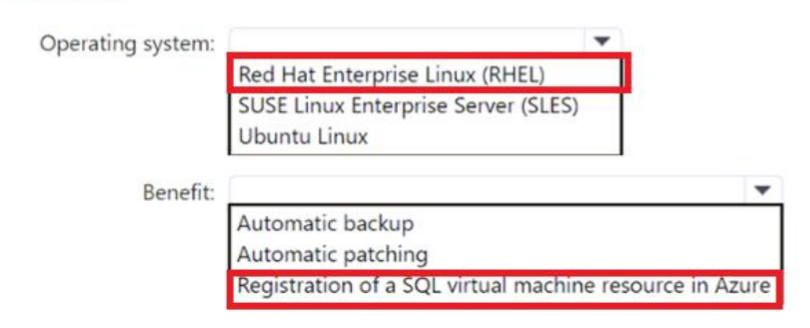
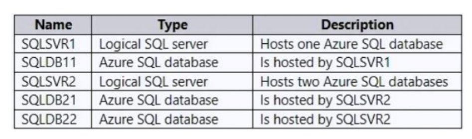
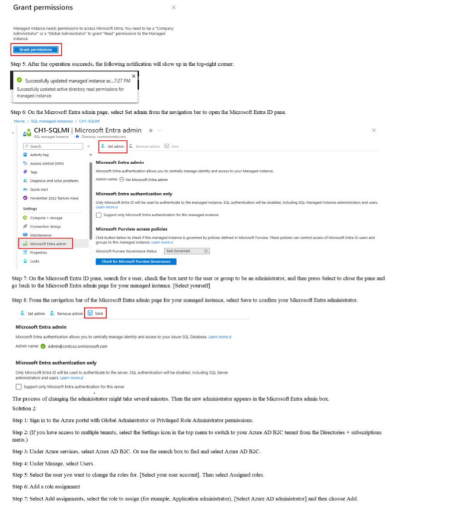
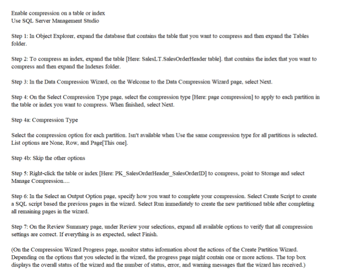
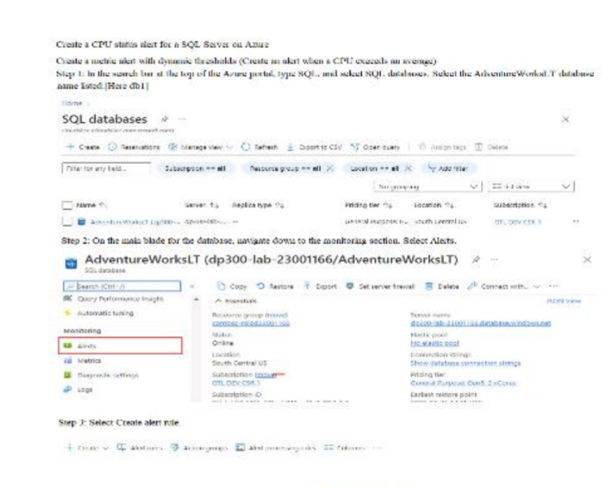
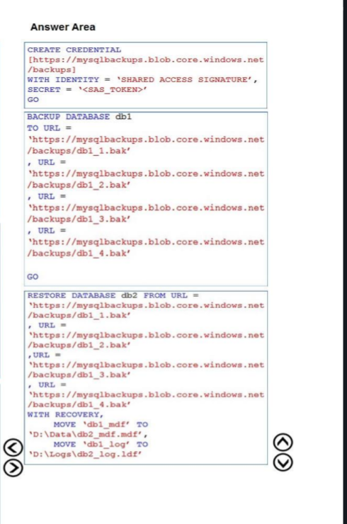
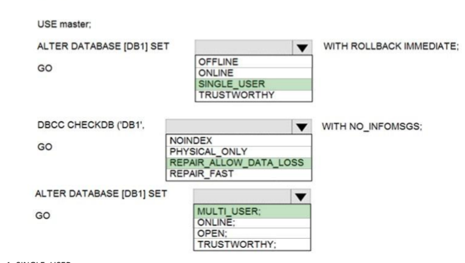
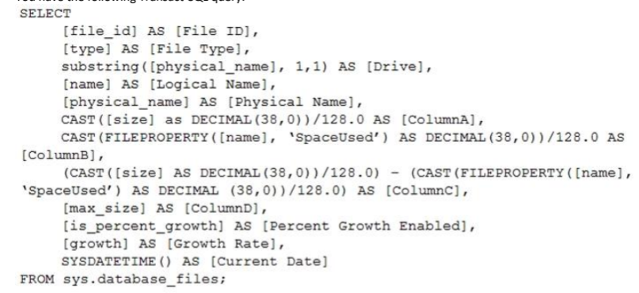
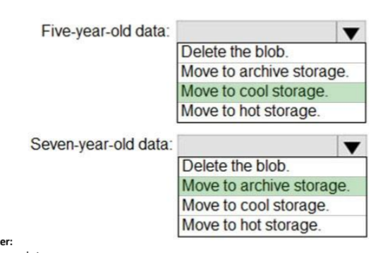
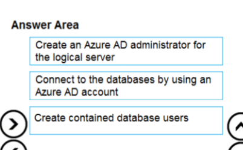

2. We have a SQL Server 2019 on an Azure virtual machine containing an SSISDB database. We find that all the Microsoft SSIS packages fail to run on the virtual machine. We should perform the following actions to resolve the issue:
- 2.1: Attach the SSISDB database
- 2.2: Turn on the TRUSTWORTHY property and CLR property: This is done because here the SSISDB catalog was never created and we need to enable CLR.
- 2.3: Open the master key for the SSISDB database. 
- 2.4: Encrypt a copy of the master key by using the service master key.

3. For a table which has 6 billion rows and is loaded nightly using a batch process, if we need to provide the greatest reduction in space for the database and maximize performance, we need to use columnstore archival compression. For columnstore tables and indexes, columnstore compression is enabled by default and is not configurable. We can further use columnstore archival compression to further reduce the data size if we can afford extra CPU resources to store and retrieve data.
4. If we have a SQL Server 2019 database and we need to migrate it to Azure SQL database, remove or replace its Polybase feature as this could create errors during migration and is not supported by Azure SQL Database
5. To migrate an SQL Server 2019 database which resides on premise in a datacenter, to a SQL Database MI, use Azure Database Migration Service as we can do online and offline migration using it and thereby, reduce downtime and dataloss during the migration.
6. To migrate an onprem database residing on a server to an Azure SQL MI, using Azure Database Migration Service, we need Full and Log Backup WITH CHECKSUM option enabled.
7. If we need to a database from a particular resource group to another resource group and have the same configuration and settings as the original resource group we need to do the following:
- 7.1: From the Azure Portal, export the ARM template
- 7.2: Change the server name and related variables in the templates
- 7.3: From the Azure portal, deploy the templates
- 7.4: From the database project, deploy the database schema and permissions

8. If we have an Azure Synapse Analytics dedicated SQL pool named Pool 1 and Azure Data Lake Storage Gen 2 account named Account 1 and we need to access the files in Account 1 using an external table, then to create an external data source in Pool 1, we can use the following code: 
- 

9. If we plan to develop a dataset named Purchases by using Azure Databricks and we need to support hourly incremental load pipelines that will vary for each Store ID, we need to use the following code: 
- 
10. If we design a streaming data solution that will ingest variable volume of data and if we need to change the partition count after creation, we can use Azure Event Hubs Dedicated. In Event Hubs, the partition count is fixed from 1-32, but it can changed in the Dedicated tier.
11. If we are building a database in an Azure Synapse Analytics serverless SQL pool, and we have data stored in Parquet files in an Azure Data Lake Storage Gen2 container, and we need to build a table that contains only the address fields use the following T-SQL code: 
- 
12. Lets say we have an Azure Synapse Analytics Apache Spark Pool named Pool1 and we plan to load JSON files from an Azure Data Lake Storage Gen2 container into tables in POOL 1, we should load the data by using PySpark.
13. If we have a date dimension table in an Azure Synapse Analytics dedicated SQL ppol, the date dimension table will be used by all fact tables, to minimize data movement, use the REPLICATION distribution type. 
14. From a website analytics system, you receive data extracts about user interactions such as downloads, link clicks, form submissions, and video plays. If we need to design a star schema to support analytics queries on data, we need to do the following: 
- 
15. if we plan to create a table in an Azure Synapse Analytics dedicated SQL pool and the Data in the table will be retained for five years. Once a year, data that is older than five years will be deleted. You need to ensure that the data is distributed evenly across partitions. The solutions must minimize the amount of time required to delete old data. We will need to partition by OrderDateKey and Distribution must be a HASH of the product Key
- 
16. If we have an Azure Synapse Analytics workspace named WS1 that contains an Apache Spark pool named Pool1. You plan to create a database named DB1 in Pool1.
You need to ensure that when tables are created in DB1, the tables are available automatically as external tables to the built-in serverless SQL pool. The format to use for tables in DB1 is **Parquet**
17. If we are designing an anomaly detection solution for streaming data from an Azure IoT hub. The solution must meet the following requirements:
- Send the output to an Azure Synapse. 
- Identify spikes and dips in time series data.
-  Minimize development and configuration effort.
- For this purpose we can use Azure Stream Analytics
18. If we are creating a new notebook in Azure Databricks, that will support R as the primary language but also support Scala and SQL, we can use the following syntax to switch between languages: %<language> or %scala or %sql
19. If we are creating a managed data warehouse solution on Microsoft Azure. You must use PolyBase to retrieve data from Azure Blob storage that resides in parquet format and load the data into a large table called FactSalesOrderDetails.
You need to configure Azure Synapse Analytics to receive the data. Do the following steps: 
- 
20. We configure version control for Azure Data Factory instance as follows: 
- 
- 
21. If we plan to build a structured streaming solution in Azure Databricks. The solution will count new events in five minute intervals and report only events that arrive during the interval. The output will be sent to a Delta Lake table. In this case the Output mode should be **Append**
22. 
Answer is :  
23. If we have a SQL pool in Azure Synapse that contains a table named dbo.Customers. The table contains a column name Email.
You need to prevent nonadministrative users from seeing the full email addresses in the Email column. The users must see values in a format of aXXX@XXXX.com instead. For this we need to set a MASK on the Email Column from the Azure Portal
24. If we have an Azure Databricks workspace named workspace1 in the Standard pricing tier. Workspace1 contains an all-purpose cluster named cluster1.
You need to reduce the time it takes for cluster1 to start and scale up. This can be done by creating a pool in Workspace 1. 
25. If we have an Azure Synapse Analytics dedicated SQL pool that contains a table named Table1. You have files that are ingested and loaded into an Azure Data Lake Storage Gen2 container named container1. You plan to insert data from the files into Table1 and transform the data. Each row of data in the files will produce one row in the serving layer of Table1.
You need to ensure that when the source data files are loaded to container1, the DateTime is stored as an additional column in Table1.
For this we can use a GET METADATA activity that retrieves the datetime of the files.
26. Similar to above, if we use an Azure Synapse Analytics serverless pool to create an external table that has an additional DateTime column, then our goal is NOT met.
27. Similar to above, if we use a dedicated SQL pool to create an external table that has an additional DateTime column, then our goal is NOT met.
28. 
- Above since we havent configured Auto-Pause, so no extra time is required to resume operations for new activities. Also such a configuration reduces the cost for intermittent and unpredictable usage patterns.
29. If we have a webapp hosted on an Azure VNet and Azure SQL Server is assigned a private IP address and the Azure Sql server needs to allow connections from a specific virtual network only, then we should use Azure Private Link or Azure Private Endpoint.
30. If we need to auto-scale the Azure Sql database to the following configuration during peak times, then we need to use the Business Critical Service Tier
- 24 cores
- 500 GB of storage
- 124 GB of memory
- More than 50,000 IOPS

31. If we have an Azure subscription. You need to deploy an Azure SQL resource that will support cross database queries by using an Azure Resource Manager (ARM) template.
- 

32. If we have the following ARM template:
- 
- In this case we need to use the following:
- 

33. If we have an on-premises Microsoft SQL Server 2019 instance that hosts a database named DB1. You plan to perform an online migration of DB1 to an Azure SQL managed instance by using the Azure Database Migration Service.
You need to create a backup of DB1 that is accessible to the Azure Database Migration Service. We can run the backup and store it like this
- 

34. If we plan to deploy an Azure SQL database by using ARM template we can use the following:
- 

35. If we have an on-premises Microsoft SQL Server 2019 server that hosts a database named DB1.
You have an Azure subscription that contains an Azure SQL managed instance named SQLMI1 and a virtual network named VNET1. SQLMI1 resides on VNET1.
The on-premises network connects to VNET1 by using an ExpressRoute connection. You plan to migrate DB1 to SQLMI1 by using Azure Database Migration Service. You need to configure VNET1 to support the migration, For this we will configure the **NSG** of VNET1.

36. If we have an on-premises Microsoft SQL server that uses the FileTables and Filestream features.
You plan to migrate to Azure SQL. For this we will make use of SQL Server on Azure VM.

37. If we need to migrate an on-premises Microsoft SQL Server database to Azure SQL Database. The solution must minimize downtime, For this we can configure transactional replication

38. If we have a table name Table1 that has 20 columns of type CHAR(400). Row compression for Table1 is enabled. During a database audit, you discover that none of the fields contain more than 150 characters.
You need to ensure that you can apply page compression to Table1. For this we can change column type to **VARCHAR(200)**

39. If we have an on-premises Microsoft SQL Server named SQL1 that hosts five databases.
You need to migrate the databases to an Azure SQL managed instance. The solution must minimize downtime and prevent data loss. For this we can use **Backup and Restore**

40. If we have have an Azure subscription that contains an Azure SQL database. The database contains a table named tablet that uses partitioned columnstores.
You need to configure table1 to meet the following requirements:
- Each partition must be compressed. 
- The compression ratio must be maximized. 
- You must be able to index the compressed data.

Here we can make use of columnstore archival compression.

41. If we have an Azure subscription linked to an Azure Active Directory (Azure AD) tenant. The subscription contains 10 virtual machines that run Windows Server 2019 and host Microsoft SQL Server 2019 instances. We need to ensure that you can manage the SQL Server instances by using a single user account. For this we can Deploy an Azure Active Directory Domain Services(Azure AD DS) domain and join the virtual machines to the domain.

42. If we have an Azure subscription and we plan to deploy a new Azure virtual machine that will host a Microsoft SQL Server instance. We need to configure the disks on the virtual machine. The solution must meet the following requirements:
- Minimize latency for transaction logs.
- Minimize the impact on IO throughput of the virtual machine.
- For this we can use 

43. If we have an Azure SQL Database elastic pool that contains 10 databases.
You receive the following alert.
Msg 1132, Level 16, state 1, Line 1 The elastic pool has reached its storage limit. The storage used for the elastic pool cannot exceed (76800) MBs.
You need to resolve the alert. The solution must minimize administrative effort.
For this we can Increase the maximum storage of the pool, enable data compression and shrink the individual databases.

44. If we need to deploy a new Azure SQL database by using Azure Command-Line Interface (CLI), we need the name, resource group and server name.
45. If we plan to migrate 10 on-premises Microsoft SQL Server instances to Azure.
You need to ensure that the migrated environment can be managed by using multiserver administration and supports master/target (MSX/TSX) jobs. The SQL deployment options to be selected as the master server(MSX) and target server(TSX) should be :
- 

46. If we have two on-premises Microsoft SQL Server 2019 instances named SQL1 and SQL2.
You need to migrate the databases hosted on SQL1 to Azure. The solution must meet the following requirements:
• The service that hosts the migrated databases must be able to communicate with SQL2 by using linked server connections.
• Administrative effort must be minimized.
- For this to host the database, we can make use of **Azure SQL Managed Instances**.

47. If we have an on-premises Microsoft SQL Server 2016 instance that hosts a database named db1. You have an Azure subscription that contains an Azure SQL managed instance named MI1.
You plan to perform an online migration of db1 to MI1 by using Azure Database Migration Service.
You need to create the backups for the migration. The solution must minimize the number of backup files created. For this we should have the following backup types and store it accordingly:
- 

48. If we have a SQL Server on Azure Virtual Machines instance named SQLVM1 that was deployed by using an Azure Marketplace SQL Server 2019 Enterprise image.
You need to change the Microsoft SQL Server instance on SQLVM1 to the Standard edition. The solution must ensure licensing compliance. For this, from the SQL VM1, We need to **uninstall the SQL Server Instance**

49. If we have on-premises network contains a Microsoft SQL Server 2016 server that hosts a database named db1.
You have an Azure subscription.
You plan to migrate db1 to an Azure SQL managed instance.
You need to create the SQL managed instance. The solution must minimize the disk latency of the instance. To minimize Disk Latency, we can make use of the **Business Critical** Service Tier.

50. If we need to deploy an Azure SQL database. The solution must meet the following requirements:
- Dynamically scale CPU resources. 
- Ensure that the database can be paused to reduce costs.
- For this we can make use of the serverless compute tier.

51. If we have an Azure subscription.
You need to deploy an Azure SQL managed instance that meets the following requirements:
- Optimize latency. 
- Maximize the memory-to-vCore ratio.
Which service tier and hardware generation should you use?
- 

52. If we need to migrate the server to Azure. The solution must meet the following requirements:
- Ensure that the latest version of SQL Server is used. 
- Support the SQL Server Agent service.
- Minimize administrative effort.

- We can make use of Azure SQL Managed Instance for this

53. If we have a Microsoft SQL Server 2017 server that hosts five databases.
You plan to migrate the databases to Azure.
You need to recommend a solution that meets the following requirements:
- Automatically scales compute based on the workload demand 
- Provides per-second billing
- 

54. If we have an on-premises Microsoft SQL Server 2019 database named SQL1 that uses merge replication.
You need to migrate SQL1 to Azure.
- For this we need to use SQL Server on Azure Virtual Machines

55. If we have an on-premises datacenter that contains a 2-TB Microsoft SQL Server 2019 database named DB1.
You need to recommend a solution to migrate DB1 to an Azure SQL managed instance. The solution must minimize downtime and administrative effort.
- To migrate a 2-TB Microsoft SQL Server 2019 database (DB1) from an on-premises datacenter to an Azure SQL Managed Instance while minimizing downtime and administrative effort, I recommend using the Azure Database Migration Service (DMS) with the Azure SQL Migration extension in Azure Data Studio in online migration mode. This approach leverages the Managed Instance link or **Log Replay Service** (LRS) to achieve near-zero downtime and automates much of the migration process.
- LRS works by continuously replaying transaction log backups from the source database to the target Managed Instance, keeping the target in sync with the source until the final cutover. LRS is a key component of the Azure Database Migration Service (DMS) in online migration mode.

56. If we  plan to deploy an instance of SQL Server on Azure Virtual Machines that supports Write Accelerator. then we should **M-series** of Virtual Machines

57. If we have an on-premises Microsoft SQL Server 2019 instance that hosts a database named DB1.
You have an Azure subscription that contains an Azure SQL database named SQLDB1.
You need to replicate DB1 to SQLDB1.
Which type of replication should you use?
- In this case, we should use transactional replication
- Transactional Replication would be the closest match, with the understanding that Azure SQL Database can only act as a subscriber and the replication would be one-way from your on-premises SQL Server to Azure SQL Database.

58. If we have two on-premises servers that run Windows Server 2019 and host a Microsoft SQL server 2017 Always On availability group named AG1. AG1 contains a single database named DB1.
You have an Azure subscription. The subscription contains a virtual machine named VM1 that runs Linux.
You need to migrate DB1 to a SQL Server 2019 instance on VM1. The solution must minimize the downtime of DB1 during the migration.
- 

59. If we have an Azure SQL database named DB1.
You need to create a partitioned table in DB1.
Which three objects should you create in sequence?
- 

60. If we have an Azure subscription that contains an instance of SQL Server on Azure Virtual Machines named SQLVM1 and a virtual machine named Server1 that runs Windows Server. SQLVM1 and Server1 are joined to an Active Directory Domain Services (AD DS) domain. Server1 hosts a file share named Share1.
You need to ensure that a SOL Server Agent job step on SQLVM1 can access the files in Share1. The solution must use the principle of least privilege.
- For this we need to do the following:
- 

61. If we need to deploy an instance of SQL Server on Azure Virtual Machines. The solution must meet the following requirements:
- Custom performance configuration, such as IOPS, capacity, and throughout, must be supported. 
- Costs must be minimized.
- We should include Premium SSD v2 in our solution

62. If we have an on-premises datacenter that contains a 14-TB Microsoft SQL Server database.
You plan to create an Azure SQL managed instance and migrate the on-premises database to the new instance.
Which three service tiers support the SQL managed instance?
- General Purpose Standard, Business Critical Memory Optimized Premium and General Purpose Premium

63. **SIMULATION**: You need to configure db1 to pause automatically after one hour of inactivity. To complete this task, sign in to the virtual machine. You may need to use SQL Server Management Studio and the Azure portal.
- 

64. **SIMULATION**: You need to ensure that any enhancements made to the Query Optimizer through patches are available to db1 and db2 on sql12345678. To complete this task, sign in to the virtual machine. You may need to use SQL Server Management Studio and the Azure portal. 
- For this we need to set QUERY_OPTIMIZER_HOTFIXES = ON
- 

65. **SIMULATION**: If we plan to create an automation runbook that will create database users in db1 from Azure AD identities.You need to configure sql12345678 to support the creation of new database users.
- 
- 
- 

66. **SIMULATION**: plan to perform performance testing of db1.
You need prevent db1 from reverting to the last known good query plan.
- 

67. **SIMULATION**: You have a legacy application written for Microsoft SQL Server 2012. The application will be the only application that accesses db1.
You need to ensure that db1 is compatible with all the features and syntax of SQL Server 2012.
- 

68. **SIMULATION**: You need to add an Azure AD user named user2-12345678@examusers.com to db1. User2-12345678 must be able to read data from all the tables in db1 without being able to modify the data.
- 
- 

69. **SIMULATION**: You need to ensure that db1 supports a minimum of one vCore, a maximum of four vCores, and a database of up to 45 GB.
- 
- 
- 

70. Case-Study: ADatum Corporation  is a financial services company that has a main office in New York City. We need to recommend which service and target endpoint to use when migrating the databases from SVR1 to Instance1. The solution must meet the availability requirements
- 

71. Following the ADatum Corporation case study, we need to recommend a service tier and a method to offload analytical workloads for the databases migrated from SVR1. The solution must meet the availability and business requirements.
- 

72. We need to migrate DB1 to an Azure SQL service that meets the following requirements:
- Protects the confidentiality of sensitive data from malware and high-privileged unauthorized database
- Supports pattern matching for server-side database operation
- Uses a hardware-based encryption technology
- 

73. We have two on-premises Microsoft SQL Server instances named SQL1 and SQL2.
You have an Azure subscription.
You need to sync a subset of tables between the databases hosted on SQL1 and SQL2 by using SQL Data Sync.
Which five actions should you perform in sequence?
- 

74. If we have an on-premises Microsoft SQL Server 2022 instance that hosts a 60-TB production database named DB1.
You plan to migrate DB1 to Azure.
You need to recommend a hosting solution for DB1.
- We should use Hyperscale Database Service Tier to host DB1

75. We plan to provision a single Azure SQL database.
You need to ensure that the database supports the autoscaling of compute resources.
- For this purpose, we can use the General Purpose Service Tier also

76. We plan to deploy an instance of SQL Server on Linux Azure Virtual Machines. The instance will run Microsoft SQL Server 2022 and use the SQL Server IaaS Agent extension for Linux.
Which Linux operating system should you deploy, and which benefit will the SQL Server IaaS Agent extension provide?
- 

77. We have a burstable Azure virtual machine named VM1 that hosts an instance of Microsoft SQL Server. We need to attach an Azure ultra disk to VM1. The solution must minimize downtime on VM1.
- 

78. We have a new Azure SQL database. The database contains a column that stores confidential information. You need to track each time values from the column are returned in a query. The tracking information must be stored for 365 days from the date the query was executed.
Which three actions should you perform?
- Turn on auditing and write audit logs to an Azure Storage account.
- Apply sensitivity labels named Highly Confidential to the column
- Turn on Advanced Data Security for the Azure SQL server: Advanced Data Security (ADS) is a unified package for advanced SQL security capabilities. ADS is available for Azure SQL Database, Azure SQL Managed Instance, and Azure Synapse Analytics. It includes functionality for discovering and classifying sensitive data

79. We have an Azure virtual machine named VM1 on a virtual network named VNet1. Outbound traffic from VM1 to the internet is blocked. We have an Azure SQL database named SqlDb1 on a logical server named SqlSrv1. We need to implement connectivity between VM1 and SqlDb1 to meet the following requirements:
- Ensure that all traffic to the public endpoint of SqlSrv1 is blocked.
- Minimize the possibility of VM1 exfiltrating data stored in SqlDb1.
- For this we need to create a Private Link on VNet1.

80. We have a new Azure SQL database named DB1 on an Azure SQL server named AzSQL1. The only user who was created is the server administrator.
You need to create a contained database user in DB1 who will use Azure Active Directory (Azure AD) for authentication.
- 

81. 
Here we need to configure dynamic data mask for Phone Numbers:
Custom String masking method that exposes the first and last letters and adds a custom padding string in the middle, so it is PREFIX-PADDING-SUFFIX -(0, xxx-xxx,5)

82. We have an Azure SQL database that contains a table named Employees. Employees contains a column named Salary.
You need to encrypt the Salary column. The solution must prevent database administrators from reading the data in the Salary column and must provide the most secure encryption.
Which three actions should you perform in sequence:
- 

83. If have an Azure SQL database named DB1 that contains two tables named Table1 and Table2. Both tables contain a column named a Column1. Column1 is used for joins by an application named App1.
You need to protect the contents of Column1 at rest, in transit, and in use. How should you protect the contents of Column1?
- 

84. If we have 40 Azure SQL databases, each for a different customer. All the databases reside on the same Azure SQL Database server.
You need to ensure that each customer can only connect to and access their respective database. Which two actions should you perform?
- Create Users in each database
- Configure Database Firewall

85. If we have an Azure SQL Database instance named DatabaseA on a server named Server1. You plan to add a new user named App1 to DatabaseA and grant App1 db_datareader permissions. App1 will use SQL Server Authentication.
You need to create App1. The solution must ensure that App1 can be given access to other databases by using the same credentials.
Which three actions should you perform in sequence?
- 

86. If we have an Azure virtual machine named VM1 on a virtual network named VNet1. Outbound traffic from VM1 to the internet is blocked.
You have an Azure SQL database named SqlDb1 on a logical server named SqlSrv1. You need to implement connectivity between VM1 and SqlDb1 to meet the following requirements:
- Ensure that VM1 cannot connect to any Azure SQL Server other than SqlSrv1.
- Restrict network connectivity to SqlSrv1.
- For this we should create a **PRIVATE LINK** on VNet1

87. If we are developing an application that uses Azure Data Lake Storage Gen 2.
You need to recommend a solution to grant permissions to a specific application for a limited time period. What should you include in the recommendation?
- For this we should use SAS(Shared Access Signatures)

88. If we are designing an enterprise data warehouse in Azure Synapse Analytics that will contain a table named Customers. Customers will contain credit card information.
You need to recommend a solution to provide salespeople with the ability to view all the entries in Customers. The solution must prevent all the salespeople from viewing or inferring the credit card information.
What should you include in the recommendation?
- We should have column-level security

89. If we have an Azure subscription that is linked to a hybrid Azure Active Directory (Azure AD) tenant. The subscription contains an Azure Synapse Analytics SQL pool named Pool1.
You need to recommend an authentication solution for Pool1. The solution must support multi-factor authentication (MFA) and database-level authentication.
Which authentication solution or solutions should you include in the recommendation
- 

90. If we have a data warehouse in Azure Synapse Analytics.
You need to ensure that the data in the data warehouse is encrypted at rest. What should you enable?
- For this we should enable TDE

91. If we are designing a security model for an Azure Synapse Analytics dedicated SQL pool that will support multiple companies.
You need to ensure that users from each company can view only the data of their respective company. Which two objects should you include in the solution?
- Function
- Security Policy

92. If we have an Azure subscription that contains an Azure Data Factory version 2 (V2) data factory named df1. DF1 contains a linked service.
You have an Azure Key vault named vault1 that contains an encryption kay named key1. You need to encrypt df1 by using key1.What should you do first?
- For this we need to **remove linked service from df1**.
- A customer-managed key can only be configured on an empty data Factory. The data factory can't contain any resources such as linked services, pipelines and data flows. It is recommended to enable customer-managed key right after factory creation.

93. If we have an Azure subscription that contains a server named Server1. Server1 hosts two Azure SQL databases named DB1 and DB2.
You plan to deploy a Windows app named App1 that will authenticate to DB2 by using SQL authentication. You need to ensure that App1 can access DB2. The solution must meet the following requirements: 
- App1 must be able to view only DB2.
- Administrative effort must be minimized.
- For this we need to **create a contained database user for App1 on DB2**

94. If we create five Azure SQL Database instances on the same logical server.
In each database, you create a user for an Azure Active Directory (Azure AD) user named User1. User1 attempts to connect to the logical server by using Azure Data Studio and receives a login error.
You need to ensure that when User1 connects to the logical server by using Azure Data Studio, User1 can see all the databases.
- For this, we need to **Create User1 in the master database**.

95. Repeated question on private link

96. If we have an Azure SQL database named db1 that contains an Azure Active Directory (Azure AD) user named user1. You need to test impersonation of user1 in db1 by running a SELECT statement and returning to the original execution context.
How should you complete the Transact-SQL statement?
- 
- The above example creates a context execution stack using multiple principals. The REVERT statement is then used to reset the execution context to the previous caller

97. If we have an Azure SQL database named DB1. DB1 contains a table that has a column named Col1. You need to encrypt the data in Col1.
Which four actions should you perform for DB1 in sequence?
- Use the following steps for column level encryption: 
- Create a database master key 
- Create a self-signed certificate for SQL Server
- Configure a symmetric key for encryption 
- Encrypt the column data (this includes Open the symmetric key) 
- Query and verify the encryption
- 

98. If we have a Microsoft SQL Server database named DB1 that contains a table named Table1. The database role membership for a user named User1 is shown in the following exhibit.
- 
- 

99. If we have an Azure subscription that contains a logical SQL server named Server1. The master database of Server1 contains a user named User1.
You need to ensure that User1 can create databases on Server1. Which database role should you assign to User1?
- Answer is **dbmanager**
- dbmanager: Can create and delete databases. A member of the dbmanager role that creates a database, becomes the owner of that database, which allows that user to connect to that database as the dbo user. The dbo user has all database permissions in the database. Members of the dbmanager role don't necessarily have permission to access databases that they don't own.

100. If we have an on-premises Microsoft SQL Server 2019 instance named SQL1 that hosts a database named db1. You have an Azure subscription that contains an
Azure SQL managed instance named MI1 and an Azure Storage account named storage1. You plan to migrate db1 to MI1 by using the backup and restore process.
You need to ensure that you can back up db1 to storage1. The solution must meet the following requirements: 
- Use block blob storage.
- Maximize security.
What should you do on storage1?
- Answer is we should generate a SAS(Shared Access Signature)

101. If we have an Azure SQL database named DB1.
A user named User1 has an Azure Active Directory (Azure AD) account. You need to provide User1 with the ability to add and remove columns from the tables in DB1. The solution must use the principle of least privilege.
Which two actions should you perform?
- Create a contained database user.
- Assign the database user the db_ddladmin role.

102. If we have an Azure SQL database named DB1 that contains a table named Orders. The Orders table contains a row for each sales order. Each sales order includes the name of the user who placed the order.
You need to implement row-level security (RLS). The solution must ensure that the users can view only their respective sales orders.
What should you include in the solution?
- 

103. If we have an Azure subscription that contains an Azure SQL database named SQLDb1. SQLDb1 contains a table named Table1.
You plan to deploy an Azure web app named webapp1 that will export the rows in Table1 that have changed.
You need to ensure that webapp1 can identify the changes to Table1. The solution must meet the following requirements:
- Minimize compute times. 
- Minimize storage.
- 

104. If we have an Azure subscription that is linked to an Azure Active Directory (Azure AD) tenant named contoso.com The subscription contains an Azure SQL database named SQL1 and an Azure web app named app1. App1 has the managed identity feature enabled.
You need to create a new database user for app1.
How should you complete the Transact-SQL statement?
- 

105. If we have an Azure subscription that contains an Azure SQL database named DB1.
You plan to perform a classification scan of DB1 by using Azure Purview.
You need to ensure that you can register DB1.
Which three actions should you perform in sequence?
- We need to do the following actions:
- Create a Purview Account
- Modify the Access Control(IAM) setting for DB1
- Create a system assigned managed identity

106. If we have an Azure subscription that contains a group named Group1 and an Azure SQL managed instance that hosts a database named DB1.
You need to ensure that Group1 has read access to new tables created in DB1. The solution must use the principle of least privilege. How should you complete the Transact-SQL statement? 
- 

107. If we have an instance of SQL Server on Azure Virtual Machines named VM1.
You plan to schedule a SQL Server Agent job that will rebuild indexes of the databases hosted on VM1.
You need to configure the account that will be used by the agent. The solution must use the principle of least privilege. Which operating system user right should you assign to the account?
- LOGON AS A SERVICE
The account used for the SQL Server Agent service needs the "Log on as a service" user right. This permission allows the account to run as a service, which is essential for the SQL Server Agent to function properly.

The "Log on as a batch job" user right is NOT required for the SQL Server Agent service. It is typically used for accounts that need to run batch jobs, such as scheduled tasks or scripts.

108. If we have an Azure subscription that contains an instance of SQL Server on an Azure virtual machine named SQLVM1 and a user named User1. SQLVM1 hosts a database named DB1.
You need to ensure that User1 can create a scheduled task to perform a full backup of DB1. The solution must use the principle of least privilege.
Which built-in database role should you assign to User1?
- We should provide the user with SQLAgentUserRole

109. If we have an Azure subscription that contains a logical SQL server. The server hosts two databases named db1 and db2 and an Azure AD service principal named app1.
You need to ensure that app1 can access db1. The solution must use the principle of least privilege.
How should you complete the Transact-SQL statement?
- 

110. If we have an on-premises network contains a server that hosts a 60-TB database named DB1. The network has a 10-Mbps internet connection.
You need to migrate DB1 to Azure. The solution must minimize how long it takes to migrate the database. What should you use?
- Azure Databox because 10Mbps internet connection is too slow...it is best to ship your disks to Azure. This device allows for offline migration, bypassing the limitations of a slow internet connection by shipping a physical storage device containing the database to Azure

111. You have an Azure SQL logical server.
You run the following script:
- 
- 

112. If we have an Azure SQL database named DB1.
You need to encrypt DB1. The solution must meet the following requirements:
- Encrypt data in motion. 
- Support comparison operators. 
- Provide randomized encryption.
  What should you include in the solution?
- We should make use of Always Encrypted in secure enclaves.(VBS Secure Enclaves)

113. If we have an instance of SQL Server on Azure Virtual Machines.
You need to ensure that a user named User1 can configure proxy accounts for SQL Server Agent jobs. The solution must use the principle of least privilege.
Which role should you assign to User1?
- We can assign sysadmin role
- Only members of the sysadmin fixed server role have permission to create, modify, or delete proxy accounts.
- Users who are not members of the sysadmin fixed server role must be added to one of the following SQL Server Agent fixed database roles in the msdb database to use proxies: SQLAgentUserRole, SQLAgentReaderRole, or SQLAgentOperatorRole.

114. You have an Azure SQL database named DB1. DB1 has a table named Table1 that contains the following columns:
- 
- You plan to enable Always Encrypted for Table1.
Which two columns support encryption?
- Column 4 (Varchar) and Column 5(Datetime2)

115. If we have an Azure subscription that contains an Azure SQL managed instance named SQL1.
You use the Microsoft Power BI service.
You need to configure connectivity from the Power BI service to SQL1. The solution must ensure that only the Power BI service can initiate connections to SQL1
Which type of endpoint should you use for SQL1, and what should you use to control the connections to SQL1 ?
- 
- While trying to connect  to Power BI with your managed Instance Database we need either data gateway or use public endpoint.

116. If we need to deploy a logical SQL server by using PowerShell. The solution must ensure that the logical SQL server can create Azure AD users and provide Transparent Data Encryption (TDE) with a customer-managed key. How should you complete the command? 
- 

117. If we create a logical SQL server that hosts four databases. Each database will be used by a separate customer.
You need to ensure that each customer can access only its own database. The solution must minimize administrative effort.
Which two actions should you perform?
- Deny Public Access
- Create a Database Level Firewall Rule

118. If we have an Azure key vault named Vault1 and a SQL server on Azure Virtual Machines instance named SQL1. SQL1 hosts a database named DB1.
You need to configure Transparent Data Encryption (TDE) on DB1 to use a key in Vault1.
Which four actions should you perform in sequence?
- 

119. If we have an Azure subscription that contains an instance of SQL Server on an Azure virtual machine named VM1 and an Azure Active Directory Domain Services (Azure AD DS) domain that contains two users named User1 and User 2.
On the default instance of SQL Server on VM1, you create a credential named Credential1 for User1.
You need to ensure that User2 can create a SQL Server Agent proxy that will use Credential1. Which role should you assign to User2?
- sysadmin because only sysadmin can create proxies

120. You have an instance of SQL Server on Azure Virtual Machines named SQL1. SQL1 contains a database named DB1.
You need to enable Transparent Data Encryption (TDE) for DB1. Which three objects should you create in sequence?
- 

121. If we have an Azure subscription that contains the resources shown in the following table:
- 
- We  plan to use SQLDB11 as an elastic job database to run jobs on SQLDB11 and SQLDB22.
What is the minimum number of database scoped credentials required for the elastic jobs?
- Answer is 2

122. **SIMULATION** You need to configure your user account as the Azure AD admin for the server named sql12345678.
- 
- 

123. **SIMULATION** We need to create a new database role named role1 that can read the contents of the SalesLT.SalesOrderDetail table only in db1.
- 

124. **SIMULATION** You need to classify the StandardCost and ListPrice columns of the SalesLT.Product table in db1. The columns must have the following configurations:
- An information type of Financial 
- A sensitivity label of Confidential
- 
- 
- 

125. **SIMULATION** You need to protect all the databases on sql12345678 from SQL injection attacks.
- 
- 

126. **CASESTUDY** ADatum Corporation is a financial services company that has a main office in New York City. You need to recommend a process to automate the management of DB3. The solution must meet the management requirements.
What should be the first step of the process?
- Answer is Create database-scoped credentials in DB3

127. **CASESTUDY** ADatum Corporation is a financial services company that has a main office in New York City. You need to recommend an authentication solution for App1 access to DB1 and DB2 after their migration to Instance1. The solution must meet the availability requirements. Which actions should you perform in sequence? 
- 

128. **CASESTUDY** ADatum Corporation is a financial services company that has a main office in New York City. You need to recommend a solution that will enable remote developers to access DB1 and DB2. The solution must support the planned changes and meet the security requirements.
What should you include in the recommendation?
- The developers should access it using a private endpoint.

129. If we have an Azure SQL database named DB1.
You have 10 Azure virtual machines that connect to a virtual network subnet named Subnet1.
You need to implement a database-level firewall that meets the following requirements:
- Ensures that only the 10 virtual machines can access DB1 
- Follows the principle of least privilege
- How should you configure the firewall rule, and how should you establish network connectivity from the virtual machines to DB1?
- 

130. If we have an Azure subscription that contains an Azure SQL database named DB1.
You need to host elastic jobs by using DB1. DB1 will also be configured as a job target. The solution must support the use of location-based Conditional Access policies. What should the elastic jobs use to access DB1?
- Answer is user assigned managed identity

131. If we have an Azure subscription that contains a resource group named RG1. RG1 contains an Azure SQL Server named Server1 in the West US Azure region.
You need to ensure that any Azure services deployed to RG1 can access Server1. How should you complete the Azure Command-Line Interface (CLI) command?
- 

132. You have the on-premises networks shown in the following table.
-     
- You have an Azure subscription that contains an Azure SQL Database server named SQL1. SQL1 contains two databases named DB1 and DB2.
You need to configure access to DB1 and DB2. The solution must meet the following requirements:
- Ensure that DB1 can be accessed only by users in Branch1. 
- Ensure that DB2 can be accessed only by users in Branch2.
- Solution: You connect to DB1 and run the following command.
EXECUTE sp_set_firewall_rule ‘Allow db1 users’, ‘131.107.10.0’, ‘131.107.10.255’
- You connect to DB2 and run the following command.
EXECUTE sp_set_database_firewall_rule ‘Allow db2 users’, ‘131.107.11.0’, ‘131.107.11.255’
- Does this meet the goal?
- Answer is NO, the solution does not meet the goal as it uses a server-level firewall rule for DB1, which allows access to all databases. The correct approach is to use database-level firewall rules for both DB1 and DB2.

133. Same Question as above but now the proposed solution is as follows:
- Solution: You connect to the master of SQL1 and run the following command.
EXECUTE sp_set_firewall_rule ‘Allow db1 and db2 users’, ‘131.107.11.0’, ‘131.107.11.255’
- Does this meet the goal?
- Answer is NO

134. Same Question as above but now the proposed solution is as follows:
Solution: You connect to DB1 and run the following command.
EXECUTE sp_set_firewall_rule ‘Deny db1 users’, ‘131.107.11.0’, ‘131.107.11.255’
You connect to DB2 and run the following command.
EXECUTE sp_set_database_firewall_rule ‘Deny db2 users’, ‘131.107.10.0’, ‘131.107.10.255’
Does this meet the goal?
- Answer is NO

135. You have an Azure SQL database named sqldb1.
You need to minimize the possibility of Query Store transitioning to a read-only state. What should you do?
- We need to Decrease by half the value of Data Flush Interval

136. You have SQL Server 2019 on an Azure virtual machine that runs Windows Server 2019. The virtual machine has 4 vCPUs and 28 GB of memory.
You scale up the virtual machine to 16 vCPUSs and 64 GB of memory. You need to provide the lowest latency for tempdb.
What is the total number of data files that tempdb should contain?
- Answer is 8. The number of files depends on the number of (logical) processors on the machine. As a general rule, if the number of logical processors is less than or equal to eight, use the same number of data files as logical processors. If the number of logical processors is greater than eight, use eight data files and then if contention continues, increase the number of data files by multiples of 4 until the contention is reduced to acceptable levels or make changes to the workload/code.

137. If we have an Azure SQL database named db1. You need to retrieve the resource usage of db1 from the last week. How should you complete the statement?
- 
- sys.resource_stats returns CPU usage and storage data for Azure SQL Database.

138.  If we have 50 Azure SQL databases.
You need to notify the database owner when the database settings, such as the database size and pricing tier, are modified in Azure.
What should you do?
- For this we should create an Alert Rule that uses an Activity Log signal type. Activity log events - An alert can trigger on every event, or, only when a certain number of events occur. The activity log of a database logs the change for the SKU (Stock-keeping-Unit) change

139. If we have several Azure SQL databases on the same Azure SQL Database server in a resource group named ResourceGroup1.
You must be alerted when CPU usage exceeds 80 percent for any database. The solution must apply to any additional databases that are created on the Azure
SQL server. Which resource type should you use to create the alert?
- Answer is SQL Databases. 

140. Repeat question on the number of data files in tempdb.

141. If we have SQL Server on an Azure virtual machine that contains a database named DB1. DB1 contains a table named CustomerPII.
You need to record whenever users query the CustomerPII table. Which two options should you enable?
- For this we should enable SQL Server Audit and database audit specification

142. If we have an Azure virtual machine based on a custom image named VM1.
VM1 hosts an instance of Microsoft SQL Server 2019 Standard. You need to automate the maintenance of VM1 to meet the following requirements:
- Automate the patching of SQL Server and Windows Server.
- Automate full database backups and transaction log backups of the databases on VM1.
-  Minimize administrative effort.
What should you do first?
- Answer is Register the Azure subscription to the Microsoft.SqlVirtualMachine resource provider. Automated Patching depends on the SQL Server infrastructure as a service (IaaS) Agent Extension. The SQL Server IaaS Agent Extension (SqlIaasExtension) runs on Azure virtual machines to automate administration tasks. The SQL Server IaaS extension is installed when you register your SQL Server VM with the SQL Server VM resource provider. To utilize the SQL IaaS Agent extension, you must first register your subscription with the Microsoft.SqlVirtualMachine provider, which gives the SQL IaaS extension the ability to create resources within that specific subscription.

143.   If we are building an Azure Stream Analytics job to retrieve game data. You need to ensure that the job returns the highest scoring record for each five-minute time interval of each game. How should you complete the Stream Analytics query?
- 

144. A company plans to use Apache Spark analytics to analyze intrusion detection data.
You need to recommend a solution to analyze network and system activity data for malicious activities and policy violations. The solution must minimize administrative efforts.
- We can use Azure Databricks in this regard.

145. Your company analyzes images from security cameras and sends alerts to security teams that respond to unusual activity. The solution uses Azure Databricks.
You need to send Apache Spark level events, Spark Structured Streaming metrics, and application metrics to Azure Monitor.
Which three actions should you perform in sequence?
- 

146. If we have an Azure data solution that contains an enterprise data warehouse in Azure Synapse Analytics named DW1.
Several users execute adhoc queries to DW1 concurrently. You regularly perform automated data loads to DW1.
You need to ensure that the automated data loads have enough memory available to complete quickly and successfully when the adhoc queries run. What should you do?
- For this we can assign a larger resource class to automated data load queries. The performance capacity of a query is determined by the user's resource class. Smaller resource classes reduce the maximum memory per query, but increase concurrency. Larger resource classes increase the maximum memory per query, but reduce concurrency

147. You are monitoring an Azure Stream Analytics job.
You discover that the Backlogged input Events metric is increasing slowly and is consistently non-zero. You need to ensure that the job can handle all the events.
What should you do?
- For this, we can increase the number of streaming units.Backlogged Input Events: Number of input events that are backlogged. A non-zero value for this metric implies that your job isn't able to keep up with the number of incoming events. If this value is slowly increasing or consistently non-zero, you should scale out your job, by increasing the SUs(Streaming Units)

148. If we have an Azure Stream Analytics job.
You need to ensure that the job has enough streaming units provisioned. You configure monitoring of the SU % Utilization metric.
Which two additional metrics should you monitor?
- One is Backlogged Input Events and other is Watermark delay.

149. If we  have an Azure Databricks resource.
You need to log actions that relate to changes in compute for the Databricks resource. Which Databricks services should you log?
- Answer is Clusters

150. Your company uses Azure Stream Analytics to monitor devices. The company plans to double the number of devices that are monitored. You need to monitor a Stream Analytics job to ensure that there are enough processing resources to handle the additional load. Which metric should you monitor?
- Answer is Watermark Delay. The Watermark delay metric is computed as the wall clock time of the processing node minus the largest watermark it has seen so far.
The watermark delay metric can rise due to: 
- Not enough processing resources in Stream Analytics to handle the volume of input events. 
- Not enough throughput within the input event brokers, so they are throttled.
- Output sinks are not provisioned with enough capacity, so they are throttled

151. If we manage an enterprise data warehouse in Azure Synapse Analytics.
Users report slow performance when they run commonly used queries. Users do not report performance changes for infrequently used queries.
You need to monitor resource utilization to determine the source of the performance issues. Which metric should you monitor?
- Answer is Cache Hit Percentage

152. If we have an Azure Synapse Analytics dedicated SQL pool named Pool1 and a database named DB1. DB1 contains a fact table named Table.
You need to identify the extent of the data skew in Table1.
- Answer is  Connect to Pool1 and query sys.dm_pdw_nodes_db_partition_stats.

153. You have an Azure Synapse Analytics dedicated SQL pool.
You run PDW_SHOWSPACEUSED('dbo.FactInternetSales'); and get the results shown in the following table:
- 
- Which statement accurately describes the dbo.FactInternetSales table?
- Answer is table is skewed. The rows per distribution can vary up to 10% without a noticeable impact on performance. Here the distribution varies more than 10%. It is skewed.

154. If we have an Azure SQL managed instance named SQLMI1 that has Resource Governor enabled and is used by two apps named App1 and App2.
You need to configure SQLMI1 to limit the CPU and memory resources that can be allocated to App1. Which four actions should you perform in sequence? 
- 

155. If we have SQL Server 2019 on an Azure virtual machine. You are troubleshooting performance issues for a query in a SQL Server instance. To gather more information, you query sys.dm_exec_requests and discover that the wait type is PAGELATCH_UP and the wait_resource is 2:3:905856.
You need to improve system performance. Solution: You shrink the transaction log file. Does this meet the goal?
- Answer is NO

156. Same question as above. But now we do this:
Solution: You change the data file for the master database to autogrow by 10 percent. Does this meet the goal?
- Answer is NO, You should instead reduce the use of table variables and temporary tables. Or you could create additional tempdb files

157. Same question as above. But now we do this:
Solution: You reduce the use of table variables and temporary tables. Does this meet the goal?
- Answer is Yes

158. Same question as above. But now we do this:
Solution: You create additional tempdb files. Does this meet the goal?
- Answer is Yes

159. If we have an Azure SQL database named db1 on a server named server1.
You need to modify the MAXDOP settings for db1.
What should you do?
- Answer is we should modify the Database Scoped Configuration of db1.

160. If we have SQL Server on an Azure virtual machine.
You need to add a 4-TB volume that meets the following requirements:
- Maximizes IOPs
- Uses premium solid state drives (SSDs)
What should you do?
- Answer is attach a stripe set that contains 4 1-TB SSDs
- For more throughput, you can add additional data disks and use disk striping

161. You have an Azure SQL database named db1 on a server named server1.
The Intelligent Insights diagnostics log identifies that several tables are missing indexes. You need to ensure that indexes are created for the tables. What should you do?
- Answer is Modify the automatic tuning settings for db1.
- Automatic tuning is a fully managed intelligent performance service that uses built-in intelligence to continuously monitor queries executed on a database, and it automatically improves their performance.
- Automatic tuning for Azure SQL Database uses the CREATE INDEX, DROP INDEX, and FORCE LAST GOOD PLAN database advisor recommendations to optimize your database performance.

162. If we have an Azure SQL managed instance named SQL1 and two Azure web apps named App1 and App2. You need to limit the number of IOPs that App2 queries generate on SQL1.
Which two actions should you perform on SQL1?
- For this we need to enable Resource Governor and also create a workload group for the same.

163. If we have an Azure SQL database named db1 on a server named server1.
The Intelligent Insights diagnostics log identifies queries that cause performance issues due to tempDB contention. You need to resolve the performance issues. What should you do?
- Answer is we need to implement memory-optimized tables.

164. If we have an Azure subscription that contains an Azure SQL database. The database fails to respond to queries in a timely manner.
You need to identify whether the issue relates to resource_semaphore waits. How should you complete the Transact-SQL query?
- 

165. Same as the tempdb contention question, where we need to configure number of secondary files.

166. You receive numerous alerts from Azure Monitor for an Azure SQL Database instance.
You need to reduce the number of alerts. You must only receive alerts if there is a significant change in usage patterns for an extended period.
Which two actions should you perform?
- Answer is we should Set the Alert Logic Threshold to Dynamic and Threshold sensitivity to Low.

167. If we have an Azure SQL database named sqldb1.
You need to minimize the amount of space by the data and log files of sqldb1. What should you run?
- We can run DBCC SHRINKDATABASE. It shrinks the size of data and log files in the specified database

168. If we have an Azure SQL Database server named sqlsrv1 that hosts 10 Azure SQL databases.
The databases perform slower than expected. You need to identify whether the performance issue relates to the use of tempdb by Azure SQL databases in sqlsrv1. What should you do?
- For this we can run dynamic management view-based queries.

169. You are building an Azure virtual machine. You allocate two 1-TiB, P30 premium storage disks to the virtual machine. Each disk provides 5,000 IOPS. You plan to migrate an on-premises instance of Microsoft SQL Server to the virtual machine. The instance has a database that contains a 1.2-TiB data file. The database requires 10,000 IOPS.
You need to configure storage for the virtual machine to support the database. Which three objects should you create in sequence?
- 
- Disk Striping: Use multiple disks and stripe them together to get a combined higher IOPS and Throughput limit. The combined limit per VM should be higher than the combined limits of attached premium disks.

170. You need to use an Azure Resource Manager (ARM) template to deploy an Azure virtual machine that will host a Microsoft SQL Server instance. The solution must maximize disk I/O performance for the SQL Server database and log files.
How should you complete the template?
- 

171. You have an Azure SQL managed instance named MI1.
You need to implement automatic tuning for the databases of MI1. What should you do?
- Use Transact-SQL to enable the FORCE_LAST_GOOD_PLAN option. For Azure SQL Managed Instance, the supported option FORCE_LAST_GOOD_PLAN can only be configured through T-SQL. The Azure portal based configuration and automatic index tuning options described in this article do not apply to Azure SQL Managed Instance.

172. You have an Azure subscription that contains an Azure SQL database named db1.
You need to implement SQL insights for db1.
Which two resources should you create first?
- Answer is a Virtual Machine and Log Analytics Workspace.S

173. You have an Azure subscription that contains the resources shown in the following table:
- 
- App1 experiences transient connection errors and timeouts when it attempts to access db1 after extended periods of inactivity.
You need to modify db1 to resolve the issues experienced by App1 as soon as possible, without considering immediate costs
- Answer is We need to disable auto-pause delay for DB1.

174. You have an Azure SQL database named DB1 that contains a table named Table1.
You run a query to load data into Table1.
The performance metrics of Table1 during the load operation are shown in the following exhibit:
- 
- select the answer choice that completes each statement
- 

175. You have a database named db1.
The log for db1 contains the following entry.
- 
- You need to ensure that db1 can process transactions. Which three actions should you perform in sequence?
- Answer is as follows:
- Remove db1 from the availability group
- Shrink the transaction log file
- Add db1 back to the availability group

176. You have the following resources:
- 15 SQL Server on Azure Virtual Machines instances 
- 20 Azure SQL databases
You need to recommend a solution to centrally monitor the resources for security vulnerabilities.
What should you include in the recommendation?
- We can make use of Microsoft Defender

177. You have an Azure subscription that contains an instance of SQL Server on Azure Virtual Machines named SQLVM1 and a user named User1. SQLVM1 hosts a database named DB1.
You need to ensure that User1 can perform the following tasks on DB1:
- Create jobs. 
- View all jobs
- Modify, delete, and disable the jobs the user created.
The solution must use the principle of least privilege.
Which built-in database role should you assign to User1, and where is the role defined?
- 
- The answer should be SQLAgentReaderRole. SQLAgentUserRole cannot view all jobs, it can only view own jobs. Although both SQLAgentReaderRole and SQLAgentOperatorRole can create/modify/delete own jobs, the next thing to consider here is that the user must be able to disable its own job. SQLAgentReaderRole can disable own job, where SQLAgentOperatorRole can disable all jobs. Using the principal of least privilege, the answer is SQLAgentReaderRole.

178. You have an Azure subscription that contains an Azure SQL managed instance named SQLMI1 and a Log Analytics workspace named Workspace1.
You need to collect performance metrics for SQLMI1 and stream the metrics to Workspace.
What should you do first?
- Answer is Modify the diagnostic setting for SQL MI1.

179. You have an Azure SQL database named DB1 in the General Purpose service tier. You need to monitor DB1 by using SQL Insights.
What should you include in the solution?
- 

180. You have an Azure SQL database named DB1 in the General Purpose service tier.
The performance metrics for DB1 are shown in the following exhibit:
- 
- You need to reduce the Log IO percentage. The solution must minimize costs.
What should you do?
- Answer is we should change the Service Tier to Business Critical

181. You have an Azure SQL database named DB1 that contains a nonclustered index named index1.
End users report slow queries when they use index1.
You need to identify the operations that are being performed on the index. Which dynamic management view should you use?
- Answer is sys.dm_db_index_operational_stats

182. You have an Azure SQL managed instance named SQLMI1 that hosts multiple databases.
You need to monitor the performance of SQLMI1 and identify which database uses the most memory and the most disk I/O.Which objects should you query? To answer, select the appropriate options in the answer area:
- 

183. You have an Azure subscription that contains an instance of SQL Server on Azure Virtual Machines. The virtual machine hosts a database named DB1.
You need to monitor DB1 by using Extended Events. The solution must meet the following requirements:
- Capture raw event data and store the data in Azure Storage. 
- Minimize the performance impact of capturing extended events.
How should you complete the Transact-SQL statement?
- 

184. You have an Azure SQL database named DB1.
You need to query the fragmentation information of data and indexes for the tables in DB1.
Which command should you run?
- Answer is sts.dm_db_index_physical_stats

185. We have an Azure SQL managed instance named SQLMI1 that has the following settings:
- vCores: 4 
- Service tier: General Purpose 
- Hardware generation: Standard-series (Gen5)
You discover that memory pressure on SQLMI1 is high.
You need to reduce the memory pressure on SQLMI1. The solution must minimize costs.
What should to do?
- Change vCores to 8, Remember memory is directly proportional to the vCores configured. More vCores means more memory.

186. We have five instances of SQL Server on Azure Virtual Machines.
You need to monitor Microsoft SQL Server performance for all the instances by consolidating metrics into a single graphic display. The solution must minimize administrative effort.
What should you use? 
- Obviously Azure Monitor

187. You have an instance of SQL Server on Azure Virtual Machines named SQL1.
SQL1 contains an Extended Events session named session1 that captures Microsoft SQL Server events.
You need to correlate the session events with events captured by Event Tracing for Windows (ETW).
- To correlate the events captured by your Extended Events session (session1) with events captured by Event Tracing for Windows (ETW), you should **add a target** to your session. Specifically, you need to add the ETW target to your Extended Events session.
- Add the ETW Target:
```sql
ALTER EVENT SESSION session1
ON SERVER
ADD TARGET package0.etw_classic_sync_target
```
- Make sure the SQL Server service startup account is a member of the Performance Log Users group

188. You have an Azure subscription that contains the following resources:
- 10 Azure SQL databases 
- Five Azure SQL managed instances 
- Five instances of SQL Server on Azure Virtual Machines
- You need to implement a centralized monitoring solution for all the Azure SQL resources. 
- The solution must minimize administrative effort
- What should you include in the solution?
- Answer is SQLInsights

189. **SIMULATION**: You need to ensure that all queries executed against db1 are captured in the Query Store.
To complete this task, sign in to the virtual machine. You may need to use SQL Server Management Studio and the Azure portal:
- 

190. **SIMULATION**: You need to enable change data capture (CDC) for db1.
To complete this task, sign in to the virtual machine. You may need to use SQL Server Management Studio and the Azure portal.
- 

191. **SIMULATION**: In an Azure SQL database named db1, you need to enable page compression on the PK_SalesOrderHeader_SalesOrderID clustered index of the SalesLT.SalesOrderHeader table.
To complete this task, sign in to the virtual machine. You may need to use SQL Server Management Studio and the Azure portal.
- 

192. **SIMULATION**: You need to rebuild the index for PK_Address_AddressID in the SalesLT.Address table in db1. The solution must meet the following requirements:
- Ensure that 30 percent of the index page is reserved for future updates and inserts. 
- Minimize page splits.
To complete this task, sign in to the virtual machine. You may need to use SQL Server Management Studio and the Azure portal.
- 

193. **CASESTUDY**: ADatum Corporation is a financial services company that has a main office in New York City.
- You need to recommend a solution to meet the security requirements and the business requirements for DB3.
- Run the sys.sp_cdc_enable_db stored procedure

194. **CASESTUDY**: ADatum Corporation is a financial services company that has a main office in New York City.
- You need to recommend a solution to ensure that the performance of DB3 is optimized after the migration to Azure SQL Database. The solution must meet availability requirements.
What should you include in the recommendation?
- Answer is Vertical Scaling as DB3 is an Azure SQL Database. It doesnot have access to a Resource Governor or a custom resource pool or horizontal scaling.

195. **CASESTUDY**: ADatum Corporation is a financial services company that has a main office in New York City.
- You need to identify the event_file target for monitoring DB3 after the migration to Azure SQL Database. The solution must meet the management requirements.
What should you use as the event_file target?
- Here we can use an Azure Blob Storage Container, 
- In Azure SQL Database, when you need to use Extended Events and store the event file target, Azure Blob Storage is the recommended option. 
- It allows you to store the generated event data securely and access it later for analysis.
- Azure SQL Database does not support direct access to a SQL Server filegroup (Option A) or the use of a local file system like in on-premises environments, which eliminates Options B and C.

196. You have an Azure virtual machine named Server1 that has Microsoft SQL Server installed. Server1 contains a database named DB1.
- You have a logical SQL server named ASVR1 that contains an Azure SQL database named ADB1.
- You plan to use SQL Data Sync to migrate DB1 from Server1 to ASVR1.
- You need to prepare the environment for the migration. The solution must ensure that the connection from Server1 to ADB1 does NOT use a public endpoint.
What should you do?
- 

197. You have an Azure SQL managed instance named Server1 and an Azure Blob Storage account named storage1 that contains Microsoft SQL Server database backup files.
You plan to use Log Replay Service to migrate the backup files from storage1 to Server1. The solution must use the highest level of security when connecting to storage1.
Which PowerShell cmdlet should you run, and which parameter should you specify to secure the connection? To answer, select the appropriate options in the answer area
- 

198. You have an on-premises Microsoft SQL Server instance named SQLSVR1 that hosts a database named DB1.
You have an Azure subscription that contains an Azure SQL database named SQLDB1.
You need to perform the following actions:
- Sync DB1 with SQLDB1 by using SQL Data Sync.
- Configure an index in DB1 by using CREATE INDEX.
- Add data to DB1 at regular intervals by using BULK INSERT.
- Which option should you specify when you use BULK INSERT, and which parameter should you specify when you use CREATE INDEX? To answer, select the appropriate options in the answer area.
- 

199. You have an Azure subscription that contains an Azure SQL database named DB1.
You execute the following T-SQL statements against DB1.
- 
- For each of the following statements, select Yes if the statement is true, otherwise select No.
- 

200. You have SQL Server on an Azure virtual machine that contains a database named DB1.
You have an application that queries DB1 to generate a sales report. You need to see the parameter values from the last time the query was executed. Which two actions should you perform?
- To do this, we should enable lightweight_query_profiling in DB1
- Also we should enable Last_Query_Plan_Stats in DB1

201. You have SQL Server on an Azure virtual machine that contains a database named Db1. You need to enable automatic tuning for Db1.
How should you complete the statements?
- 
- First we should enable the query store and then set the automatic tuning option

202. You deploy a database to an Azure SQL Database managed instance.
You need to prevent read queries from blocking queries that are trying to write to the database. Which database option should set?
- Answer is READ_COMMITTED_SNAPSHOT TO ON

203. You have an Azure SQL database.
You discover that the plan cache is full of compiled plans that were used only once. You run the select * from sys.database_scoped_configurations Transact-SQL command and receive the results shown in the following table:
- 
- You need relieve the memory pressure. What should you configure?
• Answer is OPTIMIZE_FOR_AD_HOC_WORKLOADS

204. You have SQL Server on an Azure virtual machine that contains a database named DB1.
- You view a plan summary that shows the duration in milliseconds of each execution of query 1178902 as shown in the following exhibit:
- 
- What should you do to ensure that the query uses the execution plan which executes in the least amount of time?
- Force the query execution plan for plan 1221065

205. You have an Azure SQL database named DB1. The automatic tuning options for DB1 are configured as shown in the following exhibit:
- 
- 
- By default CREATE INDEX is disabled. It is here configured as INHERIT so it is disabled.
- By default DROP INDEX is disabled.
- FORCE LAST GOOD PLAN (automatic plan correction) - Identifies Azure SQL queries using an execution plan that is slower than the previous good plan, and queries using the last known good plan instead of the regressed plan.

206. You have an Azure SQL database named DB1. You run a query while connected to DB1.
You review the actual execution plan for the query, and you add an index to a table referenced by the query. You need to compare the previous actual execution plan for the query to the Live Query Statistics. What should you do first in Microsoft SQL Server Management Studio (SSMS)?
- First we need to save the actual execution plan.

207. You have an Azure SQL database.
Users report that the executions of a stored procedure are slower than usual. You suspect that a regressed query is causing the performance issue.
You need to view the query execution plan to verify whether a regressed query is causing the issue. The solution must minimize effort.
What should you use?
- We can make use of Query store in Microsoft SSMS to view the query execution plan.

208. You have an Azure SQL database. The database contains a table that uses a columnstore index and is accessed infrequently.
- You enable columnstore archival compression. What are two possible results of the configuration?
- For this, queries that use the index will retrieve fewer data pages and queries that use the index will consume more CPU resources.

209. You are designing a dimension table in an Azure Synapse Analytics dedicated SQL pool.
You need to create a surrogate key for the table. The solution must provide the fastest query performance. What should you use for the surrogate key?
- For faster query performance, we can make use of an IDENTITY column in the surrogate key. Dedicated SQL pool supports many, but not all, of the table features offered by other databases. Surrogate keys are not supported. Implement it with an Identity column.

210. You are designing a star schema for a dataset that contains records of online orders. Each record includes an order date, an order due date, and an order ship date.
You need to ensure that the design provides the fastest query times of the records when querying for arbitrary date ranges and aggregating by fiscal calendar attributes.
Which two actions should you perform?
- Create a date dimension table that has an integer key in the format of YYYYMMDD.
- Use integer columns for the date fields.
- For faster query times, use integer rather than DateTime fields

211. You are designing an enterprise data warehouse in Azure Synapse Analytics that will store website traffic analytics in a star schema.
You plan to have a fact table for website visits. The table will be approximately 5 GB. You need to recommend which distribution type and index type to use for the table. The solution must provide the fastest query performance.
- 
- Consider using a hash-distributed table when: The table size on disk is more than 2 GB and the table has frequent insert, update, and delete operations.
- Clustered columnstore tables offer both the highest level of data compression and the best overall query performance.

212. You have an Azure Data Factory pipeline that is triggered hourly.
The pipeline has had 100% success for the past seven days. The pipeline execution fails, and two retries that occur 15 minutes apart also fail. The third failure returns the following error:
- 
- Since the file is missing and time of error is 7:45, The parameter used to generate year=2021/month=01/day=10/hour=06 was incorrect.

213. You have an Azure SQL database. You are reviewing a slow performing query as shown in the following exhibit:
- 
- 
- Live Query Statistics as it a percentage of the execution(see 100%)
- The use of a Key Lookup operator in a query plan indicates that the query might benefit from performance tuning. For example, query performance might be improved by adding a covering index.

214. You have an Azure SQL managed instance.
You need to gather the last execution of a query plan and its runtime statistics. The solution must minimize the impact on currently running queries. What should you do?
- For this we can run sys.dm_exec_query_plan_stats.

215. You have an Azure SQL database named db1 on a server named server1. You use Query Performance Insight to monitor db1.
You need to modify the Query Store configuration to ensure that performance monitoring data is available as soon as possible.
Which configuration setting should you modify and which value should you configure?
- 
- INTERVAL_LENGTH_MINUTES defines size of time window during which collected runtime statistics for query plans are aggregated and persisted. Every active query plan has at most one row for a period of time defined with this configuration. Default is 60. 
- Statistics Collection Interval (INTERVAL_LENGTH_MINUTES): Defines the level of granularity for the collected runtime statistic, expressed in minutes. The default is 60 minutes. Consider using a lower value if you require finer granularity or less time to detect and mitigate issues.
```sql
ALTER DATABASE [QueryStoreDB]
SET QUERY_STORE (INTERVAL_LENGTH_MINUTES = 1);
```
216. You have an Azure SQL Database managed instance.
The instance starts experiencing performance issues. You need to identify which query is causing the issue and retrieve the execution plan for the query. The solution must minimize administrative effort.
- Answer is dynamic management views

217. You have an Azure SQL database named DB1.
You need to display the estimated execution plan of a query by using the query editor in the Azure portal. What should you do first?
- Answer is Run the SET SHOWPLAN_ALL Transact-SQL statement.

218. You have an Azure SQL database. You have a query and the associated execution plan as shown in the following exhibit:
- 
- 
- The Key Lookup cost is 99% so that is the performance bottleneck.
- The key lookup on the clustered index is used because the nonclustered index does not include the required columns to resolve the query. If you add the required columns to the nonclustered index, the key lookup will not be required.

219. You have an instance of SQL Server on Azure Virtual Machines that has a database named DB1.
You plan to implement Azure SQL Data Sync for DB1. Which isolation level should you configure?
- Answer is SNAPSHOT as it is in-between and offers best performance

220. You have SQL Server on an Azure virtual machine. You review the query plan shown in the following exhibit.
- 
- 

221. A data engineer creates a table to store employee information for a new application. All employee names are in the US English alphabet. All addresses are locations in the United States. The data engineer uses the following statement to create the table.
- 
- You need to recommend changes to the data types to reduce storage and improve performance. Which two actions should you recommend?
- Change Salary to the money data type as Money takes less space compared to VARCHAR(20)
- Change LastHireDate to the date data type as Date takes less space compared to Datetime.

222. You have an Azure SQL database.
You identify a long running query. You need to identify which operation in the query is causing the performance issue. What should you use to display the query execution plan in Microsoft SQL Server Management Studio (SSMS)?
- We will use the actual execution plan

223. You have a version-8.0 Azure Database for MySQL database.
You need to identify which database queries consume the most resources. Which tool should you use?
- We will use Query Store. The Query Store feature in Azure Database for MySQL provides a way to track query performance over time. Query Store simplifies performance troubleshooting by helping you quickly find the longest running and most resource intensive queries. Query Store automatically captures a history of queries and runtime statistics, and it retains them for your review. It separates data by time windows so that you can see database usage patterns. Data for all users, databases, and queries is stored in the mysql schema database in the Azure Database for MySQL instance.

224. You have an Azure subscription that contains an Azure SQL database. The database contains a table named table1.
You execute the following Transact-SQL statements:
- 
- You need to reduce the time it takes to perform analytic queries on the database.
Which configuration should you enable?
- We should enable BATCH_MODE_ON_ROWSTORE

225. You create a new Azure SQL managed instance named SQL1 and enable Database Mail extended stored procedures.
You need to ensure that SQL Server Agent jobs running on SQL1 can notify administrators when a failure occurs.
Which three actions should you perform in sequence?
- 

226. You have a Microsoft SQL Server 2019 database named DB1 and an Azure SQL managed instance named SQLMI1.
You need to move a SQL Server Agent job from DB1 to SQLMI1.
Which job attribute is unsupported in SQLMI1?
- Answer is Output files, all the other options like logToTable, EmailNotifications,Schedules are supported in Managed Instances.

227. You create an Azure SQL managed instance and a job that performs backups.
You need to configure the job to notify a distribution group by email when the job fails. The solution must minimize administrative effort. Which three actions should you perform in sequence:
- 

228. You have an Azure SQL managed instance.
You need to configure the SQL Server Agent service to email job notifications.
Which statement should you execute?
- EXECUTE msdb.dbo.sysmail_add_profile_sp @profile_name = ‘AzureManagedInstance_dbmail_profile’;

229. You have an Azure Data Factory instance named ADF1 and two Azure Synapse Analytics workspaces named WS1 and WS2.
ADF1 contains the following pipelines:
- P1: Uses a copy activity to copy data from a nonpartitioned table in a dedicated SQL pool of WS1 to an Azure Data Lake Storage Gen2 account
- P2: Uses a copy activity to copy data from text-delimited files in an Azure Data Lake Storage Gen2 account to a nonpartitioned table in a dedicated SQL pool of WS2
You need to configure P1 and P2 to maximize parallelism and performance. Which dataset settings should you configure for the copy activity of each pipeline?
- 

230. You have the following Azure Data Factory pipelines:
- Ingest Data from System1
Ingest Data from System2 
- Populate Dimensions 
- Populate Facts
Ingest Data from System1 and Ingest Data from System2 have no dependencies. Populate Dimensions must execute after Ingest Data from System1 and Ingest
Data from System2. Populate Facts must execute after the Populate Dimensions pipeline. All the pipelines must execute every eight hours.
What should you do to schedule the pipelines for execution?
- Answer is  Create a parent pipeline that contains the four pipelines and use a schedule trigger.

231. You have an Azure Data Factory pipeline that performs an incremental load of source data to an Azure Data Lake Storage Gen2 account.
Data to be loaded is identified by a column named LastUpdatedDate in the source table. You plan to execute the pipeline every four hours.
You need to ensure that the pipeline execution meets the following requirements:
- Automatically retries the execution when the pipeline run fails due to concurrency or throttling limits.
- Supports backfilling existing data in the table.
Which type of trigger should you use?
- We should use tumbling window trigger as it supports backfill scenarios. Pipeline runs can be scheduled for windows in the past.

232. You have an Azure Data Factory that contains 10 pipelines.
You need to label each pipeline with its main purpose of either ingest, transform, or load. The labels must be available for grouping and filtering when using the monitoring experience in Data Factory.
What should you add to each pipeline?
- We should add an annotation to each pipeline, as Azure Data Factory annotations help you to easily filter different Azure Data Factory objects based on a tag. 

233. You have an Azure data factory that has two pipelines named PipelineA and PipelineB. 
- PipelineA has four activities as shown in the following exhibit:
- 
- PipelineB has two activities as shown in the following exhibit.
- 
- You create an alert for the data factory that uses Failed pipeline runs metrics for both pipelines and all failure types. The metric has the following settings:
- Operator: Greater than 
- Aggregation type: Total
-  Threshold value: 2
-  Aggregation granularity (Period): 5 minutes 
-  Frequency of evaluation: Every 5 minutes
Data Factory monitoring records the failures shown in the following table.
- 
- 

234. You have an Azure Data Lake Storage account that contains a staging zone. You need to design a daily process to ingest incremental data from the staging zone, transform the data by executing an R script, and then insert the transformed data into a data warehouse in Azure Synapse Analytics.
Solution: You use an Azure Data Factory schedule trigger to execute a pipeline that executes mapping data flow, and then inserts the data into the data warehouse.
Does this meet the goal?
- Answer is No, as we use an Azure Data Factory schedule trigger to execute a pipeline that executes an Azure Databricks notebook, and then inserts the data into the data warehouse.

235. Same as above but now our solution changes:
- Solution: You schedule an Azure Databricks job that executes an R notebook, and then inserts the data into the data warehouse.
Does this meet the goal?
- Answer is No, as we need an Azure Data Factory Job, not an Azure Databricks job.

236. Same as above but now our solution changes:
- Solution: You use an Azure Data Factory schedule trigger to execute a pipeline that executes an Azure Databricks notebook, and then inserts the data into the data warehouse.
- Answer is Yes

237. Same as above but now our solution changes:
- Solution: You use an Azure Data Factory schedule trigger to execute a pipeline that copies the data to a staging table in the data warehouse, and then uses a stored procedure to execute the R script.
- Answer is No

238. You have an Azure subscription that contains an Azure SQL managed instance named SQLMi1 and a SQL Agent job named Backupdb. Backupdb performs a daily backup of the databases hosted on SQLMi1.
You need to be notified by email if the job fails. Which three actions should you perform in sequence?
- 

239. You have SQL Server on an Azure virtual machine. You need to use Policy-Based Management in Microsoft SQL Server to identify stored procedures that do not comply with your naming conventions.
Which three actions should you perform in sequence?
- 

240. You have an Azure SQL managed instance named SQLMI1 that hosts 10 databases.
You need to implement alerts by using Azure Monitor. The solution must meet the following requirements:
- Minimize Costs
- Aggregate Intelligent Insights Telemetry from each database
What should you do?
- From the Diagnostic settings of each database, select Send to Log Analytics.
- You can set up an instance database resource to collect the following diagnostic telemetry: To enable streaming of diagnostic telemetry for an instance database, follow these steps: 
- 1. Go to instance database resource within managed instance.
- 2. Select Diagnostics settings. 
- 3. Select Turn on diagnostics if no previous settings exist, or select Edit setting to edit a previous setting. 
- 4. Etc.
- 5. Repeat the above steps for each instance database you want to monitor.

241. You have an Azure SQL managed instance that hosts multiple databases.
You need to configure alerts for each database based on the diagnostics telemetry of the database. What should you use?
- Azure SQL Analytics alerts based on diagnostics logs
- You can use Azure SQL Analytics for monitoring and alerting. You can easily create alerts with the data coming from Azure SQL Database resources. Here are some useful log queries that you can use with a log alert:
Example, HIGH CPU:
- 

242. You have an Azure SQL managed instance.
You need to enable SQL Agent Job email notifications. What should you do?
- Answer is "Run the sp_configure command"

243. You have four Azure subscriptions. Each subscription contains multiple Azure SQL databases.
You need to update the column and index statistics for the databases. What should you use?
- Answer is Azure Automation Workbook. You can create a runbook for index maintenance in an Azure SQL database

244. You have SQL Server on an Azure virtual machine named SQL1. SQL1 has an agent job to back up all databases.
You add a user named dbadmin1 as a SQL Server Agent operator. You need to ensure that dbadmin1 receives an email alert if a job fails.
Which three actions should you perform in sequence?
- 

245. You need to apply 20 built-in Azure Policy definitions to all new and existing Azure SQL Database deployments in an Azure subscription. The solution must minimize administrative effort.
Which three actions should you perform in sequence?
- 
- The first step in enforcing compliance with Azure Policy is to assign a policy definition. 
- A policy definition defines under what condition a policy is enforced and what effect to take.
- With an initiative definition, you can group several policy definitions to achieve one overarching goal. 
- An initiative evaluates resources within scope of the assignment for compliance to the included policies.
- Assign the initiative definition you created in the previous step.
- Run Azure Policy remediation tasks

246. You have an Azure SQL Database managed instance named SQLMI1. A Microsoft SQL Server Agent job runs on SQLMI1.
You need to ensure that an automatic email notification is sent once the job completes. What should you include in the solution?
-  From SQL Server Management Studio (SSMS), create a Database Mail profile
  
247. You need to trigger an Azure Data Factory pipeline when a file arrives in an Azure Data Lake Storage Gen2 container. Which resource provider should you enable?
- We will enable Microsoft.EventGrid
- Event-driven architecture (EDA) is a common data integration pattern that involves production, detection, consumption, and reaction to events. Data integration scenarios often require Data Factory customers to trigger pipelines based on events happening in storage account, such as the arrival or deletion of a file in Azure Blob Storage account. Data Factory natively integrates with Azure Event Grid, which lets you trigger pipelines on such events.

248. You deploy an instance of SQL Server on Azure Virtual Machines named VM1.
You need to create a SQL Server Agent job that will rebuild indexes of the databases hosted on VM1. The solution must use the principle of least privilege.
What should you create first?
- a system-assigned managed identity in Azure AD

249. You need to deploy an Azure SQL Database elastic pool by using a Bicep template.
How should you complete the template?
- 

250. You have an Azure AD tenant and a logical Microsoft SQL server named SQL1 that hosts several Azure SQL databases.
You plan to assign Azure AD users permissions to the databases automatically by using Azure Automation.
You need to create the required Automation accounts.
Which two accounts should you create?
- From the Azure Active Directory admin center create a service principal.
- On SQL1, create a SQL user in the databases
- I vote for A: create a service principal (Entra -> App Registrations -> Create), then add service principal as a credential to Automation account, and then C: create a contained database users for the service principal, that have permission to assign permissions to other users (db_securityadmin)

251. You have an Azure subscription.
You plan to deploy an instance of SQL Server on Azure Virtual Machines by using an Azure Marketplace image.
You need to register the SQL Server IaaS Agent extension (SqlIaasExtension). The solution must meet the following requirements:
- Install critical updates for SQL Server automatically. 
- Minimize performance impact on the virtual machine

Which management mode should you select?
- Answer is full

252. You have an Azure subscription that contains 20 Azure SQL databases.
You create a Transact-SQL statement to perform index maintenance on a database. You need to schedule the statement to run once daily against each database by using Transact-SQL commands.
What should you use to schedule the statement?
- We can make use of an elastic job to schedule this

253. You have an Azure subscription. You need to deploy a logical SQL server by using an Azure Resource Manager (ARM) template. The solution must ensure that the server will allow inbound connectivity from any Azure resource.
How should you complete the template?
- 

254. You have an instance of SQL Server on Azure Virtual Machines named VM1.
You need to use an Azure Automation runbook to initiate a SQL Server database backup on VM1.
How should you complete the command?
- 

255. You manage 100 Azure SQL managed instances located across 10 Azure regions.
You need to receive voice message notifications when a maintenance event affects any of the 10 regions. The solution must minimize administrative effort.
What should you do?
- From the Azure portal, create a service health alert.

256. You plan to deploy three instances of SQL Server on Azure Virtual Machines that will each contain 20 databases.
You need to recommend a solution that meets the following requirements:
- Ensures that the deployment is highly available 
- Minimizes administrative effort to manage users, logins, permissions, and SQL Server Agent jobs across the instances
What should you include in the recommendation?
- 

257. You have two Azure virtual machines named Server1 and Server2 that run Windows Server 2022 and are joined to an Active Directory Domain Services (AD DS) domain named contoso.com.
Both virtual machines have a default instance of Microsoft SQL Server 2019 installed. Server1 is configured as a master server, and Server2 is configured as a target server.
On Server1, you create a proxy account named contoso\sqlproxy.
You need to ensure that the SQL Server Agent job steps can be downloaded from Server1 and run on Server2.
Which two actions should you perform?
- On Server2, create a proxy account.
- On Server1, set the AllowDownloadedJobsToMatchProxyName registry entry to 1.

258. You have an Azure subscription. The subscription contains an instance of SQL Server on Azure Virtual Machines named SQL1 and an Azure Automation account named account1.
You need to configure account1 to restart the SQL Server Agent service if the service stops.
Which setting should you configure?
- State configuration (DSC)

259. **SIMULATION**
- You need to ensure that any unused indexes of the databases on sql12345678 are removed automatically.
To complete this task, sign in to the virtual machine. You may need to use SQL Server Management Studio and the Azure portal.
- 
- 

260. **SIMULATION**
You need to generate an email alert to admin@contoso.com when CPU percentage utilization for db1 is higher than average.
To complete this task, sign in to the virtual machine. You may need to use SQL Server Management Studio and the Azure portal.
- 
- 
- 
- 
- 
- 

261. You have 25 Azure SQL databases.
You need to implement a centralized database management solution that uses Transact-SQL.
What should you include in the solution?
- Answer is Elastic Jobs

262. You have an Azure subscription that contains a SQL Server on Azure Virtual Machines instance named SQLVM1. SQLVM1 has the following configurations:
- Automated patching is enabled.
- The SQL Server IaaS Agent extension is installed.
- The Microsoft SQL Server instance on SQLVM1 is managed by using the Azure portal.
You need to automate the deployment of cumulative updates to SQLVM1 by using Azure Update Manager. The solution must ensure that the SQL Server instance on SQLVM1 can be managed by using the Azure portal.
What should you do first on SQLVM1?
- Answer is Set Automated patching to Disable

263. You plan to move two 100-GB databases to Azure.
You need to dynamically scale resources consumption based on workloads. The solution must minimize downtime during scaling operations.
What should you use?
- An Azure SQL Database elastic pool

264. You have 10 Azure virtual machines that have SQL Server installed.
You need to implement a backup strategy to ensure that you can restore specific databases to other SQL Server instances. The solution must provide centralized management of the backups.
What should you include in the backup strategy?
- Answer is Azure Backup

265. You need to recommend an availability strategy for an Azure SQL database. The strategy must meet the following requirements:
- Support failovers that do not require client applications to change their connection strings.
- Replicate the database to a secondary Azure region.
- Support failover to the secondary region. What should you include in the recommendation?
- Answer is Failover Groups

266. You have SQL Server on an Azure virtual machine that contains a database named DB1. DB1 is 30 TB and has a 1-GB daily rate of change.
You back up the database by using a Microsoft SQL Server Agent job that runs Transact-SQL commands. You perform a weekly full backup on Sunday, daily differential backups at 01:00 in the morning, and transaction log backups every five minutes.
The database fails on Wednesday at 10:00 in the morning. Which three backups should you restore in sequence?
- 

267.   You are building a database backup solution for a SQL Server database hosted on an Azure virtual machine. In the event of an Azure regional outage, you need to be able to restore the database backups. The solution must minimize costs.
Which type of storage accounts should you use for the backups?
- Answer is geo-redundant storage (GRS)
- Geo-redundant storage (GRS) is cheaper compared to read-access geo-redundant storage (RA-GRS). Geo-redundant storage (with GRS or GZRS) replicates your data to another physical location in the secondary region to protect against regional outages. Data is available to be read only if the customer or Microsoft initiates a failover from the primary to secondary region.

268. You have SQL Server on Azure virtual machines in an availability group.
You have a database named DB1 that is NOT in the availability group. You create a full database backup of DB1.
You need to add DB1 to the availability group. Which restore option should you use on the secondary replica?
- Answer is Restore with NoRecovery
- Prepare a secondary database for an Always On availability group requires two steps: 
- 1. Restore a recent database backup of the primary database and subsequent log backups onto each server instance that hosts the secondary replica, using
RESTORE WITH NORECOVERY 
- 2. Join the restored database to the availability group.

269. You are planning disaster recovery for the failover group of an Azure SQL Database managed instance. Your company's SLA requires that the database in the failover group become available as quickly as possible if a major outage occurs.
You set the Read/Write failover policy to Automatic. What are two results of the configuration?
- In the event of a datacenter or Azure regional outage, the databases will fail over automatically.
- In the event of an outage, the minimum delay for the databases to fail over in the primary instance will be
one hour.

270. You have an Azure SQL database named DB1.
You need to ensure that DB1 will support automatic failover without data loss if a datacenter fails. The solution must minimize costs.
Which deployment option and pricing tier should you configure?
- Answer is Azure SQL Database Standard

271. You have an Azure SQL database named Sales. You need to implement disaster recovery for Sales to meet the following requirements:
- During normal operations, provide at least two readable copies of Sales.
- Ensure that Sales remains available if a datacenter fails
- Solution: You deploy an Azure SQL database that uses the General Purpose service tier and geo-replication.
- Does this meet the goal?
- Answer is Yes

272. Same question as above
- Solution: You deploy an Azure SQL database that uses the Business Critical service tier and Availability Zones.
- Does this meet the goal?
- Answer is Yes

273. Same question as above
- Solution: You deploy an Azure SQL database that uses the General Purpose service tier and failover groups.
- Does this meet the goal?
- Answer is No

274. You plan to move two 100-GB databases to Azure.
You need to dynamically scale resources consumption based on workloads. The solution must minimize downtime during scaling operations.
What should you use?
- Answer is two Azure SQL Databases in an elastic pool

275. You have an on-premises app named App1 that stores data in an on-premises Microsoft SQL Server 2019 database named DB1.
You plan to deploy additional instances of App1 to separate Azure regions. Each region will have a separate instance of App1 and DB1. The separate instances of
DB1 will sync by using Azure SQL Data Sync. You need to recommend a database service for the deployment. The solution must minimize administrative effort. What should you include in the recommendation?
- Answer is Azure SQL Database single database
- Azure SQL Database single database supports Data Sync.
- Azure SQL Data Sync does not support Azure SQL Managed Instance at this time.

276. You have two Azure SQL Database servers named Server1 and Server2. Each server contains an Azure SQL database named Database1.
You need to restore Database1 from Server1 to Server2. The solution must replace the existing Database1 on Server2.
Solution: From Microsoft SQL Server Management Studio (SSMS), you rename Database1 on Server2 as Database2. From the Azure portal, you create a new database on Server2 by restoring the backup of Database1 from Server1, and then you delete Database2.
Does this meet the goal?
- Answer is Yes, This procedure is necessary and correct, as there is no option in Azure SQL Database to directly restore a database.

277. You have two Azure VMs named DBServer1 and DBServer2. Each of them hosts a default SQL Server instance. DBServer1 is in the East US Azure region and contains a database named DatabaseA. DBServer2 is in the West US Azure region.
DBServer1 has a high volume of data changes and low latency requirements for data writes. You need to configure a new availability group for DatabaseA. The secondary replica will reside on DBServer2. What should you do?
- Configure the primary endpoint as TCP://DBServer1.contoso.com:5022, configure the secondary endpoint as TCP://DBServer2.contoso.com:5022, and set the availability mode to Asynchronous.

278. You have an on-premises multi-tier application named App1 that includes a web tier, an application tier, and a Microsoft SQL Server tier. All the tiers run on HyperV virtual machines. Your new disaster recovery plan requires that all business-critical applications can be recovered to Azure. You need to recommend a solution to fail over the database tier of App1 to Azure. The solution must provide the ability to test failover to Azure without affecting the current environment.
What should you include in the recommendation?
- Answer is Azure Site Recovery

279. You plan to migrate on-premises Microsoft SQL Server databases to Azure. You need to identify which deployment and resiliency options meet the following requirements:
- Support user-initiated backups.
- Support multiple automatically replicated instances across Azure regions. 
- Minimize administrative effort to implement and maintain business continuity.
What should you identify?
- 
- Managed Instance will support native BACKUP like SQL Server.
- For geographic failover of instances of SQL Managed Instance, use Auto-failover groups. The auto-failover groups feature allows you to manage the replication and failover of some or all databases on a logical server to another region.

280. You configure a long-term retention policy for an Azure SQL database as shown in the exhibit
- 
- 
- 

281. You have a new Azure subscription.
You create an Azure SQL Database instance named DB1 on an Azure SQL Database server named Server1. You need to ensure that users can connect to DB1 in the event of an Azure regional outage. In the event of an outage, applications that connect to DB1 must be able to connect without having to update the connection strings. Which two actions should you perform?
- From the properties of Server1, add a failover group.
- Create a new Azure SQL Database server named Server2.

282. You have an Azure SQL database. You run the following PowerShell script.
- 
- 
- Short term retention is set to 21 days. Note: Short term retention policy is used to address point-in-time restores whereas a long-term retention policy is used to address restores from long-term or older backups for various audit and compliance purposes. We can also save these backup files as part of a short-term retention policy for up to 7-35 days.
- Weekly retention is set to P52W, which stands for a periodic frequency of 52 weeks (364 days).
- Yearly retention is set to PSY.

283. You have an Azure SQL managed instance. You need to restore a database named DB1 by using Transact-SQL. Which command should you run?
- 

284. You have an Azure subscription that contains the resources shown in the following table:
- 
- You need to back up db1 to mysqlbackups, and then restore the backup to a new database named db2 that is hosted on SQL1. The solution must ensure that db1 is backed up to a stripe set.
Which three Transact-SQL statements should you execute in sequence?
- 

285. You have an Azure subscription that contains the resources shown in the following table:
- 
- You need to create a read-only replica of DB1 and configure the App1 instances to use the replica. What should you do?
- 
- In Hyperscale databases, the ApplicationIntent argument in the connection string used by the client dictates whether the connection is routed to the read-write primary replica or to a read-only HA replica. If ApplicationIntent is set to ReadOnly and the database doesn't have a secondary replica, connection will be routed to the primary replica and will default to the ReadWrite behavior.

286. You have two Azure SQL Database servers named Server1 and Server2. Each server contains an Azure SQL database named Database1.
You need to restore Database1 from Server1 to Server2. The solution must replace the existing Database1 on Server2.
Solution: From the Azure portal, you delete Database1 from Server2, and then you create a new database on Server2 by using the backup of Database1 from
Server1. Does this meet the goal?
- Answer is Yes

287. Same question as above.
- Solution: You run the Remove-AzSqlDatabase PowerShell cmdlet for Database1 on Server2. You run the RestoreAzSqlDatabase PowerShell cmdlet for
Database1 on Server2. Does this meet the goal?
- Answer is No

288. Same question as above
- Solution: You restore the backup for Database1 from Server1 to the Server2 by using the RESTORE Transact-SQL command with the REPLACE option.
Does this meet the goal?
- Answer is No

289. You have an Always On availability group deployed to Azure virtual machines. The availability group contains a database named DB1 and has two nodes named
SQL1 and SQL2. SQL1 is the primary replica. You need to initiate a full backup of DB1 on SQL2. Which statement should you run?
- Answer is: BACKUP DATABASE DB1 TO URL='https://mystorageaccount.blob.core.windows.net/mycontainer/DB1.bak' with (COPY_ONLY, STATS=5, COMPRESSION);
- BACKUP DATABASE supports only copy-only full backups of databases, files, or filegroups when it's executed on secondary replicas. Copy-only backups don't impact the log chain or clear the differential bitmap.

290. You have a SQL Server on Azure Virtual Machines instance named VM1 that hosts a database named DB1. You run the following query:
- 
- For each of the following statements, select Yes if the statement is true. Otherwise, select No.
- 

291. You configure backups for an Azure SQL database as shown in the following exhibit.
- 
- 

292. You have an Azure subscription that contains an Azure SQL database named SQL1.
SQL1 is in an Azure region that does not support availability zones.
You need to ensure that you have a secondary replica of SQL1 in the same region.
What should you use?
- Answer is active geo-replication

293. You have an Azure SOI database named SQLDb1 that contains the resources shown in the following table:
- 
- Column1 contains JSON data.
You need to compress Column1. The solution must minimize the amount of storage used.
What should you use?
- Answer is the COMPRESS() function

294. You have an Azure subscription that contains two instances of SQL Server on Azure Virtual Machines named VM1 and VM2. Both instances run Microsoft SQL Server 2019 CU8.
You need to deploy a failover cluster instance (FCI) to VM1 and VM2 that will use Azure shared disks. The solution must maximize resiliency.
Which quorum option should you use?
- Answer is : node majority with a disk witness

295. You have an Azure SQL database named DB1.
You need to ensure that DB1 will support automatic failover without data loss if a datacenter fails. The solution must minimize costs.
Which deployment option and pricing tier should you configure?
- Answer is Azure SQL Database Premium

296. You have an Azure SQL database named DB1.
You need to ensure that DB1 will support automatic failover without data loss if a datacenter fails. The solution must minimize costs.
Which deployment option and pricing tier should you configure?
- Azure SQL Database Business Critical

297. You plan to deploy two instances of SQL Server on Azure virtual machines in a highly available configuration that will use an Always On availability group.
You need to recommend a deployment solution that meets the following requirements:
- Provides a Service Level Agreement (SLA) of at least 99.95% 
- Replicates databases in the same group synchronously
- Minimizes the latency of database writes
What should you recommend?
- Answer is : Create a proximity group and an availability set. Deploy each virtual machine to the availability set. Add both virtual machines to the proximity group.

298. You have a single availability set that contains two SQL Server on Azure Virtual Machines instances.
The instances were deployed by using an Azure Marketplace SQL Server 2019 Enterprise image that has the latest cumulative updates applied. The instances are configured as the nodes of a failover cluster instance (FCI) named FCI1.
You need to ensure that client applications can connect to FCI1. The solution must meet the following requirements:
- Provide an availability SLA. 
- Minimize costs.
What should you create?
- Answer is  : a distributed network name (DNN) resource

299. You have an Azure subscription.
You need to deploy an Azure SQL managed instance by using an Azure Resource Manager (ARM) template. The solution must meet the following requirements:
- The SQL managed instance must be assigned a unique identity. 
- The SQL managed instance must be available in the event of an Azure datacenter outage.
How should you complete the template?
- 

300. You have an Azure subscription that contains two Azure SQL managed instances named SQLMI1 and SQLMI2. SQLMI1 contains a database named DB1 and a user named User1.
- User1 drops DB1.
You need to perform a point-in-time restore of DB1 to SQLMI2.
What should you use to perform the restore?
- Answer is Azure Portal

301. You deploy an instance of SQL Server on Azure Virtual Machines: named SQL1 that hosts multiple databases.
You configure the full recovery model for all the databases.
You perform a full backup of the master database on SQL1.
You need to a perform an additional backup of the master database on SQL1. The solution must minimize how long it takes to perform the backup.
Which type of backup should you perform?
- Answer is full backup because it would minimize the time taken

302. You have an Azure SQL database named SQL1.
You need to implement a disaster recovery solution for SQL1. The solution must minimize the following:
- The recovery point objective (RPO) 
- The recovery time objective (RTO) 
- Administrative effort
What should you include in the solution?
- Answer is "auto-failover groups"

303. You need to recommend a disaster recovery solution for an on-premises Microsoft SQL Server database. The solution must meet the following requirements:
- Support real-time data replication to a different geographic region. 
- Use Azure as a disaster recovery target.
- Minimize costs and administrative effort.
What should you include in the recommendation?
- Answer is : transactional replication to an Azure SQL Managed Instance

304. You have an Azure subscription.
You need to deploy two instances of SQL Server on Azure virtual machines in a highly available configuration that will use an Always On availability group. The solution must meet the following requirements:
- Minimize how long it takes to fail over. 
- Maintain existing connections to the primary replica during a failover.
What should you do?
- Answer is Connect each virtual machine to a single subnet on a single virtual network

305. You have an Azure SQL database.
You need to implement a disaster recovery solution that meets the following requirements:
- Minimizes how long it takes to recover the database if a datacenter fails 
- Minimizes administrative effort
What should you include in the solution?
- Answer is Auto-Failover groups

306. You have an Azure SQL database named DB1.
You need to ensure that DB1 will support automatic failover without data loss if a datacenter fails. The solution must minimize costs.
Which deployment option and pricing tier should you configure?
- Answer is  Azure SQL Database managed instance Business Critical

307. You are modifying an existing disaster recovery solution for an Azure SQL managed instance that contains a failover group named FG1.
You need to ensure the maximum in-transit time for FG1 when an automatic failover oсcurs. What should you configure?
- Answer is : a grace period

308. You have an Azure subscription that contains three instances of SQL Server on Azure Virtual Machines.
You plan to implement a disaster recovery solution.
You need to be able to perform disaster recovery drills regularly. The solution must meet the following requirements:
- Minimize administrative effort for the recovery drills. 
- Isolate the recovery environment from the production environment
What should you use?
- Answer is : Azure Site Recovery

309. You have an instance of SQL Server on Azure Virtual Machines named VM1.
You need to implement a disaster recovery solution that meets the following requirements:
- Returns the solution to an operational state within 15 minutes of a failure 
- Can perform disaster recovery testing in an isolated environment 
- Minimizes administrative effort
What should you include in the solution?
- Answer is : Azure Site Recovery

310. You plan to deploy an Azure SQL managed instance.
You need to restore database backups across regions.
Which type of storage account should you use?
- Answer is : geo redundant storage (GRS)

311. You have an Azure SQL database named DB1.
You need to ensure that DB1 will support automatic failover without data loss if a datacenter fails. The solution must minimize costs.
Which deployment option and pricing tier should you configure?
- Answer is Azure SQL Database Premium

312. You have an Azure subscription that contains two instances of SQL Server on Azure Virtual Machines named VM1 and VM2. Both instances run Microsoft SQL Server 2019 CU8.
You need to deploy a failover cluster instance (FCI) to VM1 and VM2. The solution must eliminate the need for the following:
- A distributed network name (DNN) 
- A load balancer
What should you do?
- Answer is Connect VM1 and VM2 to a single subnet

313. You have an Azure subscription that contains a storage account named databasebackups.
You have an Azure SQL managed instance named DB1.
You need to back up DB1 to databasebackups.
How should you complete the commands?
- 

314. You have an Azure SQL database named DB1.
You need to ensure that DB1 will support automatic failover without data loss if a datacenter fails. The solution must minimize costs.
Which deployment option and pricing tier should you configure?
- Answer is Azure SQL Database Premium

315. You plan to deploy an Always On failover cluster instance (FCI) on Azure virtual machines.
You need to provision an Azure Storage account to host a cloud witness for the deployment.
How should you configure the storage account?
- 

316. You have an Azure virtual machine named Server1 that contains an instance of Microsoft SQL Server 2022 named SQL1.
SQL1 contains two databases named DB1 and DB2.
You need to take a snapshot backup of DB1 and DB2. The backup must NOT disrupt the backup chain and must NOT affect other databases.
Which three Transact-SQL commands should you run in sequence?
- 

317. **SIMULATION** You need to configure a disaster recovery solution for db1. When a failover occurs, the connection strings to the database must remain the same. The secondary server must be in the West US 3 Azure region.
To complete this task, sign in to the virtual machine. You may need to use SQL Server Management Studio and the Azure portal.
- 
- 

318. **SIMULATION**: You need to configure high availability for db1. The solution must tolerate the loss of an Azure datacenter without data loss or the need to modify application connection strings.To complete this task, sign in to the virtual machine. You may need to use SQL Server Management Studio and the Azure portal.
- 
- 

319. **SIMULATION**:You need to configure a monthly backup of db2. The monthly backups must be retained for five years, and then deleted.
To complete this task, sign in to the virtual machine. You may need to use SQL Server Management Studio and the Azure portal.
- 

320. **SIMULATION**:You need to provide a user named user2-12345678 with the ability to back up and restore databases and change the compute setting of the databases located on a server named sql12345678. User2-12345678 must be prevented from connecting to the databases and modifying database server settings. The solution must minimize administrative effort.
To complete this task, sign in to the virtual machine. You may need to use SQL Server Management Studio and the Azure Portal
- 
- 

321. **CASE STUDY**: ADatum Corporation is a financial services company that has a main office in New York City.
- You need to recommend a backup solution to restore DB3. The solution must meet the availability requirements. Which type of backup should you use?
- Answer is : point-in-time restore (PITR)

322. **CASE STUDY**: ADatum Corporation is a financial services company that has a main office in New York City.
- You need to recommend which configuration to perform twice to enable access to the primary and secondary replicas of DB3. The solution must meet the availability requirements.
What should you recommend?
- Answer is Configure connection strings that reference the read-write listener.

323. **CASE STUDY**: ADatum Corporation is a financial services company that has a main office in New York City. 
- You plan to deploy Instance by using the following script:
- 
- You need to specify the licenseType and storageRedundancy parameters. The deployment must meet the availability requirements and the business requirements for DB1 and DB2.
To what should you set each parameter?
- 

324. You have an Azure virtual machine named Server1 that runs Windows Server 2022. Server1 contains an instance of Microsoft SQL Server 2022 named SQL1 and a database named DB1.
You create a master key in the master database of SQL1.
You need to create an encrypted backup of DB1.
What should you do?
- Answer is : Create a certificate in the master database of SQL1

325. You have a SQL Server on Azure Virtual Machines instance named SQLVM1 that contains two databases named DB1 and DB2. The database and log files for DB1 and DB2 are hosted on managed disks.
You need to perform a snapshot backup of DB1 and DB2.
How should you complete the T-SQL statements?
- 

326. You have an Azure subscription. The subscription contains three virtual machines that run Red Hat Enterprise Linux (RHEL). You plan to implement a highly available deployment of Microsoft SQL Server 2022 on the virtual machines by using failover cluster instances (FCIs).
You need to prepare for the implementation.
What should you do first on each server?
- Answer is Install the cluster resource manager and the FCI resource agent.

327. You have an Azure SQL database named DB3.
You need to provide a user named DevUser with the ability to view the properties of DB3 from Microsoft SQL Server Management Studio (SSMS) as shown in the exhibit. (Click the Exhibit tab.)
- 
- Which Transact-SQL command should you run?
- Answer is GRANT VIEW DATABASE STATE to DevUser

328. You have SQL Server on an Azure virtual machine that contains a database named DB1. The database reports a CHECKSUM error.
You need to recover the database. How should you complete the statements?
- 
- The specified database must be in single-user mode to use one of the following repair options.
- REPAIR_ALLOW_DATA_LOSS tries to repair all reported errors. These repairs can cause some data loss.
- All users that have the appropriate permissions to connect to the database are allowed.

329. You have an Azure SQL Database managed instance named sqldbmi1 that contains a database name Sales. You need to initiate a backup of Sales.
How should you complete the Transact-SQL statement?
- 

330. You have the following Transact-SQL query:
- 
- Which column returned by the query represents the free space in each file?
  -  Answer is Column C

331. You have an Azure Data Lake Storage Gen2 account named account1 that stores logs as shown in the following table.
- 
- You do not expect that the logs will be accessed during the retention periods. You need to recommend a solution for account1 that meets the following requirements:
- Automatically deletes the logs at the end of each retention period
-  Minimizes storage costs
-  What should you include in the recommendation?
-  
  
332. You have an Azure Data Lake Storage Gen2 container. Data is ingested into the container, and then transformed by a data integration application. The data is NOT modified after that. Users can read files in the container but cannot modify the files.
You need to design a data archiving solution that meets the following requirements:
- New data is accessed frequently and must be available as quickly as possible.
- Data that is older than five years is accessed infrequently but must be available within one second when requested.
- Data that us older than seven years is NOT accessed. After seven years, the data must be persisted at the lowest cost possible.
- Costs must be minimized while maintaining the required availability. 
- How should you manage the data?
- 

333. You plan to perform batch processing in Azure Databricks once daily.
Which type of Databricks cluster should you use?
- Answer is Automated

334. You have two Azure virtual machines named VM1 and VM2 that run Windows Server 2019. VM1 and VM2 each host a default Microsoft SQL Server 2019 instance. VM1 contains a database named DB1 that is backed up to a file named D:\DB1.bak.
You plan to deploy an Always On availability group that will have the following configurations: 
- VM1 will host the primary replica of DB1.
- VM2 will host a secondary replica of DB1. 
You need to prepare the secondary database on VM2 for the availability group. How should you complete the Transact-SQL statement?
- 

335. You have an Azure Active Directory (Azure AD) tenant named contoso.com that contains a user named user1@contoso.com and an Azure SQL managed instance named SQLMI1.
You need to ensure that user1@contoso.com can create logins in SQLMI1 that map to Azure AD service principals. Which three actions should you perform in sequence?
- 

336. You have a 50-TB Microsoft SQL Server database named DB1. You need to reduce the time it takes to perform database consistency checks of DB1. Which Transact-SQL command should you run?
- 
- NOINDEX specifies that intensive checks of nonclustered indexes for user tables will not be performed. This choice decreases the overall execution time.
- NOINDEX doesn't affect system tables because integrity checks are always performed on system table indexes.
- Many new checks have been introduced to include the new features. Therefore, using the PHYSICAL_ONLY option may cause a much shorter run-time for DBCC CHECKDB on large databases and is recommended for frequent use on production systems.

337. You have an Azure SQL database named DB1 that contains a private certificate named Sales. The private key for Sales is encrypted with a password.
You need to change the password for the private key. Which Transact-SQL statement should you run?
- Answer is 
```sql
ALTER CERTIFICATE Sales WITH PRIVATE KEY (DECRYPTION BY PASSWORD = 'Mb^68K&*w%'),
ENCRYPTION BY PASSWORD = ' 6YY9YcD!pV')
```
- Azure SQL database ALTER CERTIFICATE changes the password used to encrypt the private key of a certificate, removes the private key, or imports the private key if none is present.

338. You have a SQL Server on Azure Virtual Machines instance that hosts a 10-TB SQL database named DB1. You need to identify and repair any physical or logical corruption in DB1. The solution must meet the following requirements:
- Minimize how long it takes to complete the procedure.
-  Minimize data loss.
How should you complete the command?
- 
- REPAIR_REBUILD:  Performs repairs that have no possibility of data loss. This option may include quick repairs, such as repairing missing rows in nonclustered indexes, and more time-consuming repairs, such as rebuilding an index.
- PHYSICAL_ONLY: Limits the checking to the integrity of the physical structure of the page and record headers and the allocation consistency of the database. This check is designed to provide a small overhead check of the physical consistency of the database, but it can also detect torn pages, checksum failures, and common hardware failures that can compromise a user's data.

339. You have an Azure SQL database named DB1. You need to identify how much unused space in megabytes was allocated to DB1. How should you complete the Transact-SQL query?
- 

340. You have an Azure SQL database. You need to identify whether a delayed query execution is associated to a RESOURCE_SEMAPHORE wait. How should you complete the Transact-SQL statement?
- 

341. You have an Azure subscription that contains 50 instances of SQL Server on Azure Virtual Machines. The instances host 500 Azure SQL databases.
You need to ensure that all the databases have the same configuration. The solution must meet the following requirements:
- Auditing must be enabled.
- Azure Defender must be enabled.
- Public network access must be disabled
- Administrative effort must be minimized.

- Which two resources should you create in the subscription?
- Answer is : An Azure Policy Assignment and Azure Policy Definition

342. You have an instance of SQL Server on Azure Virtual Machine named SQL1.
You need to monitor SQL1 and query the metrics by using Kusto query language. The solution must minimize administrative effort.
Where should you store the metrics?
- Answer is Log Analytics Workspace.

343. You have a resource group named App1Dev that contains an Azure SQL Database server named DevServer1. DevServer1 contains an Azure SQL Database instance named DB1. The schema and permissions for DB1 are saved in a Microsoft SQL Server Data Tools (SSDT) database project.
You need to populate a new resource group named App1Test with the DB1 database and an Azure SQL server named TestServer1. The resources in App1Test must have the same configurations as the resources in App1 Dev. Which four actions should you perform in sequence?
- 

344. You have two instances of SQL Server on Azure Virtual Machines named VM1 and VM2. VM1 hosts a database named db1. You plan to create a database availability group (DAG) for db1. The solution must use certificate authentication between VM1 and VM2.
You need to configure authentication for the outbound connections of VM1. Which three actions should you perform in sequence?
- 

345. You have an Azure subscription that contains the resources shown in the following table.
- 
You need to configure a connection between VM1 and MI1. The solution must meet the following requirements: 
- The connection must be encrypted.
- Network latency must be minimized. 
What should you implement?
- Answer is private endpoints.
- out of four options, for encryption, both site-to-site VPN and private endpoints provide encryption. For minimizing network latency, virtual network peering and private endpoints offer the best options. Since we need both encryption and minimized latency, private endpoints would be our best choice.

346. You have a database on a SQL Server on Azure Virtual Machines instance. The current state of Query Store for the database is shown in the following exhibit.
- 
- 

347. You have a SQL Server on Azure Virtual Machines instance that hosts a database named DB1.
You need to configure the autogrow and autoshrink settings for DB1.
Which statements should you use?
- 

348. You have an Azure subscription that contains a resource group named RG1. RG1 contains an instance of SQL Server on Azure Virtual Machines named SQ1.
You need to use PowerShell to enable and configure automated patching for SQ1. The solution must include both SQL Server and Windows security updates.
How should you complete the command?
- 

349. You have an Azure virtual machine named VM1 that runs Windows Server 2022 and hosts a Microsoft SQL Server 2019 instance named SQL1.
You need to configure SQL1 to use mixed mode authentication.
- Which procedure should you run?
- Answer is xp_instance_regwrite

350. **CASE STUDY**. Contoso, Ltd. is a financial data company that has 100 employees. The company delivers financial data to customers.
- What should you use to migrate the PostgreSQL database?
- Answer is Azure Database Migration Service

351. **CASE STUDY**. Contoso, Ltd. is a financial data company that has 100 employees. The company delivers financial data to customers.
- You need to implement a solution to notify the administrators. The solution must meet the monitoring requirements.
What should you do?
- Answer is Create an Azure Monitor alert rule that has a dynamic threshold and assign the alert rule to an action
group.

352. **CASE STUDY**. Litware, Inc. is a renewable energy company that has a main office in Boston. The main office hosts a sales department and the primary datacenter for the company.
- You need to implement statistics maintenance for SalesSQLDb1. The solution must meet the technical requirements. Which four actions should you perform in sequence?
- 
- 

353. **CASE STUDY**. Litware, Inc. is a renewable energy company that has a main office in Boston. The main office hosts a sales department and the primary datacenter for the company.
- You need to provide an implementation plan to configure data retention for ResearchDB1. 
- The solution must meet the security and compliance requirements.
- What should you include in the plan?
- Answer is Configure the Manage Backups settings for ResearchSrv01

354. **CASE STUDY**. Litware, Inc. is a renewable energy company that has a main office in Boston. The main office hosts a sales department and the primary datacenter for the company.
- You need to recommend a configuration for ManufacturingSQLDb1 after the migration to Azure. The solution must meet the business requirements.
What should you include in the recommendation?
- 

355. **CASE STUDY**. Litware, Inc. is a renewable energy company that has a main office in Boston. The main office hosts a sales department and the primary datacenter for the company.
- What should you do after a failover of SalesSQLDb1 to ensure that the database remains accessible to SalesSQLDb1App1?
- Answer is : Update the connection strings of SalesSQLDb1App1

356. **CASE STUDY**. Contoso, Ltd. is a financial data company that has 100 employees. The company delivers financial data to customers.
- Question: What should you implement to meet the disaster recovery requirements for the PaaS solution?
- Answer is FAILOVER GROUPS

357. **CASE STUDY**. Litware, Inc. is a renewable energy company that has a main office in Boston. The main office hosts a sales department and the primary datacenter for the company.
- You need to implement authentication for ResearchDB1. The solution must meet the security and compliance requirements.
What should you run as part of the implementation
- Since we need to authenticate database users by using AD credentials so:
- Answer is : CREATE USER and the FROM EXTERNAL PROVIDER clause

358.  **CASE STUDY**. Litware, Inc. is a renewable energy company that has a main office in Boston. The main office hosts a sales department and the primary datacenter for the company.
- You are planning the migration of the SERVER1 databases. The solution must meet the business requirements. What should you include in the migration plan?
- 

359. **CASE STUDY**. Litware, Inc. is a renewable energy company that has a main office in Boston. The main office hosts a sales department and the primary datacenter for the company.
- You need to recommend the appropriate purchasing model and deployment option for the 30 new databases. The solution must meet the technical requirements and the business requirements.
What should you recommend?
- 

360. **CASE STUDY**. Contoso, Ltd. is a clothing retailer based in Seattle. The company has 2,000 retail stores across the United States and an emerging online presence.
The network contains an Active Directory forest named contoso.com. The forest is integrated with an Azure Active Directory (Azure AD) tenant named contoso.com. Contoso has an Azure subscription associated to the contoso.com Azure AD tenant.
- nYou need to design a data retention solution for the Twitter feed data records. The solution must meet the customer sentiment analytics requirements. Which Azure Storage functionality should you include in the solution?
- Answer is Lifecycle Management

361. **CASE STUDY**. Contoso, Ltd. is a clothing retailer based in Seattle. The company has 2,000 retail stores across the United States and an emerging online presence.
The network contains an Active Directory forest named contoso.com. The forest is integrated with an Azure Active Directory (Azure AD) tenant named contoso.com. Contoso has an Azure subscription associated to the contoso.com Azure AD tenant.
- You need to implement the surrogate key for the retail store table. The solution must meet the sales transaction dataset requirements.
- Since it will be referenced by another table with 5 billion rows, so 
- Answer is a table that has an IDENTITY property.

362. **CASE STUDY**. Contoso, Ltd. is a clothing retailer based in Seattle. The company has 2,000 retail stores across the United States and an emerging online presence.
The network contains an Active Directory forest named contoso.com. The forest is integrated with an Azure Active Directory (Azure AD) tenant named contoso.com. Contoso has an Azure subscription associated to the contoso.com Azure AD tenant.
- You need to design an analytical storage solution for the transactional data. The solution must meet the sales transaction dataset requirements.
What should you include in the solution?
- 

363. **CASE STUDY**. Litware, Inc. is a renewable energy company that has a main office in Boston. The main office hosts a sales department and the primary datacenter for the company.
- You create all of the tables and views for ResearchDB1.
You need to implement security for ResearchDB1. The solution must meet the security and compliance requirements.
Which three actions should you perform in sequence?
- 

364. **CASE STUDY**. Litware, Inc. is a renewable energy company that has a main office in Boston. The main office hosts a sales department and the primary datacenter for the company.
- You need to configure user authentication for the SERVER1 databases. The solution must meet the security and compliance requirements.
Which three actions should you perform in sequence?
- 

365. **CASE STUDY**. Contoso, Ltd. is a financial data company that has 100 employees. The company delivers financial data to customers.
- You are evaluating the role assignments. For each of the following statements, select Yes if the statement is true. Otherwise, select No.
- 
- 

366. **CASE STUDY**. Contoso, Ltd. is a financial data company that has 100 employees. The company delivers financial data to customers.
- Question: You need to recommend a solution to ensure that the customers can create the database objects. The solution must meet the business goals.
What should you include in the recommendation?
- Answer is: For each customer, create an additional schema and grant the customer ddl_admin to the new schema

367. **CASE STUDY**. Contoso, Ltd. is a financial data company that has 100 employees. The company delivers financial data to customers.
- Which feature should you use to provide customers with the required level of access based on their service agreement?
- When a customer establishes a service agreement with Contoso, a separate resource group that contains an Azure SQL database will be provisioned for the customer. The database will have a complete copy of the financial data. The data to which each customer will have access will depend on the service agreement tier. The customers can change tiers by changing their service agreement.
- Answer is : we will implement row-level security.
- Provide the customers with different table and row access based on the customer's service agreement and the question asks to meet the service agreement

368. **CASE STUDY**. Litware, Inc. is a renewable energy company that has a main office in Boston. The main office hosts a sales department and the primary datacenter for the company.
- You need to implement the monitoring of SalesSQLDb1. The solution must meet the technical requirements. How should you collect and stream metrics?
- 
- SalesSQLDb1 is in an elastic pool named SalesSQLDb1Pool. Litware technical requirements include: all SQL Server and Azure SQL Database metrics related to CPU and storage usage and limits must be analyzed by using
Azure built-in functionality.
- Migrate ManufacturingSQLDb1 to the Azure virtual machine platform. Event hubs are able to handle custom metrics. Cannot use Azure Log Analytics in case of VMs

369. **CASE STUDY**. Contoso, Ltd. is a financial data company that has 100 employees. The company delivers financial data to customers.
- Based on the PaaS prototype, which Azure SQL Database compute tier should you use?
- Answer is Serverless. Serverless is optimal when there are variable workloads, which seems to be the case based on the graphs that show intermittent usage spikes

370. **CASE STUDY**. Contoso, Ltd. is a financial data company that has 100 employees. The company delivers financial data to customers.
- Which audit log destination should you use to meet the monitoring requirements?
- Answer is Azure Log Analytics
- cenario: Use a single dashboard to review security and audit data for all the PaaS databases. With dashboards can bring together operational data that is most important to IT across all your Azure resources, including telemetry from Azure Log Analytics.

371.  **CASE STUDY**. ADatum Corporation is a retailer that sells products through two sales channels: retail stores and a website.
- Which windowing function should you use to perform the streaming aggregation of the sales data?
- Answer is Tumbling.

372. **CASE STUDY**. ADatum Corporation is a retailer that sells products through two sales channels: retail stores and a website.
- Which counter should you monitor for real-time processing to meet the technical requirements?
- Answer is CPU% Utilization

373. **CASE STUDY**. Litware, Inc. is a renewable energy company that has a main office in Boston. The main office hosts a sales department and the primary datacenter for the company.
- You need to identify the cause of the performance issues on SalesSQLDb1.
Which two dynamic management views should you use?
- Answer is sys.dm_exec_requests
- Another one is sys.dm_tran_locks
