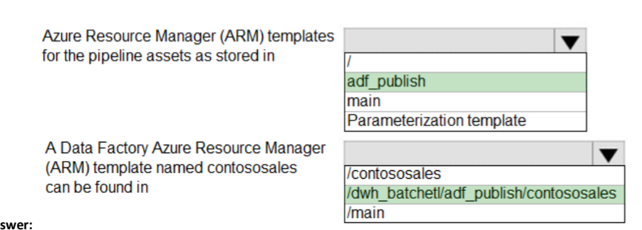

2. We have a SQL Server 2019 on an Azure virtual machine containing an SSISDB database. We find that all the Microsoft SSIS packages fail to run on the virtual machine. We should perform the following actions to resolve the issue:
- 2.1: Attach the SSISDB database
- 2.2: Turn on the TRUSTWORTHY property and CLR property: This is done because here the SSISDB catalog was never created and we need to enable CLR.
- 2.3: Open the master key for the SSISDB database. 
- 2.4: Encrypt a copy of the master key by using the service master key.

3. For a table which has 6 billion rows and is loaded nightly using a batch process, if we need to provide the greatest reduction in space for the database and maximize performance, we need to use columnstore archival compression. For columnstore tables and indexes, columnstore compression is enabled by default and is not configurable. We can further use columnstore archival compression to further reduce the data size if we can afford extra CPU resources to store and retrieve data.
4. If we have a SQL Server 2019 database and we need to migrate it to Azure SQL database, remove or replace its Polybase feature as this could create errors during migration and is not supported by Azure SQL Database
5. To migrate an SQL Server 2019 database which resides on premise in a datacenter, to a SQL Database MI, use Azure Database Migration Service as we can do online and offline migration using it and thereby, reduce downtime and dataloss during the migration.
6. To migrate an onprem database residing on a server to an Azure SQL MI, using Azure Database Migration Service, we need Full and Log Backup WITH CHECKSUM option enabled.
7. If we need to a database from a particular resource group to another resource group and have the same configuration and settings as the original resource group we need to do the following:
- 7.1: From the Azure Portal, export the ARM template
- 7.2: Change the server name and related variables in the templates
- 7.3: From the Azure portal, deploy the templates
- 7.4: From the database project, deploy the database schema and permissions

8. If we have an Azure Synapse Analytics dedicated SQL pool named Pool 1 and Azure Data Lake Storage Gen 2 account named Account 1 and we need to access the files in Account 1 using an external table, then to create an external data source in Pool 1, we can use the following code: 
- 

9. If we plan to develop a dataset named Purchases by using Azure Databricks and we need to support hourly incremental load pipelines that will vary for each Store ID, we need to use the following code: 
- 
10. If we design a streaming data solution that will ingest variable volume of data and if we need to change the partition count after creation, we can use Azure Event Hubs Dedicated. In Event Hubs, the partition count is fixed from 1-32, but it can changed in the Dedicated tier.
11. If we are building a database in an Azure Synapse Analytics serverless SQL pool, and we have data stored in Parquet files in an Azure Data Lake Storage Gen2 container, and we need to build a table that contains only the address fields use the following T-SQL code: 
- 
12. Lets say we have an Azure Synapse Analytics Apache Spark Pool named Pool1 and we plan to load JSON files from an Azure Data Lake Storage Gen2 container into tables in POOL 1, we should load the data by using PySpark.
13. If we have a date dimension table in an Azure Synapse Analytics dedicated SQL ppol, the date dimension table will be used by all fact tables, to minimize data movement, use the REPLICATION distribution type. 
14. From a website analytics system, you receive data extracts about user interactions such as downloads, link clicks, form submissions, and video plays. If we need to design a star schema to support analytics queries on data, we need to do the following: 
- 
15. if we plan to create a table in an Azure Synapse Analytics dedicated SQL pool and the Data in the table will be retained for five years. Once a year, data that is older than five years will be deleted. You need to ensure that the data is distributed evenly across partitions. The solutions must minimize the amount of time required to delete old data. We will need to partition by OrderDateKey and Distribution must be a HASH of the product Key
- 
16. If we have an Azure Synapse Analytics workspace named WS1 that contains an Apache Spark pool named Pool1. You plan to create a database named DB1 in Pool1.
You need to ensure that when tables are created in DB1, the tables are available automatically as external tables to the built-in serverless SQL pool. The format to use for tables in DB1 is **Parquet**
17. If we are designing an anomaly detection solution for streaming data from an Azure IoT hub. The solution must meet the following requirements:
- Send the output to an Azure Synapse. 
- Identify spikes and dips in time series data.
-  Minimize development and configuration effort.
- For this purpose we can use Azure Stream Analytics
18. If we are creating a new notebook in Azure Databricks, that will support R as the primary language but also support Scala and SQL, we can use the following syntax to switch between languages: %<language> or %scala or %sql
19. If we are creating a managed data warehouse solution on Microsoft Azure. You must use PolyBase to retrieve data from Azure Blob storage that resides in parquet format and load the data into a large table called FactSalesOrderDetails.
You need to configure Azure Synapse Analytics to receive the data. Do the following steps: 
- 
20. We configure version control for Azure Data Factory instance as follows: 
- 
- 
21. If we plan to build a structured streaming solution in Azure Databricks. The solution will count new events in five minute intervals and report only events that arrive during the interval. The output will be sent to a Delta Lake table. In this case the Output mode should be **Append**
22. 
Answer is :  
23. If we have a SQL pool in Azure Synapse that contains a table named dbo.Customers. The table contains a column name Email.
You need to prevent nonadministrative users from seeing the full email addresses in the Email column. The users must see values in a format of aXXX@XXXX.com instead. For this we need to set a MASK on the Email Column from the Azure Portal
24. If we have an Azure Databricks workspace named workspace1 in the Standard pricing tier. Workspace1 contains an all-purpose cluster named cluster1.
You need to reduce the time it takes for cluster1 to start and scale up. This can be done by creating a pool in Workspace 1. 
25. If we have an Azure Synapse Analytics dedicated SQL pool that contains a table named Table1. You have files that are ingested and loaded into an Azure Data Lake Storage Gen2 container named container1. You plan to insert data from the files into Table1 and transform the data. Each row of data in the files will produce one row in the serving layer of Table1.
You need to ensure that when the source data files are loaded to container1, the DateTime is stored as an additional column in Table1.
For this we can use a GET METADATA activity that retrieves the datetime of the files.
26. Similar to above, if we use an Azure Synapse Analytics serverless pool to create an external table that has an additional DateTime column, then our goal is NOT met.
27. Similar to above, if we use a dedicated SQL pool to create an external table that has an additional DateTime column, then our goal is NOT met.
28. 
- Above since we havent configured Auto-Pause, so no extra time is required to resume operations for new activities. Also such a configuration reduces the cost for intermittent and unpredictable usage patterns.
29. If we have a webapp hosted on an Azure VNet and Azure SQL Server is assigned a private IP address and the Azure Sql server needs to allow connections from a specific virtual network only, then we should use Azure Private Link or Azure Private Endpoint.
30. If we need to auto-scale the Azure Sql database to the following configuration during peak times, then we need to use the Business Critical Service Tier
- 24 cores
- 500 GB of storage
- 124 GB of memory
- More than 50,000 IOPS

31. If we have an Azure subscription. You need to deploy an Azure SQL resource that will support cross database queries by using an Azure Resource Manager (ARM) template.
- 

32. If we have the following ARM template:
- 
- In this case we need to use the following:
- 

33. If we have an on-premises Microsoft SQL Server 2019 instance that hosts a database named DB1. You plan to perform an online migration of DB1 to an Azure SQL managed instance by using the Azure Database Migration Service.
You need to create a backup of DB1 that is accessible to the Azure Database Migration Service. We can run the backup and store it like this
- 

34. If we plan to deploy an Azure SQL database by using ARM template we can use the following:
- 

35. If we have an on-premises Microsoft SQL Server 2019 server that hosts a database named DB1.
You have an Azure subscription that contains an Azure SQL managed instance named SQLMI1 and a virtual network named VNET1. SQLMI1 resides on VNET1.
The on-premises network connects to VNET1 by using an ExpressRoute connection. You plan to migrate DB1 to SQLMI1 by using Azure Database Migration Service. You need to configure VNET1 to support the migration, For this we will configure the **NSG** of VNET1.

36. If we have an on-premises Microsoft SQL server that uses the FileTables and Filestream features.
You plan to migrate to Azure SQL. For this we will make use of SQL Server on Azure VM.

37. If we need to migrate an on-premises Microsoft SQL Server database to Azure SQL Database. The solution must minimize downtime, For this we can configure transactional replication

38. If we have a table name Table1 that has 20 columns of type CHAR(400). Row compression for Table1 is enabled. During a database audit, you discover that none of the fields contain more than 150 characters.
You need to ensure that you can apply page compression to Table1. For this we can change column type to **VARCHAR(200)**

39. If we have an on-premises Microsoft SQL Server named SQL1 that hosts five databases.
You need to migrate the databases to an Azure SQL managed instance. The solution must minimize downtime and prevent data loss. For this we can use **Backup and Restore**

40. If we have have an Azure subscription that contains an Azure SQL database. The database contains a table named tablet that uses partitioned columnstores.
You need to configure table1 to meet the following requirements:
- Each partition must be compressed. 
- The compression ratio must be maximized. 
- You must be able to index the compressed data.

Here we can make use of columnstore archival compression.

41. If we have an Azure subscription linked to an Azure Active Directory (Azure AD) tenant. The subscription contains 10 virtual machines that run Windows Server 2019 and host Microsoft SQL Server 2019 instances. We need to ensure that you can manage the SQL Server instances by using a single user account. For this we can Deploy an Azure Active Directory Domain Services(Azure AD DS) domain and join the virtual machines to the domain.

42. If we have an Azure subscription and we plan to deploy a new Azure virtual machine that will host a Microsoft SQL Server instance. We need to configure the disks on the virtual machine. The solution must meet the following requirements:
- Minimize latency for transaction logs.
- Minimize the impact on IO throughput of the virtual machine.
- For this we can use 

43. If we have an Azure SQL Database elastic pool that contains 10 databases.
You receive the following alert.
Msg 1132, Level 16, state 1, Line 1 The elastic pool has reached its storage limit. The storage used for the elastic pool cannot exceed (76800) MBs.
You need to resolve the alert. The solution must minimize administrative effort.
For this we can Increase the maximum storage of the pool, enable data compression and shrink the individual databases.

44. If we need to deploy a new Azure SQL database by using Azure Command-Line Interface (CLI), we need the name, resource group and server name.
45. If we plan to migrate 10 on-premises Microsoft SQL Server instances to Azure.
You need to ensure that the migrated environment can be managed by using multiserver administration and supports master/target (MSX/TSX) jobs. The SQL deployment options to be selected as the master server(MSX) and target server(TSX) should be :
- 

46. If we have two on-premises Microsoft SQL Server 2019 instances named SQL1 and SQL2.
You need to migrate the databases hosted on SQL1 to Azure. The solution must meet the following requirements:
• The service that hosts the migrated databases must be able to communicate with SQL2 by using linked server connections.
• Administrative effort must be minimized.
- For this to host the database, we can make use of **Azure SQL Managed Instances**.

47. If we have an on-premises Microsoft SQL Server 2016 instance that hosts a database named db1. You have an Azure subscription that contains an Azure SQL managed instance named MI1.
You plan to perform an online migration of db1 to MI1 by using Azure Database Migration Service.
You need to create the backups for the migration. The solution must minimize the number of backup files created. For this we should have the following backup types and store it accordingly:
- 

48. If we have a SQL Server on Azure Virtual Machines instance named SQLVM1 that was deployed by using an Azure Marketplace SQL Server 2019 Enterprise image.
You need to change the Microsoft SQL Server instance on SQLVM1 to the Standard edition. The solution must ensure licensing compliance. For this, from the SQL VM1, We need to **uninstall the SQL Server Instance**

49. If we have on-premises network contains a Microsoft SQL Server 2016 server that hosts a database named db1.
You have an Azure subscription.
You plan to migrate db1 to an Azure SQL managed instance.
You need to create the SQL managed instance. The solution must minimize the disk latency of the instance. To minimize Disk Latency, we can make use of the **Business Critical** Service Tier.

50. If we need to deploy an Azure SQL database. The solution must meet the following requirements:
- Dynamically scale CPU resources. 
- Ensure that the database can be paused to reduce costs.
- For this we can make use of the serverless compute tier.
