# Azure Data Administrator Course (DP-300)
- We will manage on-prem and cloud relational databases
- 
- Basic SQL Queries can be identified as 
```sql
SELECT CountryRegion,Count(*) 
FROM SalesLT.Address
Where ModifiedDate < '2010-01-01'
Group by CountryRegion
Having Count(*) > 100
order by CountryRegion DESC

select * from SalesLT.SalesOrderDetail
select * from SalesLT.SalesOrderHeader

select SoH.SalesOrderID, OrderDate, OrderQty
from SalesLT.SalesOrderDetail SoD
JOIN SalesLT.SalesOrderHeader SoH
ON SoD.SalesOrderID = SoH.SalesOrderID

```

### Optimizing Query Performance
- Understanding Execution Plans
- There are 3 different types of execution plans
- First is an estimator plan: Here computer takes a look at the query angles
- 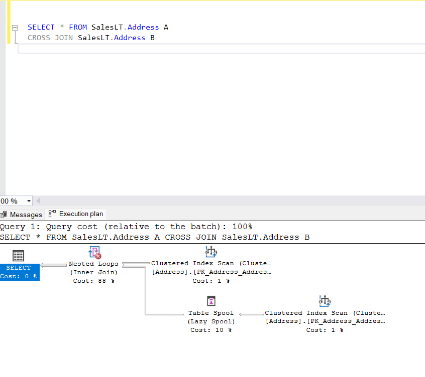
- Actual Execution Plan
- 
- To view the execution plan use these queries
```sql

SET SHOWPLAN_ALL ON
GO

```
- 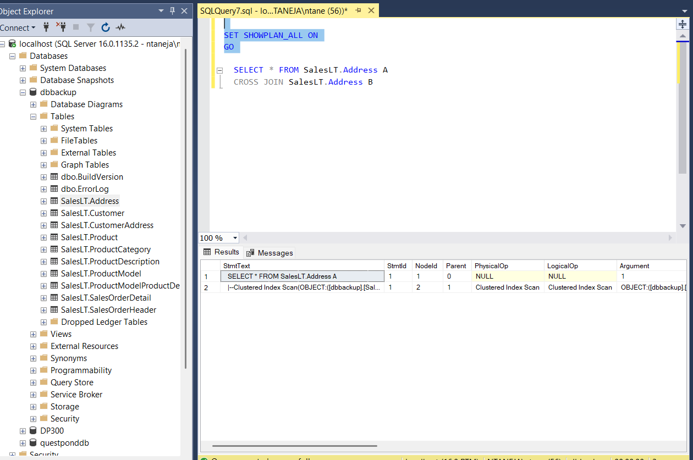
- We can see live query statistics also
- 
- So the 3 types of execution plans are estimated execution plan, actual execution plan and live query statistics

### Different Types of loops used in execution plans and Scan and Seek
- We have 2 kinds of indexes
- Clustered and Non Clustered
- A clustered index would mean that the table would get reshaped for that particular index. All the roles would be sorted in that order.
- Non-clustered index is just maintained separately.
```sql
CREATE NONCLUSTERED INDEX [IX_Address_City] ON [SalesLT].[Address]
(
[CITY] ASC
)
GO
```
- 
- Now when we run the estimated execution plan, we can see now we do an Index Seek over the IX_Address_City that we just created
- Also, **Nested Loop joins** are very efficient. They are used when we have 2 inputs: Input One and Input Two
- Input One is generally small
- Input Two is potentially large
- Advantages of nested loops, it uses the least I/O, that's input/output, and the fewest comparisons.
- Next is a **Merge Join**. This is useful when Input One and Input Two are not small
- It also requires Input One and Input Two to be sorted on their joins
- Merge Joins are very fast
- What happens if Index is not there?
- 
- In this case there are no indexes on SalesOrderHeaderCopy and SalesOrderDetailCopy
- So as we can see in the execution plan, we use a **Hash Match JOIN**
- This is the least preferred join. It is used for large unsorted, unindexed inputs
- So we have 3 main types of JOINS: Nested Loop, Merge and Hash Joins in that order

#### Seek and Scan
- Scan is like going through a book from page 1 onwards.
- Seek is like going to an index at the back of the book
- In Sql Server 2017 onwards, we have a new batch mode adaptive join introduced
- It converts into a hash join or nested loop join once first input has been scanned.

#### All of this helps us to identify problem areas in Execution Plans

### Identifying Problem Areas in Execution Plans
```sql
SELECT * FROM SalesLT.Address
where City = 'Bothell'
```
- Do we need all the columns?
- Instead of Index Scan we should use Index Seek
- SELECT * uses a clustered index scan
- 
- Since we now have an index on Modified Date and City
- It should do a Index seek right?
- But no, it still does a scan
- We can make it do an Index Seek by introducing a Where Statement
- 
- 
- 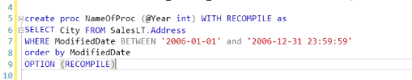
- The RECOMPILE keyword in SQL Server, when used with stored procedures, instructs the SQL Server query optimizer to discard the existing execution plan for the stored procedure and generate a new one the next time the procedure is executed. This can be useful in specific scenarios where the cached execution plan may not be optimal due to changes in data, schema, or query parameters.
```sql
CREATE PROCEDURE dbo.MyStoredProcedure
    @Parameter1 INT
WITH RECOMPILE
AS
BEGIN
    SELECT * FROM MyTable WHERE Column1 = @Parameter1;
END
```
- In this case, SQL Server will not cache the execution plan, and a fresh plan is created for each execution.
- You can use the RECOMPILE option when executing a stored procedure to generate a new execution plan for that specific execution only, without affecting the cached plan for future executions.
```sql
EXEC dbo.MyStoredProcedure @Parameter1 = 123 WITH RECOMPILE;
```
- In SQL Server, SARGable predicates (Search Argument-able predicates) are conditions in a query's WHERE clause or JOIN criteria that can effectively utilize indexes to optimize query performance.
- The term "SARGable" refers to predicates that allow the SQL Server query optimizer to perform an index seek or range scan rather than a full table scan or index scan, resulting in faster query execution.
- A predicate is SARGable if it can be directly matched to an index key, enabling the database engine to narrow down the rows to be processed efficiently. Conversely, non-SARGable predicates often force SQL Server to scan more data, degrading performance.
- Your choice of "LIKE" is correct because when used with a wildcard at the end (e.g., "HI%"), it allows the database to efficiently use indexes, making the query SARGable and faster.

## Evaluate Performance Improvements

### Identifying and Implementing Index Changes for Queries
- Indexes allow us to not go through the entire table and seek a particular point
- Requirement for an index: BIG Table
- We should use columns for indexes which are usually in the 'WHERE' clause
- Also the columns should be SARGable like less than, greater than or LIKE 'HI%'
  ```sql
    CREATE CLUSTERED INDEX ix_Address_AddressLine1_AddressLine2 //index name
    ON [SalesLT].[Address](AddressLine1, AddressLine2) //index columns

  ```
- We can have only one clustered index per table
- This is usually the primary key
- When we create a primary key, we also create automatically, a clustered index.
- It re-sorts the table based on the index.
- So a heap is a table without a clustered index,once we have a clustered index, it gets re-sorted based on the index.
- Most of the time clustered indexes are unique, but we can create a non-unique clustered index as well.
- It is quite good for identity columns
- We can have only 1 clustered index per table because we cannot sort a table two different ways at the same time.
- But we can have as many number of non-clustered indexes as we want.
- It creates a separate index.
- If we insert, update, delete rows, then all indexes need to be adjusted.
- So too many indexes slow down our machine.
- We dont have to index the entire table.
- Filtered Indexes use the WHERE clause
- n SQL Server, a **filtered index** is a non-clustered index that includes only a subset of rows from a table, based on a defined filter predicate (a WHERE clause). Unlike a standard index that covers all rows in a table, a filtered index is optimized for queries that target a specific portion of the data, making it smaller, more efficient, and faster for certain operations. Filtered indexes are particularly useful for improving query performance, reducing storage, and minimizing maintenance overhead in scenarios where only a subset of data is frequently queried.
- In SQL Server, the **fill factor** is a setting that determines how full the leaf-level pages of an index (clustered or non-clustered) should be when the index is created or rebuilt. It is expressed as a percentage (0 to 100) and controls the amount of free space left on each leaf page to accommodate future data modifications, such as inserts or updates. Properly configuring the fill factor can optimize performance by balancing storage efficiency, index maintenance, and query performance.
- A fill factor of 100 means pages are filled completely, leaving no free space (maximizing storage but potentially increasing page splits).
- A fill factor of 70 means pages are filled to 70%, leaving 30% free space for future inserts or updates.
- A fill factor of 0 is equivalent to 100 for leaf pages but leaves minimal space in intermediate levels (rarely used).
- 
- We cant create indexes manually in Azure SQL Database
- Traditionally we store data inside a row store.
- In Sql server 2012, we got the column store.
- Column store stores each column separately and we combine them at the end
- This is useful in huge amount of database like Data Warehouse.
- Column Store storage compresses the data down.
- Column store is not the standard type of index.
- Column store indexes are available in most tiers of Azure SQL Database
- If we dont need an Index, we can always drop it.


### Use DMVs to improve query performance execution
- We will figure out how we can use Dynamic Management Views(DMVs) to gather query performance information
- 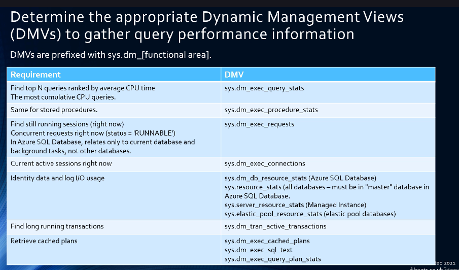
- DMVs are system views

### sys.dm_exec_cached_plans
- This can retrieve last execution plans in the cache
- 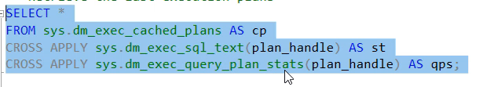
- 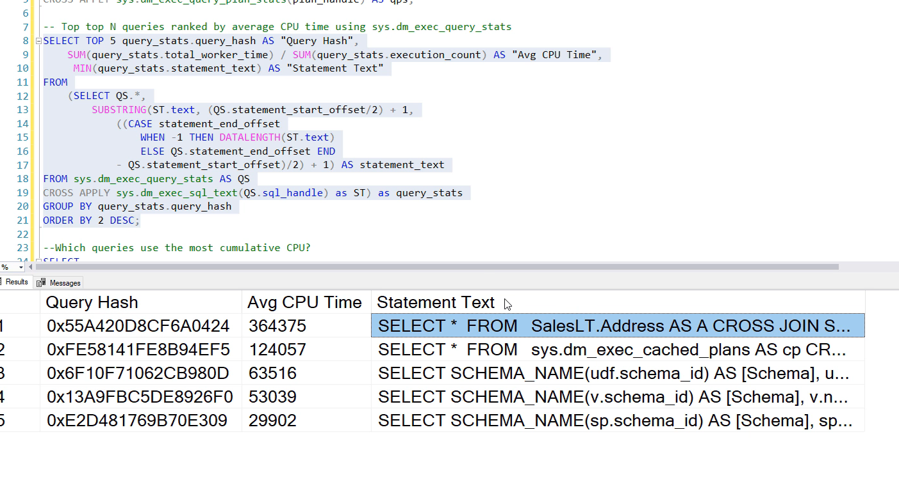
- It can show which queries is running the longest
- Whether we can improve the query by using indexes
- It can also answer questions like: Which used the most cumulative CPU
- DMV stands for Dynamic Management View. DMVs, along with Dynamic Management Functions (DMFs), are powerful tools introduced in SQL Server 2005 to provide insights into the internal state, performance, and health of a SQL Server instance. They are collectively referred to as Dynamic Management Objects (DMOs) and reside in the sys schema with names starting with dm_.
- DMVs and DMFs return server state information that database administrators (DBAs) and developers use to:
- Monitor Server Health
- Track resource usage (CPU, memory, disk I/O).
- Monitor active sessions, connections, and requests.
- Analyze wait types to identify bottlenecks.
- Identify slow or resource-intensive queries using DMVs like sys.dm_exec_query_stats.
- Detect blocking, deadlocks, or contention issues (e.g., sys.dm_tran_locks, sys.dm_os_waiting_tasks).
- Analyze query execution plans and optimize them.
- Identify unused or missing indexes (sys.dm_db_index_usage_stats, sys.dm_db_missing_index_details).
- In Azure SQL Database, DMVs like sys.dm_db_resource_stats help monitor resource usage, and sys.dm_continuous_copy_status tracks replication lag.
- DMVs provide real-time or near-real-time snapshots of SQL Server's internal state, unlike static catalog views that show metadata.
- 
- 


### How to decide which DMV to get the appropriate information
- 
- 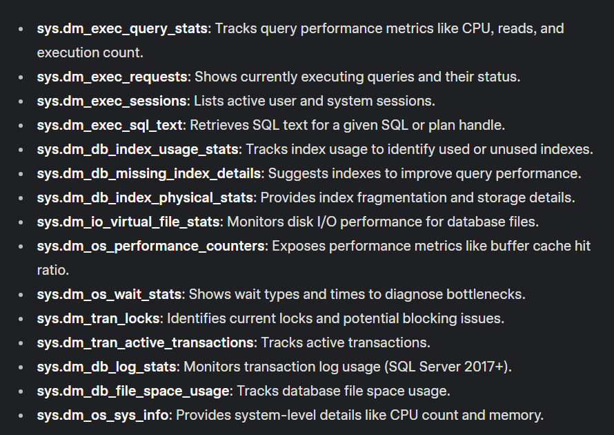
- 
- Get current session ID
```sql
select @@spid
```
- 
- 
- 
- 

### Recommend Query construct modifications based on resource usage
- 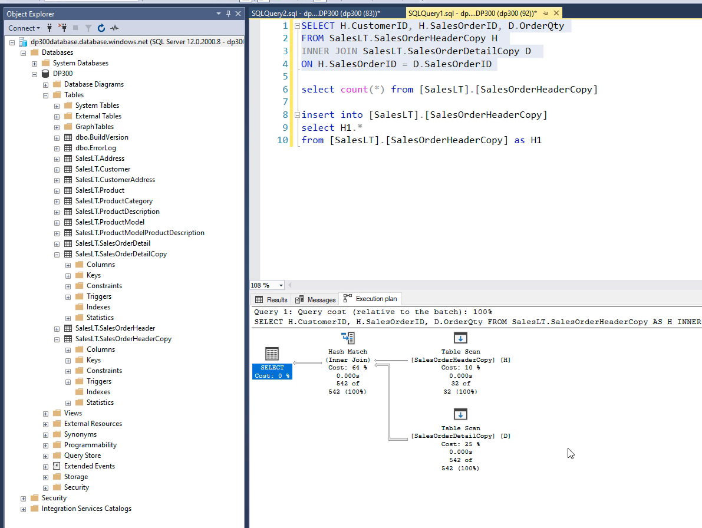
- Remember SalesHeaderCopy and SalesDetailCopy donot have any indexes
- SQL Server is not complaining about indexes not being there because there are only 32 rows in our database
- What if we had lot more rows?
- If we insert lot many rows and run the query and look at the execution plan we get this:
- 
- It is asking us to create a non-clustered index.
- It gives us the recommended query to use:
- 
- Now lets just run the query again after creating the index
- 
- Now we have an index scan
- This is one way of detecting missing indexes
- Can we do it for the entire database? i.e detect missing indexes
- Answer is YES, we need to use a DMV
```sql
select * from sys.dm_db_missing_index_details
```
- 
- 
- Biggest query construct modification we can think of is to create indexes whenever they are needed
- But dont create too many indexes, it slows the system if we are doing lot of INSERT/UPDATE/DELETEs as all indexes need to be updated
- We also need to use columns that are SARGable
- So we should not use functions when we can avoid it


### Assess the use of hints for query performance
- 
- Suppose, in the execution plan we see that we used a HASH MATCH. We probably want to use a MERGE JOIN.
- When we write the query, we can instruct SQL Server to use that, by using query hints using OPTION keyword
- 
- 
- But Microsoft recommends using Query Hints as a last resort.
- We can have LOOP joins also
- 
- We dont need to use it unless we have to.
- We can have multiple OPTIONs separated by a comma
- We can optimize stored procs like this
- 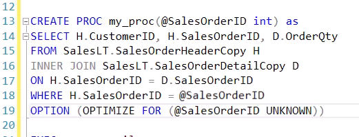
- Optimize for unknown is quite useful if you want the stored procedure to just optimize for a particular parameter with unknown value.
- 
- Most often SQL Server Query optimizer does a good job


## Plan and Implement Data Platform Resources

### Deploy Database Offerings on Selected Platforms
- 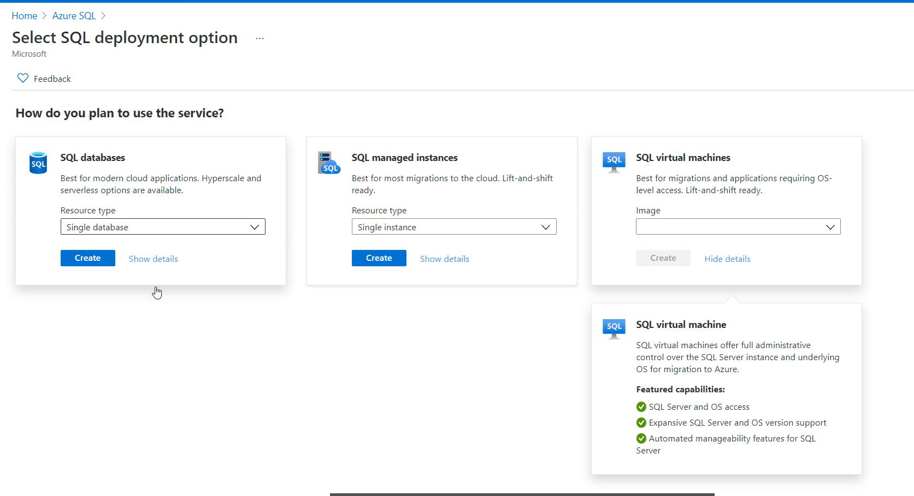
- 
- A managed instance is like having a fuller version of SQL Server on a cloud with a SQL Server that you can actually manipulate, though we cannot manipulate the Windows machine behind it.
- 
- We can also get SQL Virtual Machine with a Windows Server + SQL Server installed on it.
- In the Marketplace, we can also deploy SQL Server on different Operating Systems
- 
- 

### Configuring Customized Deployment Templates
- For any SQL Server, we can go and Export Template as ARM Template
- 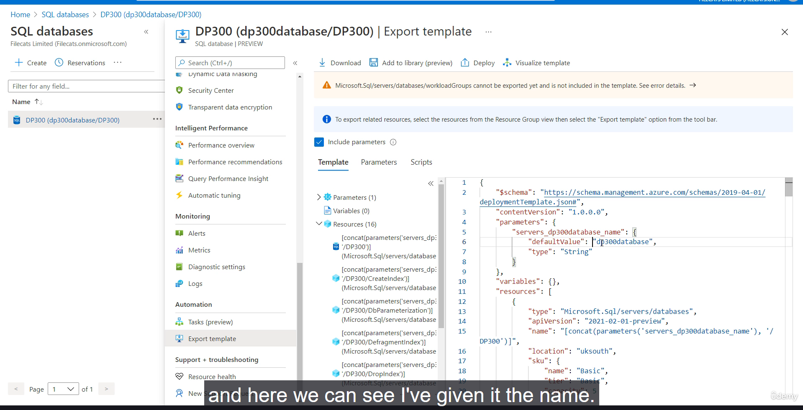
- If we create any resource, we generate it through an ARM Template.
- Remember "Download a template for automation"
- This allows us to build infrastructure as a code (IaC)
- For a resource group also we can export a template
- This way we can not only export a SQL Database but SQL Server also
- We can then deploy a custom template
- 
- We can also deploy through Azure Powershell
- 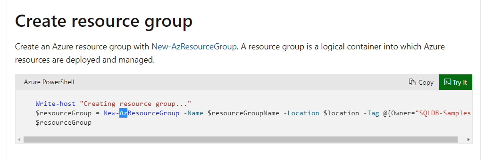
- 
- 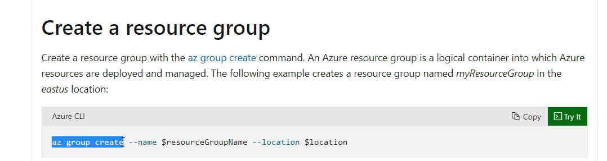
- We can also use Azure Pipelines
- We can use DACPAC( Data Tier Application - Portable Artefact )
- We will add this DACPAC to Azure-pipelines.yml
- We can also deploy databases using SQL Scripts
- If we have to create 100 databases, we can use ARM Templates
- For automated deployments, we can use Powershell, CLI, DACPAC in Azure Pipelines or if we have an existing template
- Usually, we export templates, make some adjustments and deploy a new database.

### Evaluate Requirements and functional benefits/impact for deployment
 - 
 - We can use SQL Agents in a Managed Instance and not on a SQL Database
 - T-SQL Syntax is not available in Azure Sql Database
 - Similarly trace flags are not supported in Azure SQL Database
 - Trace Flags are things which we startup in a server, since there is no server to startup, we dont have any control.
 - However, in Managed Instance, there are some trace flags that are supported
 - All trace flags are supported in virtual machines.
 - But in SQL Server VM, we have to manage backups and patches.
 - We dont have to do it in Managed Instance or SQL Database
 - 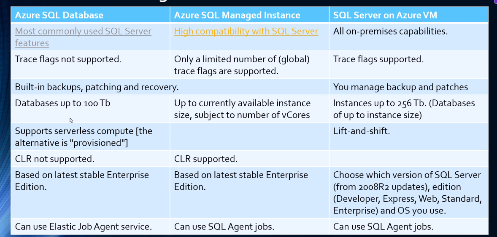
 - In Managed Instance, we can use CLR

### Evaluate Security and Scalability Aspects
- 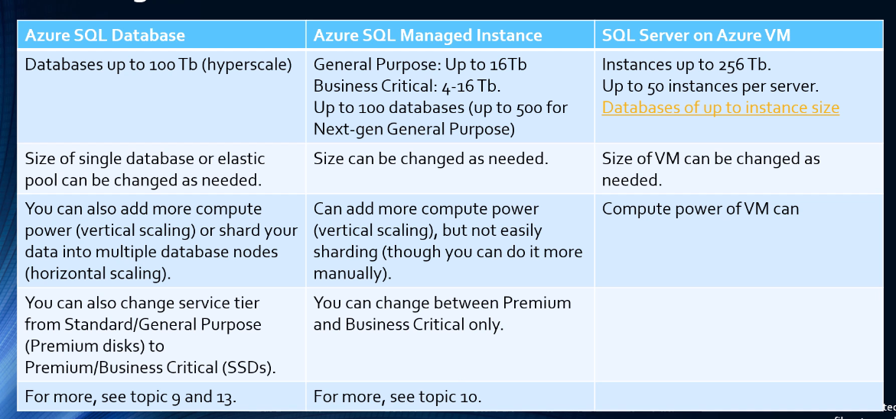
- 

### High Availability/Disaster Recovery of Possible Database Offerings
- 
- 
- 
- 

### Automate Deployment by using ARM Templates
- ARM Template is a JSON
- Go to Deploy a custom template
- 
- 
- 
- We can build our template in the editor
- We even have Quickstart templates
- 
- 
- 
- 
- 
- 
- We need to remember the types here for the resources: we have one type for the server and another for the database
- Notice the "dependsOn" field which is similar to dependsOn field in docker-compose
- This basically tells us that the database should be deployed only after server has been deployed
- 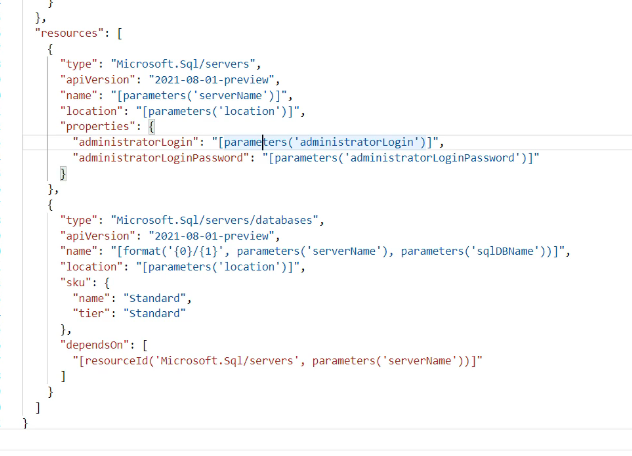
- 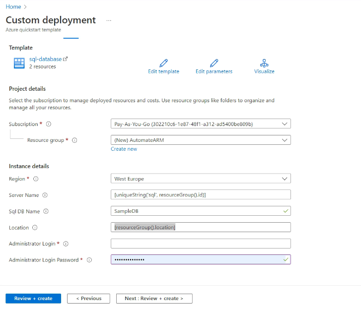
- 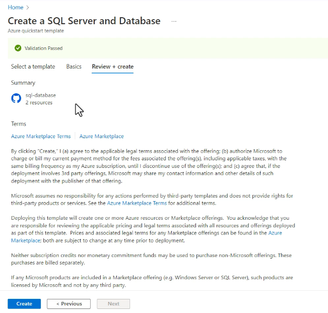
- Now it will create the server and database

### Automated Deployment by using Azure Bicep
- JSON requires lot of code to understand and it is unwieldy
- 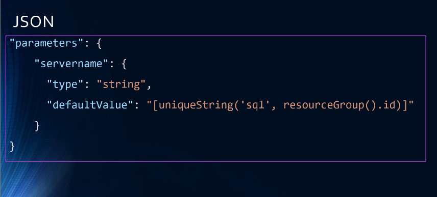
- So thats why Bicep was invented
- 
- Bicep is similar to C#
- We can deploy using Bicep only by using Azure Pipelines or Github Actions or VS Code
```bicep
@description('Specifies the location of the resource')
param location string = 'eastus'

resource sqlServer 'Microsoft.Sql/servers@2014-04-01' ={
  name: uniqueString('sqlserver', resourceGroup().id)
  location: location
  properties: {
    administratorLogin: 'sqladmin'
    administratorLoginPassword: 'P@ssword123'
}
}

resource sqlServerDatabase 'Microsoft.Sql/servers/databases@2014-04-01' = {
  parent: sqlServer
  name: 'AutomateBicep'
  location: location
  properties: {
    collation: 'SQL_Latin1_General_CP1_CI_AS'
    edition: 'Basic'
    maxSizeBytes: '1073741824'
    requestedServiceObjectiveName: 'Basic'
  }
}

```
- We also have Bicep Playground which converts Azure Bicep into ARM Templates
- 
- 
- 
- It will ask for signin, our subscription and then we can deploy it
- 
- 
- 
- Bicep is basically shorthand for ARM Templates, end of the day it is converted into ARM Template only.
- We can deploy it using Azure Pipelines, Github Actions, Azure CLI 

### Automate Deployment by using Powershell
- We first create a resource group
- 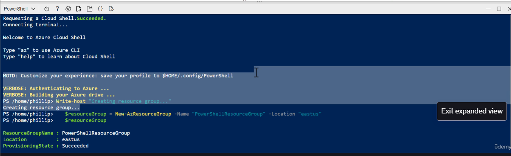
- Next we will create database server
- 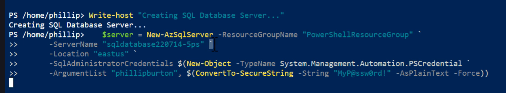
- 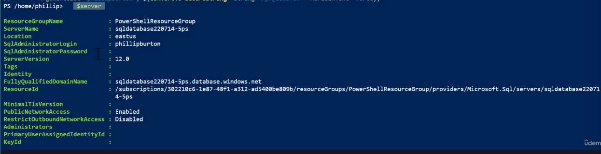
- 
- 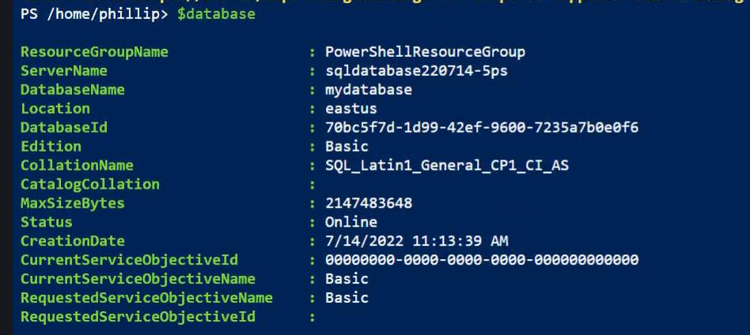
- 

### Automate Deployment using Azure CLI
- First create a resource group
- 
- 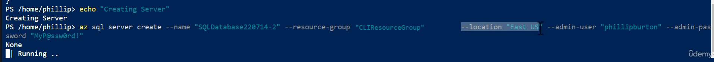
- 
- 
- 

### Configure Azure SQL Database resources for scale and performance
- We can create the following SQL databases:
- 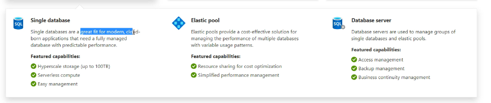
- Resource Group is just a container where all the resources for our project are
- 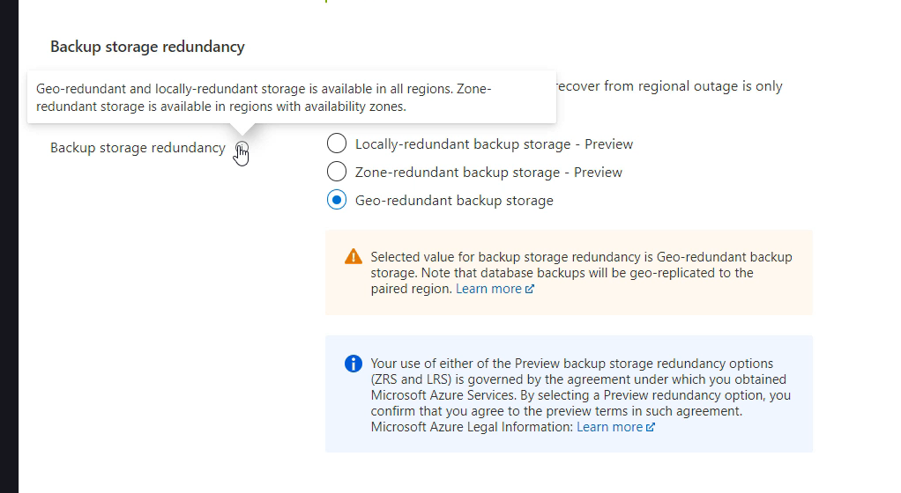
- 6 different tiers we can have
- 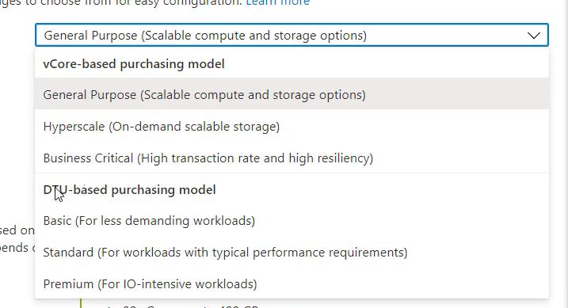
- In vCore based, we can specify the vCores and we can specify the speed and amount of storage. We can have 2-80 vCores.
- Cost goes up and down based on the number of vCores we have selected
- We also have a database maximum size
- 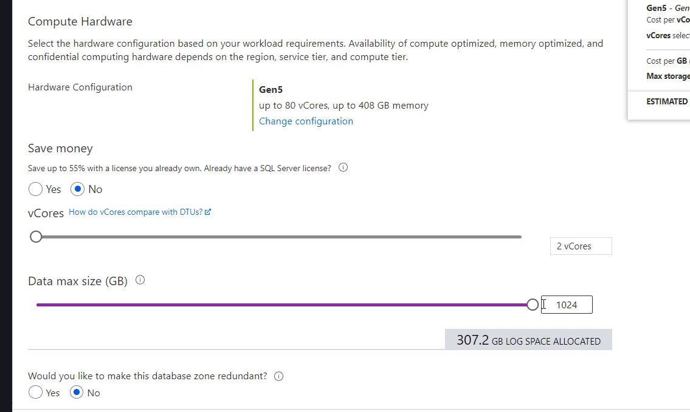
- The maximum size is partly dependent on the vCores. 
- It is also dependent on the hardware configuration. Standard Configuration nowadays is Gen5
- Amount of Log Space allocated is directly proportional to amount of data maximum size. It is approximately 30% of the data max size. 
- We also have difference in IOPS. That's input-output operations per second.
I-O-P-S, the concurrent workers number of requests that you can have and the backup retention as well.
- If we want more, we can go from General Purpose to Hyperscale, here we can go upto 100 terabytes and max number of vCores is 80
- Business Critical is when we need high transaction rate and high resiliency. 
- Cost also increases proportionally.
- Go for Hyperscale, when we need storage more than 4 Terabytes
- For business critical compute model, the IO latency is highly reduced.

### DTU based purchasing model, Server vs Serverless
- DTU: Database Transaction Units
- They are packages or bundles of maximum number of compute, memory and input/output or read and write resources for each class.
- 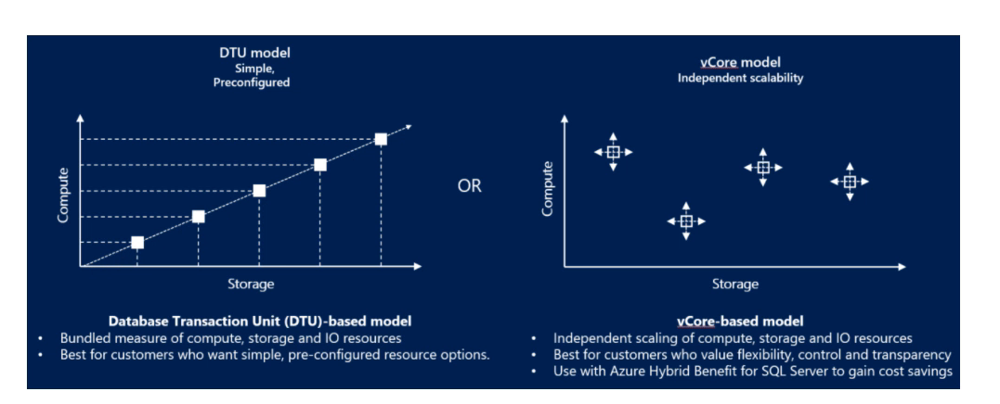
- 
- 
- Remember that Change Data Capture(CDC) cannot be used if we have less than 1 vCore.
- So, we cannot use it in S0,S1,S2 DTUs
- For more I/O intensive workloads, go for Premium DTU models
- 
- If we want to calculate how many DTUs we may need, there is a website:
- http://dtucalculator.azurewebsites.net
- We will have to run a few traces on our existing on-prem database and then it will give us a figure recommendation
- If we have DMV(Dynamic Management Views) for them to have accurate figures, we may need to flush our query store before we rescale and to do that we need to issue the command 
- 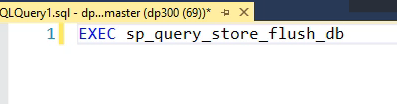
- 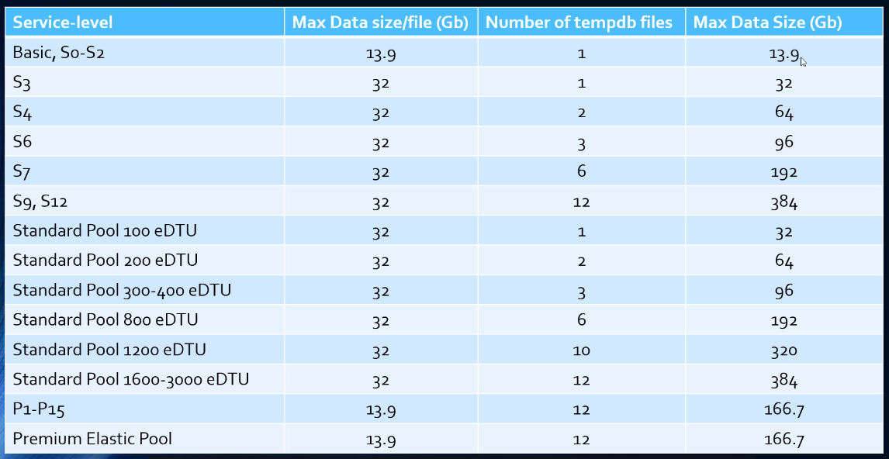

### Serverless/Provisioned and Elastic Pools
- 
- In Serverless, we are billed by the second
- After 1 hour of inactivity the database activity is stopped.
- 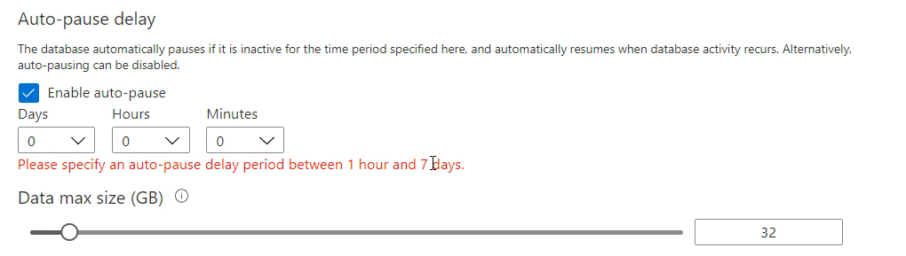
- In Provisioned, we have option to save money. If we have an existing SQL Server license, we can save on costs here.
- 
- **Azure SQL Database Elastic Pools** are a cost-effective and efficient solution for managing and scaling multiple databases with varying and unpredictable usage demands. They allow multiple databases to share a common set of resources (such as CPU, memory, and storage) on a single Azure SQL server, optimizing resource utilization and simplifying management.
- Elastic pools allocate a fixed set of resources, measured in either eDTUs (elastic Database Transaction Units) or vCores (virtual cores), depending on the purchasing model. **These resources are shared among all databases in the pool.**
- Databases can dynamically use more or less resources based on their workload, within configurable minimum and maximum limits, ensuring flexibility and performance elasticity.
- Instead of provisioning resources for each database individually, which can lead to over-provisioning or under-provisioning, elastic pools allow you to pay for a single pool's resources. This reduces costs, especially when databases have "spiky" or unpredictable usage patterns. For example, Microsoft notes that consolidating 20 databases into a 100 eDTU pool can use 20 times fewer DTUs and cut costs by up to 13 times compared to individual provisioning.
- Elastic pools are available in Basic, Standard, Premium, and Hyperscale tiers, each offering different performance and capacity levels. The tier determines the features and resource limits available to databases in the pool.
- 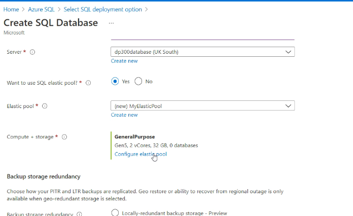
- 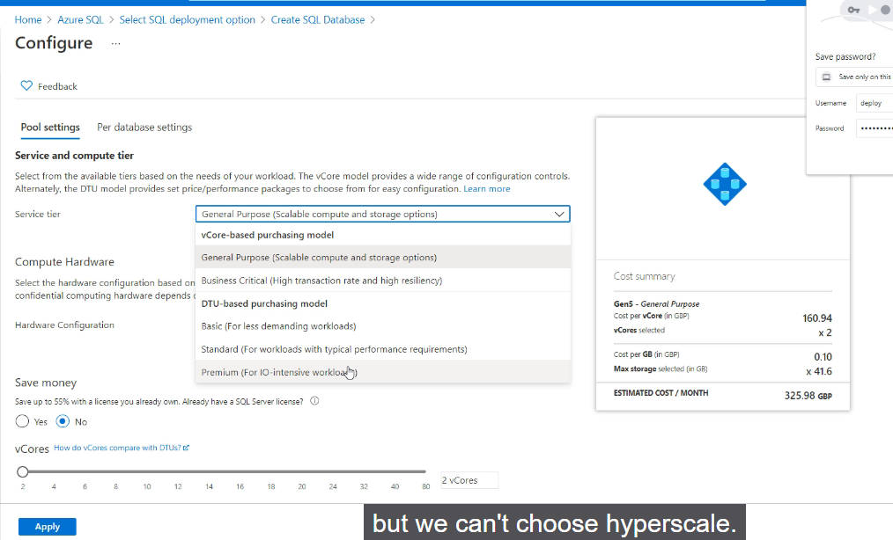
- In Elastic Pools, we cannot use Hyperscale option
- 
- Unit price for eDTUs is an extra 50%

### Other Azure SQL Configuration Settings
- 
- 
- 
- We can directly connect to Azure Sql Database or Azure SQL Database Gateway
- 
- We can setup Azure Defender for SQL 
- 
- 
- **Database collation** refers to a set of rules that define how data in a database is sorted, compared, and stored, particularly for character-based data such as strings.
- Collation determines:
- Case sensitivity: Whether uppercase and lowercase letters are treated as equal (e.g., 'A' vs. 'a').
- Accent sensitivity: Whether accented characters are distinct from their non-accented counterparts (e.g., 'é' vs. 'e').
- Sort order: How strings are ordered (e.g., alphabetical order, ignoring case, or respecting diacritics).
- Character encoding: How characters are represented in the database, ensuring proper storage and retrieval.
- In databases like Azure SQL Database, collation is set at the database level (default for all string columns) or at the column level (for specific columns). It applies to data types like CHAR, VARCHAR, NCHAR, and NVARCHAR.
- Collations are particularly important for:
- Ensuring consistent sorting and comparison in queries.
- Supporting multilingual applications where different languages have unique sorting rules.
- Handling case or accent sensitivity in searches or comparisons.
- A collation name typically includes:
- Language or locale: E.g., Latin1_General (Western European languages), SQL_Latin1_General_CP1 (SQL Server-specific).
- Code page: Defines the character encoding (e.g., CP1 for Code Page 1252).
- 
- For example:
- Latin1_General_CI_AS: Case-insensitive, accent-sensitive, used for Western European languages.
- SQL_Latin1_General_CP1_CS_AS: Case-sensitive, accent-sensitive, SQL Server-specific.

### Calculate Resource Requirements including Elastic Pool Requirements
- There are 2 kinds of purchasing model: vCore based model and DTU based model
- 
- DTU is bundle of compute, storage and IO resources
- vCore based model is transparent and is more flexible
- In DTU based model, it is very difficult to figure out how many DTUs we need
- We should also take a look at avg DTU utilization * number of databases
- Also take a look at the concurrently peaking databases multiplied by the peak DTU utilization per database
- Do our databases peak at the same time? If yes, pool is not recommended for us.
- If they peak at different times, think whether we can use level it out better using an elastic pool 
- But remember eDTU for elastic pools are more expensive than regular DTUs
- Also we cannot have elastic pools with the hyperscale model
- 
- 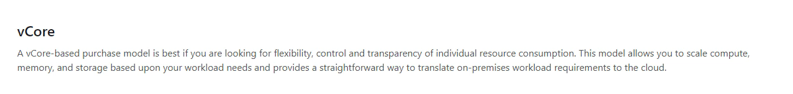
- 

### Database Sharding and Table Partitioning
- 
- Maximum database capacity can easily be exceeded in a database
- What if our computing resources are exceeded?
- We can have horizontal scaling and horizontal scaling
- 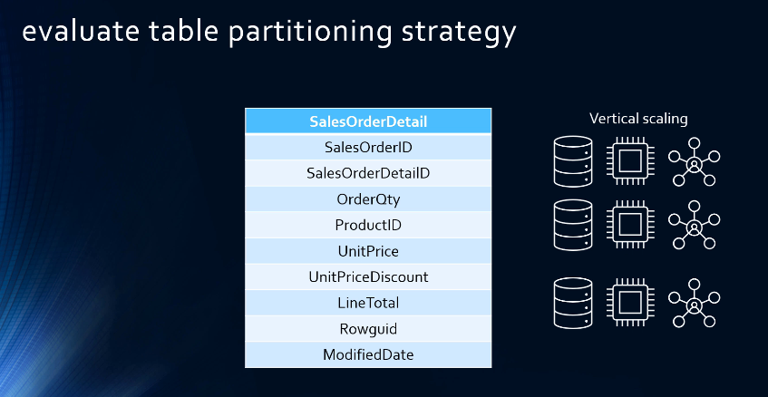
- We can divide our table
- 
- Backups for a particular partition are easier to do than the whole database
- What if data from 2015 fails, we wont be able to access it but we should be able to access data from other partition
- This is called **Sharding**
- For sharding we could have a lookup strategy. 
- We could have a table which has a shard key and a map which shows where they are stored. 
- This offers as much control as we need
- We could shard by month, year etc.
- It does have some additional overhead.
- What if we are in a seasonal industry
- Data for June is more than Data for July
- We could follow a hash strategy also where there is some random element for distribution and somehow ensure even distribution among the shards
- Rebalancing shards is difficult
- Getting sequential data might be tougher
- We can also have range strategy as described earlier
- We can also have filegroups
- Filegroups cant be used in Azure SQL Database
- In Filegroups we add additional files or data files and put them into filegroups and create a partition function.
- 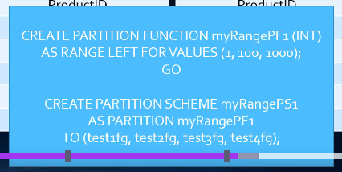
- So if we have a Sales Order Detail ID, if the value is one or less, it goes into first file, if it is 100 or less, it goes in the second file, etc
- Partition Function is what goes and Partition Scheme is where it goes
- This is called a table partition
- We can also split the table up
- 
- Each partition is a subset of the columns
- Not the best strategy
- We also need a way to join all the partitions
- 
- We can have different tables in different databases
- In Vertical partitioning, we can scale vertically to add more compute power
- We should keep data geographically close to the user
- We should also consider archiving the data
- This means we keep the data offline and rehydrate it only when we need.

### Evaluate the use of compression for tables and indexes
- We compress so that we get reduced space
- It is useful for data which is infrequently used.
- 3 main types of compression: None, Row compression, Page compression
- Suppose we have a char(60) as opposed to a varchar
- So char 60 contains 60 spaces of data.
- So char and nchar will be compressed and we can get savings upto 50% in English/German and just 15% in case of Japanese
- So, it depends on what our language is
- Certain types of dates like datetime can be compressed.
- Row compression looks at what it can compress for each of the individual items
- Most of the compression related savings come from char and nchar.
- We also have **Page Compression**
- Page compression in Azure SQL Database is a data compression technique that reduces the storage footprint of database objects like tables and indexes, optimizing disk space and potentially improving query performance. It builds on row compression and includes additional strategies to minimize data redundancy within a page.
- Consists of 3 operations: 
- Row Compression: Optimizes individual rows by using variable-length storage for fixed-length data types (e.g., storing a CHAR(100) as a VARCHAR), eliminating storage for NULL or zero values, and reducing metadata overhead.
- Prefix Compression: Identifies common prefix patterns within each column on a page and stores them once in the compression information (CI) structure, just after the page header. Repeated prefixes in the column are replaced with references to this stored prefix, reducing redundancy. For example, if multiple rows in a column start with "abc", the prefix "abc" is stored once, and rows reference it with pointers or partial matches.
- 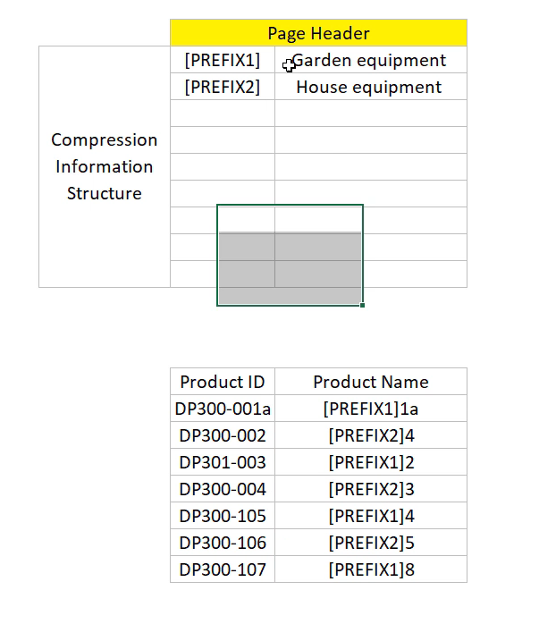
- Dictionary Compression: Searches for repeated values or patterns across the entire page (not just within a single column) and stores them in the CI structure. These repeated values are replaced with references, further reducing storage needs. For instance, a value like "xyz" appearing in multiple columns or rows on the page is stored once and referenced.
- When page compression is enabled, the SQL Server Database Engine evaluates each page during a rebuild operation. It applies row compression first, followed by prefix compression, and finally dictionary compression.
- Compressed data is stored on disk in fewer pages, reducing the physical size of the database. The compression is transparent to applications, as the Database Engine handles compression and decompression automatically.
- The CI(Compression Information) structure stores prefix and dictionary entries, which are used to reconstruct the original data during queries.
- Fewer pages mean fewer disk I/O operations, which can speed up query execution, particularly for I/O-intensive workloads like table scans or large joins
- In Azure SQL Database, smaller database sizes can lower storage costs, especially in environments with large datasets.
- Page compression is ideal for tables or indexes with high scan operations (e.g., data warehouse queries), as it reduces the number of pages read from disk.
- Compression and decompression require additional CPU resources, which can increase query execution time for write-heavy workloads (inserts, updates, deletes).
- This trade-off is less significant for read-heavy workloads, where I/O savings often outweigh CPU costs.
- Compression is available in Azure SQL Database and Azure SQL Managed Instance 
- Also for SQL Server on VM, it is available from SQL Server 2016 Service Pack 1 in all editions
- Before that it was only available in Enterprise Edition

#### What can we compress?
- We can compress tables
- Tables either stored without a clustered index or with it
- Tables without a clustered index are called heaps
- If a table has a column with less data then compression is not of much use.
- We can also compress indexes like a non clustered index
- We can also compress an indexed view.
- If we have a table with lot of partitions, then different partitions can be compressed using different settings.
- 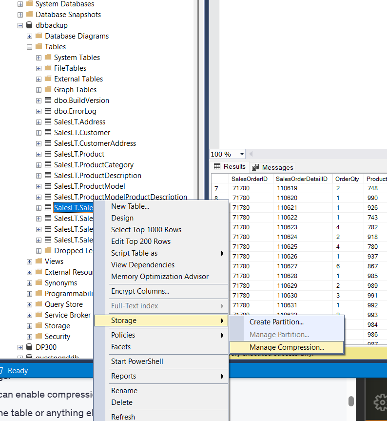
- 
- 
- 
```sql
USE [dbbackup]
ALTER TABLE [SalesLT].[SalesOrderDetail] REBUILD PARTITION = ALL
WITH
(DATA_COMPRESSION = PAGE
)


```
- Similar queries can be written for an index
- 
- We can also estimate data compression savings
- 
- We also have columnstore tables
- Columnstore table concentrates on individual columns and mashes them together whenever needed.
- Columnstore tables are used in data warehouses.
- Good thing about columnstore objects is that they are always compressed.
- They can be compressed further from columnstore compression by using columnstore archival compression. It saves even more space.
- However, this kind of compression is best when data is not often read but we want the data to be retained for regulatory or business reasons. Also it does save space, but there is a very high compute cost in uncompressing it.
- For Rowstore tables or our regular standard tables, we can choose from page, row or None compression
- Page compression further consists of Row, Prefix and Dictionary compression.

### Setup SQL Data Sync
- We can have 2 databases which are Azure SQL databases and another one which is on-prem SQL Database
- We can use **Azure SQL Data Sync** to synchronize data across multiple databases
- For this our tables need to have a primary key and we cant change the primary key.
- It doesnot work with Azure SQL Managed Instances
- We define one of the Azure SQL Databases as the Hub database and others are member databases
- If any change is made in any databases, it is replicated in all other databases
- 
- We will need some kind of conflict resolution
- We also need a database which will keep track of everything
- We can call it Sync Metadata Database or Sync Hub
- 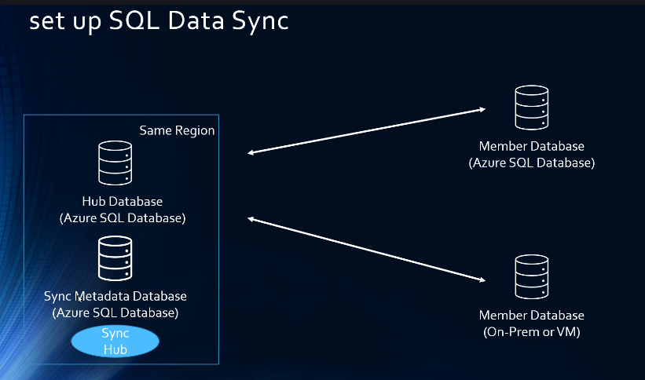
- It should be an empty database
- For member databases we need a Sync Agent
- 
- 
- Install the sync agent on on-prem databases
- 
- 
- 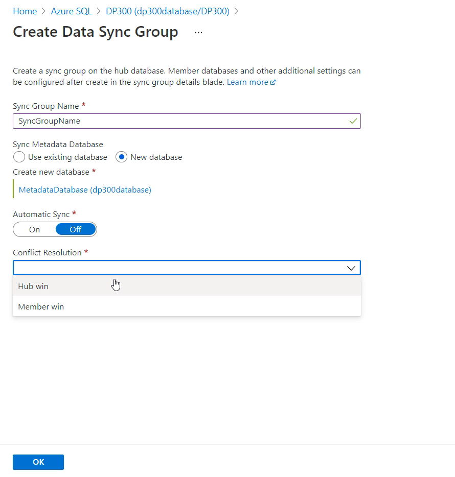
- 
- 
- 
- 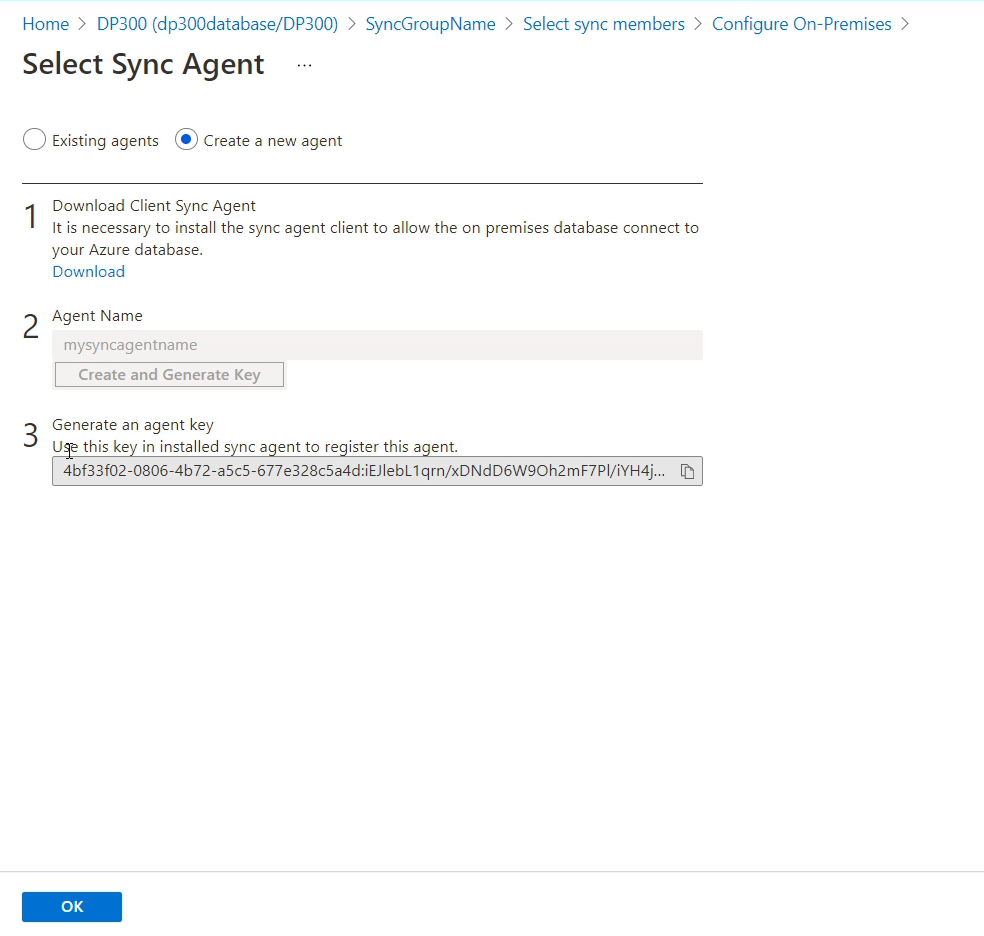
- Open the On prem database data sync agent
- 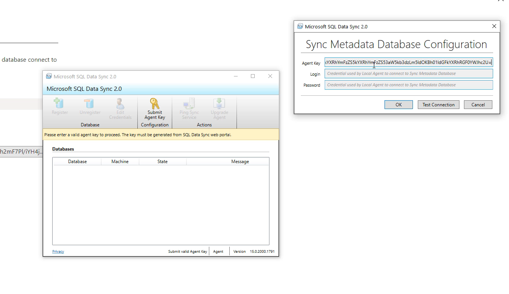
- 
- 
- 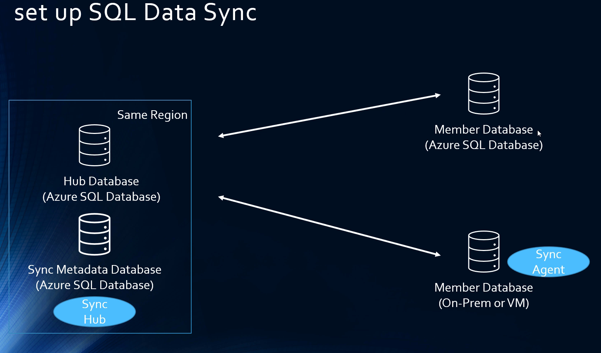

## Evaluate a strategy for Migrating to Azure
- 
- We need to consider if we need to allow downtime in migration
- 

### Azure Migrate
- 
- 
- 
- 
- 
- We have Azure Databox which helps send large amounts of data to Azure
- 
- 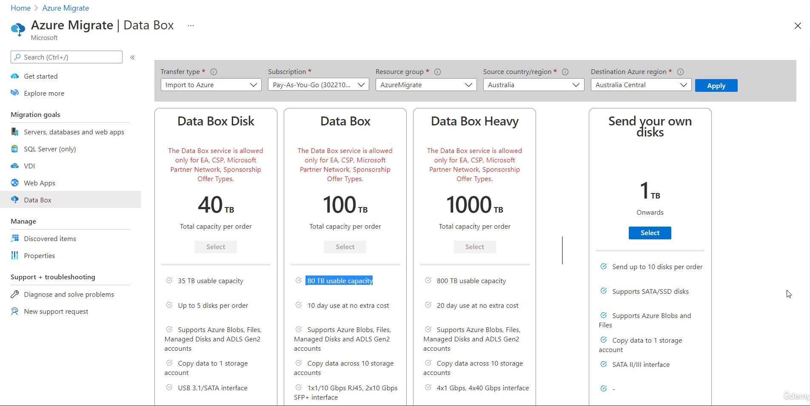

### SQL Server Migration Assistant
- 
- 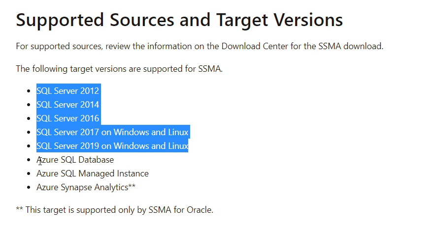
- 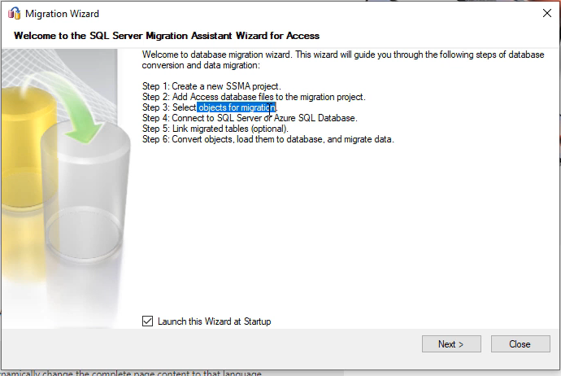
- 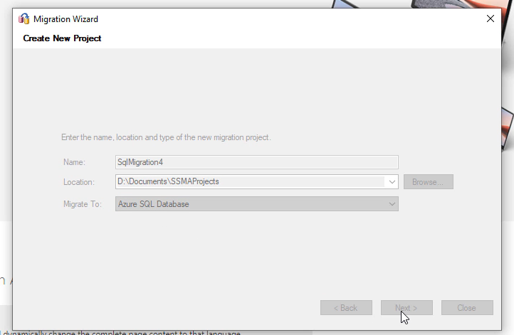
- 
- 
- 
- 
- 
- 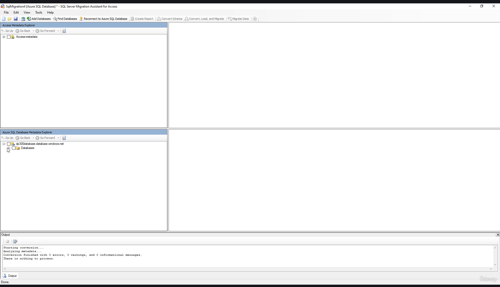

### Data Migration Assistant
- It helps us to upgrade to a modern data platform by detecting compatibility issues that can impact database functionality in our version of SQL Server or Azure SQL Database. DMA recommends performance and reliability improvements for our target environment and allows us to move schema and uncontained objects from source server to target server.
- **For larger migrations, we should use Azure Database Migration Service which can migrate databases at scale.**
- 
- 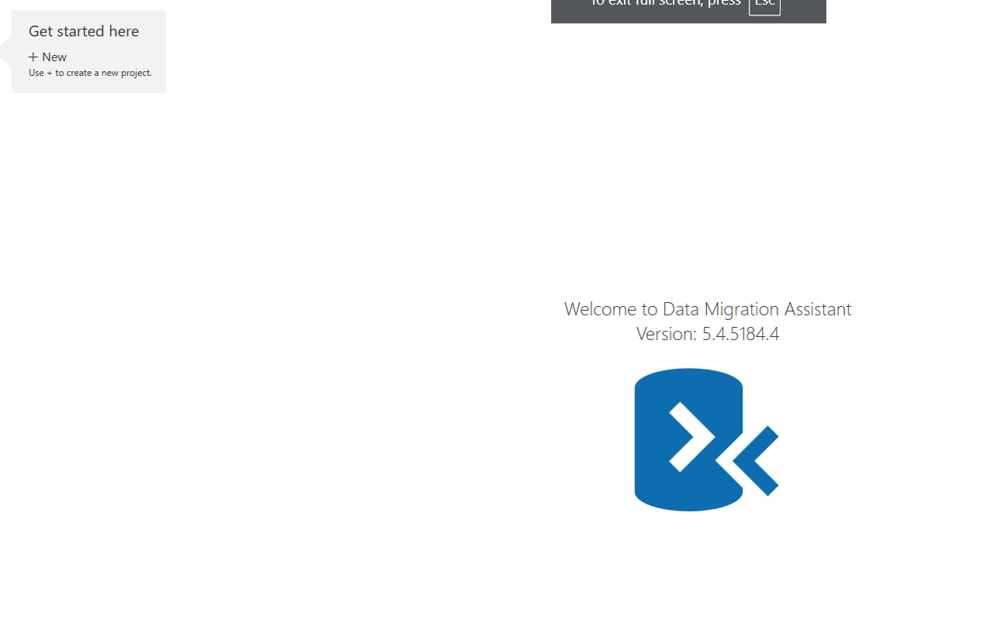
- 
- 
- 
- 
- 
- 
- 
- 
- 
- 
- 
- 
- 
- 
- 
- 
- 

### Azure Database Migration Service
- The Azure Database Migration Service (DMS) is a fully managed service provided by Microsoft Azure to facilitate seamless migrations of databases from various sources to Azure data platforms with minimal downtime.
- It supports both operational database and data warehouse migrations, enabling organizations to modernize their data infrastructure by moving on-premises or cloud-based databases to Azure.
- Azure DMS is designed to simplify, guide, and automate database migrations to Azure, supporting a variety of database engines and migration scenarios. It provides a unified platform to assess, plan, and execute migrations, ensuring reliability, performance, and minimal disruption to business operations. The service integrates with other Azure tools, such as Azure Migrate and Azure Data Studio, to offer a comprehensive migration experience.
- DMS enables organizations to move data, schemas, and database objects from on-premises environments, other clouds, or legacy systems to Azure’s managed database services, such as Azure SQL Database, Azure SQL Managed Instance, Azure Database for MySQL, PostgreSQL, and others.
- Supports both offline (one-time migration with downtime) and online (continuous replication with minimal downtime) migration modes.
- Supports a variety of database engines, including SQL Server, MySQL, PostgreSQL, Oracle, and MongoDB.
- 
- 
- 
- 
- Premium supports both online and offline migration
- 
- 
- 
- 
- 
- 
- There are other migration strategies also like BCP which is Bulk Copy Program that can be used for connecting from an on-prem or SQL Server on a Virtual Machine to Azure SQL.
- We could use the BULK INSERT Command so that we can log data from Azure Blob Storage
- We could use SSIS, that could be used for ETL
- We can also use Spark or Azure Data Factory
- For online migration strategy, use the premium pricing tier and allows continuous online migration or we could use Offline Migration for greater speed.

### Implement a Migration between Azure SQL Services
- If we are migrating from Azure SQL or Azure Managed Instance, we can open SQL Import and Export Wizard
- This wizard uses SQL Server Integration Services or SSIS.
- 
- 
- 
- 
- 
- SQL Server Integration Services (SSIS) is a Microsoft tool used to extract, transform, and load (ETL) data between different systems. It simplifies moving and processing data for tasks like data integration, migration, and automation.
- Extract Data: Pulls data from various sources, such as databases (e.g., SQL Server, Oracle), Excel files, CSV files, or APIs.
- Transform Data: Cleans, modifies, or reformats data to meet the needs of the destination system. Examples include filtering rows, converting data types, aggregating values, or joining datasets.
- Load Data: Transfers the transformed data into a target system, such as a database, data warehouse, or another file format.
- Data Migration: Move data from legacy systems to modern databases, like migrating to Azure SQL Database.
- Data Warehousing: Load data into data warehouses (e.g., Azure Synapse Analytics) for reporting and analytics.
- Data Integration: Combine data from multiple sources (e.g., merging sales data from CRM and ERP systems).
- Automation: Schedule and automate repetitive data tasks, like daily data imports or backups.
- Data Cleansing: Standardize and clean data to ensure accuracy (e.g., removing duplicates or fixing formats).
- 
- This export data can copy data but cannot be used to copy Views, Stored Procedures or Functions
- However it is quick and easy to do
- To overcome there drawbacks, we use **data tier applications** or BACPAC
- So now we export Data Tier Application, It allows us to export not just the data but also the schema
- 
- 
- 
- We can import these BACPAC files also
- 
- 
- 
- It imports data, views and stored procedures
- Much better way of exporting and importing data
- 
- 
- 
- Another way of importing and exporting data is through SQL packages
- 
- 
- 
- We can also use Azure Powershell or Azure CLI
- New-AzSqlDatabaseImport
- az sql db import
- Import Database in Azure Portal doesnot exist for Azure Managed Instance

### Performing Post Migration Validations
- We should have some tests
- We should use SQL queries against both source and target databases which should give similar results in the same timeframe. This will allow us to check if the indexes have been migrated or not
- For an on-prem database, we have something called compatibility level like 100,120,150,160,170
- If we are going from SQL Server 2012 to Sql Server 2014
- On Sql Server on Azure VM, we can choose compatibility level.
- So we may need confirm if the existing queries under the new compatibility level using the best plan?
- Is the performance worse?
- We can force the last known good plan using Auto-tuning.
- Do the stored procedures need to be recompiled?
- Always check for missing indexes
- Check for missing features or are there any new features in the new database that can used to our advantage.
- 

## Configuring Database Authentication and Authorization

### Configure Microsoft Entra ID Authentication
- Authentication is who you are and Authorization is what can you do
- 
- SQL Server Authentication is sent in plaintext and Azure Entra ID is more secure.
- Windows Server also has Windows Server Active Directory
- Azure Entra ID can synchronize with on prem Azure AD
- Azure Entra ID supports the following Authentication Methods:
- 
- It supports FIDO Security Key which is hardware based
- Microsoft Authenticator we use on our Mobile Phone
- It supports Text Messaging also besides temporary access pass.
- There are 3 kinds of authentication:
- Cloud Only Identities
- Federated Authentication
- Pass-Through Authentication
- Federated Authentication is used if we want to integrate with an existing federation provider i.e another app with login to Azure Active Directory.
- In Cloud Only Identities where Azure AD handles sign-in completely in the cloud.
- For all else, use Pass-through authentication
- On an Azure VM, we can use passwordless authentication. 
- We can also use Managed Identities
- We can create a certificate and App can connect to Azure Data using that.
- In SSMS, we can use MFA
- For new users we can set this up
- 

### Create Users from Microsoft Entra ID identities
- We can use this SQL Query
- 
- 
- 
- 
- In the SQL Server, go to Azure Entra ID and setup the Admin user before you can create other users
- 
- 
- 
- Once successfully signed in, we can create users from external provider
- 
- 
- Now we can create users and login in through those users to the Azure SQL Database
- This concludes our authentication part
- **What is the difference between SQL Server Admin and Azure Entra ID Admin**
- 
- Both of them can create users based on SQL Server authentication, both of them can create contained database users based on SQL Server authentication without logins.
- Only difference is Azure AD Admin can create users based on Active Directory users and groups

### Configure Security Principals - Roles
- In the above example, if we login as Azure Entra User, we cant see any tables
- 
- We need to add the user to the Roles
- 
- 
- Now we get access to all the tables in the database
- We can remove role like this
- 
- db_backupoperator is not valid for Azure SQL Database
- db_ddladmin can run data creation commands
- db_datareader can view all the data and the views but not insert any new rows
- db_datawriter can view and insert/update data in the rows in the tables
- db_denydatawriter means we cannot alter/change old data
- Similarly db_denydatareader means we cannot read old data
- What if we want to give access to one particular table
- In Azure SQL Database, we have 2 additional database roles
- These roles are not visible in the sql database but in the master database
- 
- dbmanager : you can create or delete databases
- loginmanager: can create or delete logins in the master database
- To get all roles
- 
- In Azure we also have RBAC
- 
- Suppose we want access to one particular table but not all of them
- We can use GRANT/REVOKE/DENY Keywords
- 
- 
- 
- To revoke permission on a particular table, use the REVOKE keyword
- 
- DENY means definitely NOT
- 
- DENY has higher privilege than GRANT
- 
- 
- To remove the DENY permission, use REVOKE keyword
- REVOKE means no permission
- 
- REVOKE doesnot override Roles like datareader,dbwriter and so on
- But DENY overrides roles like datareader, dbwriter etc.

### Configure Security Principals - Individual Permissions
- If we have to generalize individual permissions we can do it like this
- 
- However lets says a user JANE grants certain permissions to SUSAN, now we want SUSAN to delegate permissions to someone else, we then use **WITH GRANT OPTION**
- 
- MAIN Permissions are SELECT, INSERT, UPDATE, DELETE
- We also have CONTROL, REFERENCES, TAKE OWNERSHIP, VIEW CHANGE TRACKING, VIEW DEFINITION permissions
- For Schemas we have ALTER Permission with CREATE,ALTER, DROP TABLE
- For stored procs/functions we have ALTER, EXECUTE, VIEW CHANGE TRACKING, VIEW DEFINITION
- What happens if we have EXEC permission on a stored procedure but we dont have permission to Select something from the table? Will the stored proc run?
- Answer is Yes
- 
- When we go inside a stored procedure, we can read anything from the schema.
- This is called ownership chaining
- 

### ALL Permission in Security Principals
- ALL Permission would be deprecated. It is maintained for backwards compatibility
- ALL Permission for tables and views means that you can delete, insert, references, select, and update.
- But we dont have Take ownership.
- For procedures, then ALL Permission means execute.
- For scalar functions then ALL permission means execute and references.
- And for table valued functions ALL permission means delete, insert, references, select and update.
- ALL Permission for Database allows you access to backup database, backup log, create database, create function, create procedure, create rule, create table, and create view.
- Doesnot give access to ALTER and DROP Database
- 
- So ALL permission is a bit misleading
- We can create a stored procedure with EXECUTE AS permission of a certain user
- 
- To get permissions for a particular user/database/object we can use 
- 
- Remember DENY is higher than GRANT

### Configure Permissions by using Custom Roles
- It is not possible for us to keep granting, revoking permissions like this
- It is always better to package permissions together in a custom role.
- datareader,dbwriter are fixed database roles.
- Now we can create custom roles
- 
- We will now add user to a custom role
- 
- 
- 
- 
- 

### Apply Principal of Least Privilege for all securables
- Users should have the least privilege that is necessary for them to do their job.
The least privileged user account, LUA.
-  In other words, don't give people dbowner, when all they need is a single select grant, for instance. So have a think about the minimum that users need.
- You can use roles, custom roles, and also the fixed database roles.
- So you can assign permissions to the roles, and then assign users to the roles.
- This makes security administration much easier.
- DENY doesnot apply to Object Owners
- Dont put DENY in public roles
- Dont give direct rights to the underlying objects like tables, instead give access to Views
- Select Permission on a database would include all child schemas and all the tables and views.
- If we have select permission on a schema, it gives us select permission on all the tables and views
- If you give a select on a table, then that gives the select permission, on that one table only.
- Also please dont use ALL permission, use principle of least privilege.

## Implement Security for Data at Rest and Data in Transit
### Implement Transparent Data Encryption
- TDE encrypts and then it de-encrypts data at the page level at rest.
- So in other words, if you write data it's encrypted when written, and when you read data, it's decrypted.
- 
- TDE uses a database encryption key
- 
- 
- TDE key is set at server level and the databases inherit it
- At database level, we can set TDE ON or OFF
- 
- In SQL Managed Instance, we can set it using T-SQL statement
- 
- We can even set it in Powershell
- 
- We can also do it using REST API

### Implement Object-Level Encryption and Always Encrypted
- Let's say that you have got a table, which people need to have access to, but, it's also got sensitive data.
- We can encrypt it using Always Encrypted
- This is available in Azure SQL, Managed Instance and on VMs
- What about setting it on the table level?
- Lets say we have AddressLine1 and City as sensitive columns which we need to encrypt
- 
- 
- 
- Deterministic is predictable whereas randomized is less predictable
- Deterministic allows for equality joins, group by, indexes, and distinct.
- 
- We need to generate a column master key to encrypt the databases
- 
- Azure Key Vault is extremely secure
- Create a new Keyvault instance on Azure
- 
- Premium Keyvault supports HSM keys(Hardware Security Module)
- 
- To Encrypt and Decrypt using Column Master Key, we should have the above key permissions selected
- 
- 
- 
- 
- Log looks like this
- 
- Since we encrypted Address Line 1 and City it looks like this
- 
- 
- Notice that since we encrypted city deterministics, notice that the first 2 cities probably being the same, have the same encrypted value:
- 
- Hence, we can encrypt our database either deterministically or predictably like above case for city or in a randomized manner similar to Address Line 1 above.
- Now how can we see what is the actual data behind what is encrypted
- We will exit SSMS and login back again
- 
- 
- 
- The above error is because we logged in as Jane and not Philip Burton who has an access policy in the Azure Key Vault
- So we need to add a new access policy for Jane
- 
- Now try and login back again to SSMS and try to login as Jane and have Always Encrypted enabled
- 
- Now we can see the data
- However if we try to search by City we get an error:
- 
- This is because City is now an encrypted column and standard way of querying wont work.
- 
- We need to enable "Enable Parameterization for Always Encrypted"
- 
- In terms of database permissions we have:
- Alter any column master key and Alter any column Encryption Key
- These are needed to create or delete these keys
- We also have "View any column master key" and "view any column encryption key" definition.
- This is needed to access or read the metadata, of these keys to manage them or to query, encrypted columns and
 if you want to grant somebody any of this, then you use something like GRANT view any column master key definition to and the name of the user.

 #### Role Separation
 - There are 2 people involved here: There is a security administrator and Database Administrator
 - Security Admin generates column encryption keys and column master keys. That person has access to the keys and the key store, but he doesnot need access to the database.
 - Database administrator manages the metadata about the keys, but they donot need access to the keys or the key store. 
 - If the above roles need to be given to different people, then we need to use Powershell
 - If they are the same person, then we can use SSMS
 - 
 - 
 - We can get rid of the encryption by setting the column values back to PlainText
 - 

### Always Encrypted vs Transparent Data Encryption(TDE)
- 
- TDE is an older technology
- Always encrypted means data is encrypted from the server to the client
- However for TDE, the data is decrypted on the server
- Always Encrypted can encrypt at column level but TDE cannot, it can only encrypt the entire database
- TDE is just ON or OFF

### Implement Always Encrypted with VBS Enclaves
- Always Encrypted protects sensitive data from malware
and users who should have access to the database but not the data.
- It does this by encrypting the data on the client, not allowing it to be in plain text in the database engine.
- Because the data is encrypted, you can only do comparisons based on values being the same or not.
- So, in other words, is this encrypted value the same as this other value which has been encrypted?
- That only works if you're using deterministic encryption, where the encryption is the same each time.
- So, you can't do other things such as data encryption, key rotation, or pattern matching in the database.
- So you can't say, "Does it begin with the letter B?"
- To solve this problem, we can use Always Encrypted with Secure Enclaves
- Enclave means a territory inside some other territory
- It creates a protected part of the memory within the bigger memory
- In that secure enclave we can do computations on the plaintext data
- Always Encrypted in Microsoft SQL Server and Azure SQL Database is a feature that ensures sensitive data is encrypted at all times—both at rest and in transit—and is only decrypted within a secure client application, preventing unauthorized access by database administrators or other privileged users.
- When combined with Virtualization-Based Security (VBS) enclaves, Always Encrypted provides an advanced level of security by enabling secure computations on encrypted data within a trusted execution environment. This allows operations like pattern matching, range queries, and equality comparisons on encrypted columns without exposing plaintext data to the SQL Server engine.
- Always Encrypted in Microsoft SQL Server and Azure SQL Database is a feature that ensures sensitive data is encrypted at all times—both at rest and in transit—and is only decrypted within a secure client application, preventing unauthorized access by database administrators or other privileged users. When combined with Virtualization-Based Security (VBS) enclaves, Always Encrypted provides an advanced level of security by enabling secure computations on encrypted data within a trusted execution environment. This allows operations like pattern matching, range queries, and equality comparisons on encrypted columns without exposing plaintext data to the SQL Server engine.

#### Overview of Always Encrypted
- Always Encrypted protects sensitive data (e.g., credit card numbers, SSNs) by encrypting it at the client side before it’s sent to the database. 
- The encryption is transparent to applications using compatible drivers (e.g., .NET Framework Data Provider for SQL Server). 
- Key components include:
- Column Encryption Key (CEK): Encrypts specific columns in the database.
- Column Master Key (CMK): Protects the CEK and is stored in a trusted key store (e.g., Windows Certificate Store, Azure Key Vault).
- Without VBS enclaves, Always Encrypted has limitations: deterministic encryption leaks data patterns, and randomized encryption doesn’t support operations like LIKE, range queries (>, <), or sorting on encrypted columns because the SQL Server engine cannot process encrypted data.
- A VBS enclave is a secure, isolated region of memory within a Virtualization-Based Security environment, leveraging hardware virtualization (e.g., Intel VT-x, AMD-V) to create a trusted execution environment (TEE).
- It ensures that code and data inside the enclave are protected from unauthorized access, even by the operating system, hypervisor, or privileged users like database administrators.
- In the context of Always Encrypted, VBS enclaves enable rich computations on encrypted data by performing cryptographic operations securely within the enclave.
- Enable Always Encrypted with enclave support by specifying ENCLAVE_COMPUTATIONS in the column encryption key definition.
- Configure the CMK to support enclave computations, typically stored in a trusted key store like Azure Key Vault or Windows Certificate Store.
- Set up attestation to verify the enclave’s trustworthiness. For VBS enclaves, this uses the Windows Defender System Guard attestation protocol, which confirms the enclave’s code and environment are secure.

```sql
CREATE COLUMN ENCRYPTION KEY MyCEK
WITH VALUES
(
    COLUMN_MASTER_KEY = MyCMK,
    ALGORITHM = 'RSA_OAEP',
    ENCRYPTED_VALUE = 0x...,
    ENCLAVE_COMPUTATIONS = 1,
    SIGNATURE = 0x...
);

```
- VBS enclaves enable rich computations on encrypted columns, including:

- Equality comparisons: Supported with deterministic encryption even without enclaves, but enclaves enhance security.
- Range queries: >, <, >=, <=, BETWEEN.
- Pattern matching: LIKE with wildcards (e.g., '%value%').
- Sorting: ORDER BY on encrypted columns.
- Joins: Joins involving encrypted columns.
- To get strongest security use this Sql Database Configuration (DC Series)
- 
- We can enable secure enclaves like this
- 
- 
- 
- Once you enable secure enclaves, you cannot disable them


### Implement Dynamic Data Masking
- What if we want people to see first few characters of a column but not all the data. For e.g a credit card with last 4 digits
- We can achieve this with Dynamic Data Masking
- 
- This is called Column Level Encryption(CLE)
- Click on Add Mask
- 
- 
- 
- We can exclude some people from viewing masked values which means they can see everything
- Administrators can see everything
- 
- 
- 
- 
- We can REVOKE it as well
- Can do it using Azure Powershell also
- 

### Configure server and database level firewall rules
- SQL server works off port 1433
- Go to Azure SQL Server
- 
- Server level firewall rules are for users and apps to have access to all of the databases in that server. This is also the case for Azure SQL database, which doesn't have a server that you can manage apart from the things that you can see here.
- Database firewall rules are for an individual or app.
- Database rules are checked before server level rules.
- 
- Not everyone can do this
- We need atleast SQL Server Contributor or SQL Security Manager Role
- This doesnot apply to Azure SQL Managed Instance
- We can also check these in SSMS
- 
- Firewall rules can only be set from the master database only
- **NOTE: We cannot set Database Level Firewall rules using the Azure Portal**
- It can only be done using TSQL in SSMS
- For this we need control database permission at the database level

### Configure TLS
- What TLS does is it seamlessly encrypts data between a database such as SQL server and a client such as yourself.
- It could also be used for instance in banking,encrypting data from the bank to you.
- Packages of data are encrypted from one side and then decrypted from the other side.
- TLS 1.2 uses the stronger SHA256 encryption, improved reliability and better performance
- TLS creates a secure session and takes less time to connect.
- 
- Some non-microsoft drivers dont by default use TLS 1.2, they are on older version of TLS, hence we get the options
- We can also set TLS version in powershell with this command
- 
- 


## Implementing Compliance Controls for sensitive data
### Apply a Data Classification Strategy
- Sensitive data includes data privacy, regulatory and national requirements.
- 
- 
- 
- 
- The following roles can modify and read the databases' data classification: Owner, Contributor, and SQL security manager.
- The following roles can read the databases' data classification, but not modify: Reader and user access administrator.
- 
- We can also manage classifications in T-SQL
- 
- We can then view it in Azure Portal
- 
- 

### Configure Server and Database Audits
- We can use auditing to retain a trail of selected database actions, report on database activities using pre-configured reports on the dashboard, and analyze reports for suspicious events, unusual activity, and trends.
- It's not supported for premium storage or hierarchical namespace.
- Audit Events are written to Append Blobs in Blob Storage
- We have Server Policy Audits
- They always apply to all databases
- We can do server policy audits or database level audits
- The default auditing policy includes batch completed group, that's for all the queries installed procedures,
and successful database and failed database authentication group, so that's success and failed logins.
- 4000 characters of data is stored in an audit
- 
- 
- 
- 
- Event Hub allows us to setup a stream to consume audit level events and write them to a target
- 
- 
- Go to the database and view audit logs
- 
- Go to SSMS
- 
- 
- 
- 
- 
- 
- Microsoft recommends server-level auditing


### Implement Data Change Tracking
- Note Change Tracking(CT) is different from Change Data Capture(CDC)
- While both CT and CDC can be used in Azure SQL Database, only CDC can be used in Azure SQL Managed Instance.
- What does Change Tracking do?
- Let's suppose that you have a table like SalesLT.address. Now suppose a row gets changed or a particular column gets changed. Well, that's what changed tracking tracks.
- So for instance, I could tell you that this row, this column is changed.
- However, it doesn't track how many times something gets changed.
- Neither does it track historic data.
- So I couldn't go back and say what it was changed from.
- It is more lightweight or requires less storage than a feature that would do all that CDC, "change data capture".
- What is CT used for?
- It enables applications to determine which rows have changed and then only request the new rows.
- So that can save a lot of time when you open up an app.
- It doesn't have to reload the entire database, just things which are changed.
- The data is stored in an in-memory roster and flushed on
every checkpoint to the internal data.
- In other words, it is kept in memory and then saved every so often.
- 
- We can do it in UI in Database Properties
- 
- We can setup CT even at the Table Level
- 
- 
- If we want to disable CT, we need to disable it on all the tables before we disable it on the database
- 
- 

### How can we make use of Change Tracking? 
- Get the last synced
- 
- Change Tracking in SQL Server and Azure SQL Database is a lightweight feature that tracks changes (inserts, updates, deletes) to rows in a table, enabling applications to efficiently identify and synchronize only the modified data. By using Change Tracking, you can update an application’s data (e.g., a cache, a secondary database, or a client-side dataset) based on what has changed in a specific table, reducing overhead compared to full table scans or manual tracking.
- Change Tracking records changes to rows in a user table by maintaining a version number and minimal metadata about the type of change (insert, update, delete). It is designed for scenarios where an application needs to incrementally synchronize data with a database table.
- Tracks changes at the row level, not column level (it tells you which rows changed, not which columns).
- Stores the primary key of changed rows and the operation type (I for insert, U for update, D for delete).
- Uses a versioning system to indicate the state of the database at a given point.
- Lightweight and integrated into SQL Server, with minimal performance impact compared to alternatives like Change Data Capture (CDC).
- Change Tracking is ideal for applications that need to:

- Periodically refresh a cache or local dataset.
- Synchronize data between a primary database and a  secondary system (e.g., a reporting database or mobile app).
- Detect changes for incremental ETL processes.
- Applications query the changes using functions like CHANGETABLE() to retrieve the primary keys of modified rows and the operation type since a specific version.
- The application uses this information to fetch the updated data and apply it to the target system (e.g., update a cache or synchronize a dataset).
```sql
ALTER DATABASE YourDatabase
SET CHANGE_TRACKING = ON
(CHANGE_RETENTION = 2 DAYS, AUTO_CLEANUP = ON);

ALTER TABLE dbo.YourTable
ENABLE CHANGE_TRACKING
WITH (TRACK_COLUMNS_UPDATED = OFF);


-- Create a Table
CREATE TABLE dbo.Customers (
    CustomerID INT PRIMARY KEY,
    Name NVARCHAR(100),
    Email NVARCHAR(100),
    LastModified DATETIME
);
ALTER TABLE dbo.Customers
ENABLE CHANGE_TRACKING;

-- Initialize Synchronization Point or a baseline version from which to detect future changes
SELECT CHANGE_TRACKING_CURRENT_VERSION() AS CurrentVersion;
```
- Store this version number (e.g., 0) in the application or a persistent store (e.g., a configuration file, database table, or cache). This is the last sync version the application will use to query changes.
- When the application needs to update its data, query the changes since the last sync version using the CHANGETABLE function. This function returns the primary keys of changed rows, the operation type, and the version of the change.
```sql
DECLARE @LastSyncVersion BIGINT = 0; -- Replace with the application's last sync version
SELECT 
    CT.CustomerID,
    CT.SYS_CHANGE_OPERATION AS Operation,
    CT.SYS_CHANGE_VERSION AS ChangeVersion,
    C.Name,
    C.Email,
    C.LastModified
FROM 
    CHANGETABLE(CHANGES dbo.Customers, @LastSyncVersion) AS CT
LEFT JOIN 
    dbo.Customers AS C ON CT.CustomerID = C.CustomerID;

```
- CHANGETABLE(CHANGES dbo.Customers, @LastSyncVersion): Returns changes to the Customers table since @LastSyncVersion.
- 
- The application processes the change data to update its dataset, cache, or secondary system. For each row in the result set:
- Insert (I): Add the new row (e.g., insert into a local cache or secondary database).
- Update (U): Update the existing row with the new values (e.g., update the Name and Email in the cache).
- Delete (D): Remove the row from the application’s dataset or mark it as deleted.
- We can do this inside a C# application as follows:
```c#
using (var connection = new SqlConnection(connectionString))
{
    connection.Open();
    long lastSyncVersion = GetLastSyncVersion(); // Retrieve from app storage
    var command = new SqlCommand(
        @"SELECT CT.CustomerID, CT.SYS_CHANGE_OPERATION, CT.SYS_CHANGE_VERSION, 
                 C.Name, C.Email, C.LastModified
          FROM CHANGETABLE(CHANGES dbo.Customers, @LastSyncVersion) AS CT
          LEFT JOIN dbo.Customers AS C ON CT.CustomerID = C.CustomerID",
        connection);
    command.Parameters.AddWithValue("@LastSyncVersion", lastSyncVersion);

    using (var reader = command.ExecuteReader())
    {
        while (reader.Read())
        {
            int customerId = reader.GetInt32(0);
            string operation = reader.GetString(1);
            long changeVersion = reader.GetInt64(2);

            switch (operation)
            {
                case "I": // Insert
                    var newCustomer = new Customer
                    {
                        CustomerId = customerId,
                        Name = reader.IsDBNull(3) ? null : reader.GetString(3),
                        Email = reader.IsDBNull(4) ? null : reader.GetString(4)
                    };
                    AddToCache(newCustomer); // Add to app cache
                    break;
                case "U": // Update
                    var updatedCustomer = new Customer
                    {
                        CustomerId = customerId,
                        Name = reader.IsDBNull(3) ? null : reader.GetString(3),
                        Email = reader.IsDBNull(4) ? null : reader.GetString(4)
                    };
                    UpdateCache(updatedCustomer); // Update cache
                    break;
                case "D": // Delete
                    RemoveFromCache(customerId); // Remove from cache
                    break;
            }
        }
    }

    // Update the last sync version
    var newVersionCommand = new SqlCommand("SELECT CHANGE_TRACKING_CURRENT_VERSION()", connection);
    long newSyncVersion = (long)newVersionCommand.ExecuteScalar();
    SaveLastSyncVersion(newSyncVersion); // Store new version
}

```
- After processing changes, update the application’s stored last sync version to the latest database version (retrieved via CHANGE_TRACKING_CURRENT_VERSION()). This ensures the next sync starts from the most recent changes.

```sql
SELECT CHANGE_TRACKING_CURRENT_VERSION() AS NewSyncVersion;

```
- Store NewSyncVersion (e.g., 3 in the example) in the application for the next synchronization.
- Use a scheduling mechanism (e.g., SQL Server Agent, Azure Functions, or a cron job) to run the sync process periodically (e.g., every 5 minutes or daily).
- Ensure the sync frequency aligns with the CHANGE_RETENTION period to avoid missing changes due to cleanup.
- Monitor Change Tracking overhead using SQL Server’s Dynamic Management Views (DMVs), such as sys.dm_tran_commit_table, to track version growth.
- 
- Use an Azure Function to periodically run the Change Tracking sync process.
- Store the last sync version in Azure Cosmos DB or Azure Table Storage.
- Update a secondary Azure SQL Database or Azure Cache for Redis with the changed data.
- 
- 

### Using Change Data Capture(CDC)
- We need to upgrade from the Basic Pricing Tier
- CDC can be used across all 3 Azure Sql DB, Managed Instance and SQL on VM
- 
- 
- 
- 
- LSN: Log Sequence Number
- 
- 
- 
- CDC needs minimum 100eDTUs to work
- CDC cannot be used in Elastic Pool with vCore less than 1 or eDTU less than 100

### Perform Vulnerable Assessment
- We can use Azure Defender for SQL for 15$ per server per month
- 
- 
- 
- 
- 
- 
- 
- 
- 

### Using Azure Purview
- Azure Purview catalogs our data whether it is on-prem or in a cloud using SaaS
- Microsoft Purview (formerly Azure Purview) is a unified data governance and compliance platform designed to help organizations manage, secure, and gain insights from their data across on-premises, multi-cloud, and software-as-a-service (SaaS) environments.
- It provides tools for data discovery, classification, cataloging, lineage tracking, and compliance management, enabling organizations to maintain control over their data estate while ensuring regulatory compliance and enhancing data-driven decision-making.
- Microsoft Purview is a cloud-native, fully managed service that creates a **holistic, up-to-date map** of an organization’s data landscape.
- It combines data governance (from the former Azure Purview), data security, and risk and compliance solutions (from Microsoft 365 compliance tools) into a single platform. It addresses challenges like data silos, lack of visibility, and compliance requirements by automating data discovery, classifying sensitive data, and providing actionable insights.
- 
- 
- 
-  DataMap: this captures metadata that's information about data from the various sources by scanning and classifying it.
-  DataCatalog: Helps you find data with classification or metadata filters.
- Data Insights: Allow us to see where sensitive data is and how it flows from one data source to another. For instance, we've got sensitivity levels.
- 
- 
- 
- 
- 
- 
- 
- 
- 
- 
- 
- 
- 
- 
- 
- 
- 
- 
- 
- 
- 
- 
- 
- 
- 
- 

## Implementing Azure SQL Database Ledger
- Basically we need to know that this data inside a table has not tampered with.
- The Azure SQL Database Ledger is a feature that provides tamper-evident and verifiable data integrity for database records by leveraging blockchain-inspired technology.
- It ensures that data in a database cannot be altered or deleted without leaving a traceable record, making it ideal for scenarios requiring high trust, auditability, and compliance (e.g., financial systems, supply chain, or regulatory reporting).
- The principle behind Azure SQL Database Ledger is to create an immutable, cryptographically verifiable ledger of all database changes, using cryptographic hashing and a blockchain-like structure to guarantee data integrity and detect unauthorized modifications.
- The Azure SQL Database Ledger is built on the idea of immutable record-keeping and cryptographic verification, similar to blockchain but optimized for relational databases.
- Trust is maintained: Even privileged users (e.g., database administrators) cannot alter data without leaving evidence.
- This is achieved by:
- Tracking all changes to a table’s data (inserts, updates, deletes) in a ledger table.
- Generating cryptographic hashes for each change to create a tamper-evident chain of records.
- Storing periodic database digests (hashes of the database state) in an immutable external store (e.g., Azure Blob Storage or Azure Confidential Ledger) for independent verification.
- The ledger acts like a digital "audit trail" that ensures the database’s history is complete, unchanged, and verifiable, protecting against unauthorized modifications, even by insiders.
- 
- The Ledger feature integrates seamlessly with Azure SQL Database, requiring minimal application changes. It operates at the table level, with two main types of tables: ledger tables and history tables, supported by cryptographic mechanisms and external storage for verification.
- A **ledger table** is a user table configured to track all changes immutably. It stores the current state of the data (like a regular table) but is associated with a history table that records all past changes.
- When a table is created or altered as a ledger table, it automatically tracks all transactions (inserts, updates, deletes).
- Each row in a ledger table includes additional columns:
- ledger_start_transaction_id: The ID of the transaction that created or last updated the row.
- ledger_end_transaction_id: The ID of the transaction that deleted the row (NULL if the row is still active).
- ledger_start_sequence_number: A sequence number for ordering operations within a transaction.
```sql
CREATE TABLE Customers (
    CustomerID INT PRIMARY KEY,
    Name NVARCHAR(100),
    Email NVARCHAR(100)
)
WITH (LEDGER = ON);
```
- History Tables are Automatically created for each ledger table to store the historical versions of rows (previous states before updates or deletes).
- For every update or delete, the old row is moved to the history table, preserving the full change history.
- The history table is system-managed and can be queried to view past states or audit changes.
```sql
SELECT * FROM sys.ledger_table_history WHERE table_name = 'Customers';
```
- Transaction Hashes: Each transaction that modifies a ledger table generates a cryptographic hash (using SHA-256) based on the data changed and the transaction’s metadata.
- Transactions are grouped into ledger blocks, where each block contains:
- A hash of the block’s transactions.
- A reference to the hash of the previous block, forming a chain of blocks (like a blockchain).
- If a row in the ledger table or history table is altered, the hash of the affected block will no longer match, making tampering detectable.
- A database digest is a cryptographic hash of the entire database’s ledger state at a specific point in time, summarizing all ledger blocks up to that point.
- Digests are periodically generated and stored in an immutable external store, such as:
- Azure Blob Storage (with immutability enabled).
- Azure Confidential Ledger (a blockchain-based service for higher trust).
- Digests allow independent verification of the database’s integrity by comparing the current state to the stored digest.
- Auditors or applications can verify the database’s integrity by:
- Querying the ledger blocks and their hashes using system views (e.g., sys.database_ledger_blocks).
- Comparing the computed hash of the current database state to the stored digest in the external store.
- If any data in the ledger table, history table, or system metadata is altered, the hash chain will break, and verification will fail.
- Azure SQL Database provides stored procedures like sys.sp_verify_database_ledger to automate verification.
```sql
EXEC sys.sp_verify_database_ledger
    @digest = '{"block_id": 123, "hash": "0x...", "storage": "AzureBlob", "location": "https://..."}';

```
- Ledger tables and history tables are append-only, ensuring no data is overwritten or deleted without a trace.
- Cryptographic hashes link transactions and blocks, making unauthorized changes detectable.
- All changes are recorded in a verifiable format, accessible via system views and history tables.
- External digests provide a trusted reference point for third-party audits.
- Unlike full blockchain systems, Ledger is optimized for relational databases, minimizing performance overhead while maintaining strong integrity guarantees.

### Implement Azure SQL Database Ledger: Creating Updateable Ledger Table
- 
- 
- Create a Ledger Table
- 
- 
- 
- History Table is not visible
- 
- 
- Ledger History Table is part of the Updateable Ledger Table itself in the tree view
- 
- 
- 
- 
- Notice the Sequence Number restarts from 0
- 
- 
- We can create an Append-only Ledger Table
- 
- 
- 
- 
- 
- 
- 
- 

#### Now that we have these ledger tables, how do we make sure data is not tampered with
- 
- 
- 
- 
- 


### Implementing Row Level Security
- Row-Level Security (RLS) in Azure SQL Database and SQL Server is a feature that restricts access to rows in a table based on user characteristics, such as their identity, role, or context. It allows you to control which rows a user can view or modify without altering the application code, ensuring data security and compliance. RLS is particularly useful for multi-tenant applications, sensitive data protection, or scenarios where users should only access their own data (e.g., a salesperson seeing only their clients’ records).
- 
- RLS is available for SQL Server 2016 and later
- RLS works by applying a security predicate (a filter or access rule) to queries on a table. The predicate is defined in a security policy and evaluated for each row during query execution, transparently filtering out rows the user is not authorized to access.
- Security Predicate: A function that determines whether a user can access a row based on conditions (e.g., matching user ID or role).
- Filter Predicate: Restricts rows returned by SELECT, UPDATE, or DELETE queries (read access control).
- Block Predicate: Prevents INSERT, UPDATE, or DELETE operations on specific rows (write access control).
- Security Policy: A database object that binds predicates to tables and enforces RLS.
- Transparency: RLS is enforced at the database level, so applications don’t need to modify queries to enforce row restrictions. For example, in a Customers table, RLS can ensure that each salesperson only sees rows where the SalespersonID matches their user ID.

```sql
CREATE TABLE Customers (
    CustomerID INT PRIMARY KEY,
    Name NVARCHAR(100),
    Email NVARCHAR(100),
    SalespersonID NVARCHAR(128), -- Matches the user’s database login or context
    Region NVARCHAR(50)
);

-- Insert sample data
INSERT INTO Customers (CustomerID, Name, Email, SalespersonID, Region)
VALUES 
    (1, 'John Doe', 'john@doe.com', 'salesperson1', 'North'),
    (2, 'Jane Smith', 'jane@smith.com', 'salesperson2', 'South'),
    (3, 'Bob Jones', 'bob@jones.com', 'salesperson1', 'North');

-- Create Database Users
CREATE LOGIN salesperson1 WITH PASSWORD = 'SecurePass123!';
CREATE LOGIN salesperson2 WITH PASSWORD = 'SecurePass456!';

CREATE USER salesperson1 FOR LOGIN salesperson1;
CREATE USER salesperson2 FOR LOGIN salesperson2;

-- Grant read and write permissions on the table
GRANT SELECT, INSERT, UPDATE, DELETE ON Customers TO salesperson1;
GRANT SELECT, INSERT, UPDATE, DELETE ON Customers TO salesperson2;

-- For Azure Entra ID use this
CREATE USER [salesperson1@yourdomain.com] FROM EXTERNAL PROVIDER;
CREATE USER [salesperson2@yourdomain.com] FROM EXTERNAL PROVIDER;

GRANT SELECT, INSERT, UPDATE, DELETE ON Customers TO [salesperson1@yourdomain.com];
GRANT SELECT, INSERT, UPDATE, DELETE ON Customers TO [salesperson2@yourdomain.com];

-- Create a Security Predicate Function
-- Create an inline table-valued function (TVF) that defines the access logic. The function returns rows the user is allowed to access based on their identity or context. The function typically uses USER_NAME(), SUSER_NAME(), or a session context to determine the user.

CREATE SCHEMA Security;
GO

CREATE FUNCTION Security.fn_securitypredicate (@SalespersonID AS NVARCHAR(128))
RETURNS TABLE
WITH SCHEMABINDING
AS
RETURN SELECT 1 AS fn_securitypredicate_result
WHERE @SalespersonID = USER_NAME() OR USER_NAME() = 'dbo';
GO


-- Create a security policy to apply the predicate function to the table. The policy defines how the predicate filters or blocks access.

CREATE SECURITY POLICY CustomerFilter
ADD FILTER PREDICATE Security.fn_securitypredicate(SalespersonID) 
ON dbo.Customers
WITH (STATE = ON);

```
- Logic: The function checks if the SalespersonID column matches the current user’s name (USER_NAME()). It also allows the dbo user unrestricted access (e.g., for administrators).
- SCHEMABINDING: Ensures the function is bound to the table’s schema, improving performance and security.
- USER_NAME(): Returns the database user name. Use SUSER_NAME() for SQL login names or SESSION_USER for session context, depending on your authentication setup.
- FILTER PREDICATE: Restricts rows returned by SELECT, UPDATE, or DELETE queries. For example, salesperson1 will only see rows where SalespersonID = 'salesperson1'.
- STATE = ON: Enables the policy. Set to OFF to disable RLS temporarily.
- To also restrict write operations, add block predicates:
```sql
CREATE SECURITY POLICY CustomerFilter
ADD FILTER PREDICATE Security.fn_securitypredicate(SalespersonID) ON dbo.Customers,
ADD BLOCK PREDICATE Security.fn_securitypredicate(SalespersonID) ON dbo.Customers AFTER INSERT,
ADD BLOCK PREDICATE Security.fn_securitypredicate(SalespersonID) ON dbo.Customers BEFORE UPDATE,
ADD BLOCK PREDICATE Security.fn_securitypredicate(SalespersonID) ON dbo.Customers BEFORE DELETE
WITH (STATE = ON);

```
- Block Predicates:
- AFTER INSERT: Prevents inserting rows unless the SalespersonID matches the user.
- BEFORE UPDATE: Prevents updating rows unless the user owns them.
- BEFORE DELETE: Prevents deleting rows unless the user owns them.

#### Test Row-Level Security
- Test RLS by connecting as different users and running queries.

#### Monitor Performance
- Use SQL Server’s query execution plans or Dynamic Management Views (DMVs) like sys.dm_exec_query_stats to assess RLS impact on query performance.
Audit Access: Combine RLS with Azure SQL Database auditing or Microsoft Purview to track who accesses sensitive data.
- 
- 
- 
- 
- 
- 
- 
- 
- 
- 
- 
- Turn the security policy OFF and you can see everything
- Below is a concise tabular summary of the steps to implement **Row-Level Security (RLS)** in Azure SQL Database or SQL Server, based on the detailed explanation provided earlier.

| **Step** | **Description** | **Example (T-SQL)** |
|----------|-----------------|---------------------|
| **1. Set Up Table** | Create or use a table with a column to associate rows with users (e.g., `SalespersonID`). | ```sql CREATE TABLE Customers (CustomerID INT PRIMARY KEY,   Name NVARCHAR(100),   SalespersonID NVARCHAR(128))``` |
| **2. Create Users** | Create database users or logins (e.g., SQL logins or Azure AD users) and grant table permissions. | ```sql CREATE USER salesperson1 FOR LOGIN salesperson1;GRANT SELECT, INSERT, UPDATE, DELETE ON Customers TO salesperson1;``` |
| **3. Create Predicate Function** | Define an inline table-valued function (TVF) to check user access based on a column (e.g., match `SalespersonID` with `USER_NAME()`). | ```sql CREATE SCHEMA Security; GO CREATE FUNCTION Security.fn_securitypredicate (@SalespersonID NVARCHAR(128)) RETURNS TABLE WITH SCHEMABINDING AS RETURN SELECT 1 AS fn_securitypredicate_result WHERE @SalespersonID = USER_NAME();``` |
| **4. Create Security Policy** | Create a security policy to apply the predicate function as a filter (and optionally block) predicate to the table. | ```sql CREATE SECURITY POLICY CustomerFilter ADD FILTER PREDICATE Security.fn_securitypredicate(SalespersonID) ON dbo.Customers WITH (STATE = ON)``` |
| **5. Test RLS** | Test access by querying as different users to verify row restrictions. | ```sql EXECUTE AS USER = 'salesperson1' SELECT * FROM Customers;REVERT``` |
| **6. Monitor and Secure** | Grant function permissions, monitor performance, and enable auditing for compliance. | ```sql GRANT SELECT ON Security.fn_securitypredicate TO PUBLIC``` |

---

### **Notes**
- **Filter Predicate**: Restricts `SELECT`, `UPDATE`, `DELETE` queries to authorized rows.
- **Block Predicate** (optional): Add to prevent unauthorized `INSERT`, `UPDATE`, or `DELETE` operations (e.g., `ADD BLOCK PREDICATE ... AFTER INSERT`).
- **Best Practices**: Use `SCHEMABINDING` in the TVF, optimize predicates, secure user context, and test thoroughly.
- **Integration**: Combine with **Change Tracking** to sync only authorized rows or **Azure SQL Database Ledger** for tamper-evident data.


#### Different Types of Functions in SQL

- A Table-Valued Function (TVF) in SQL Server and Azure SQL Database is a user-defined function that returns a table as its output, allowing it to be used in SQL queries like a regular table or view. TVFs are commonly used to encapsulate complex logic, return rowsets for further querying, or implement reusable data transformations.
- SQL Server categorizes functions into two broad groups: User-Defined Functions (UDFs) and System Functions. User-Defined Functions include several types, while System Functions are built-in utilities provided by SQL Server.
- Scalar Functions
- Definition: A Scalar Function returns a single value (e.g., a number, string, or date) based on input parameters. It performs calculations or transformations and is typically used in SELECT, WHERE, or SET clauses.
- Purpose: Encapsulates logic for computations, formatting, or data manipulation that returns one value per invocation.
```sql
CREATE FUNCTION dbo.CalculateCustomerTotal (@CustomerID INT)
RETURNS DECIMAL(10,2)
AS
BEGIN
    DECLARE @Total DECIMAL(10,2);
    SELECT @Total = SUM(Amount)
    FROM dbo.Orders
    WHERE CustomerID = @CustomerID;
    RETURN ISNULL(@Total, 0);
END;
GO

```
- Aggregate Functions (System and User-Defined)
- Aggregate Functions operate on a set of rows and return a single value summarizing the data (e.g., SUM, COUNT, AVG). SQL Server provides built-in aggregate functions, and users can create User-Defined Aggregate (UDA) Functions using CLR (Common Language Runtime) integration.
- Purpose: Summarizes data across multiple rows, commonly used in GROUP BY queries.
```sql
SELECT SalespersonID, SUM(Amount) AS TotalSales
FROM dbo.Orders
GROUP BY SalespersonID;
```
- System Functions
- Definition: Built-in functions provided by SQL Server for various purposes, including string manipulation, date/time operations, mathematical calculations, metadata retrieval, and security checks.
- Purpose: Perform common tasks without requiring user-defined logic.
- Categories:
- String Functions: LEN, CONCAT, SUBSTRING.
- Date/Time Functions: GETDATE, DATEADD, DATEDIFF.
- Mathematical Functions: ROUND, ABS, POWER.
- Security Functions: USER_NAME, SUSER_NAME, IS_MEMBER (used in RLS).
- Metadata Functions: OBJECT_ID, DB_NAME.
- System Statistical Functions: @@ROWCOUNT, @@VERSION.
```sql
CREATE FUNCTION Security.fn_securitypredicate (@SalespersonID AS NVARCHAR(128))
RETURNS TABLE
WITH SCHEMABINDING
AS
RETURN SELECT 1 AS fn_securitypredicate_result
WHERE @SalespersonID = USER_NAME();

```
- 

### Configure Advanced Threat Protection / Microsoft Defender for SQL
- Available for Azure SQL Database, Azure Managed Instance, Azure SQL on VM
- We need to prevent SQL Injection Attacks
- Following is an example of a SQL Injection Attack where we ask the user for a parameter and the user specifies the parameter along with a SQL statement
- 
- Azure Defender can help us prevent this
- 
- 
- 
- 
- 
- 

## Monitor Activity and Performance
- Metrics are numerical values that are collected at regular intervals, and have a timestamp for when, name, value and other labels.
- They're stored in a time series database, which is suitable for alerting, and fast detection of issues.
- It's lightweight, and allows for near realtime alerting.
- 
- 
- 
- We can go upto 93 days in the past
- 
- 
- We can download the metrics as an Excel also

### Prepare an operational performance baseline
- We can create an operational performance baseline by using logs
- We can get operational performance baseline using Metrics Explorer or resources stats as T-SQL queries
- We can also see our historic storage
- Logs are events in the system which may contain non-numerical data and may be structured or freeform, and they may have a timestamp.
- We can monitor the data loading in the last hour.
- 
- Compute Resources like CPU also affect performance.
- 
- We may also need to optimize our queries
- 
- 
- 
- 
- 
- 

### Creating Event Notifications for Azure Resources
- 
- 
- 
- 
- 
- 
- 
- 
- 
- 
- 
- 
- 
- 
- When we create an Alert Rule, we do three things
- We specify the scope(target resource to monitor)
- We provide the Condition(We specify the signal and define its logic, say CPU Usage > 50%)
- We provide the Actions(Like Emailing, Text Message, Triggering an Azure Function or Runbook)

### Determine Sources for Performance Metrics
- 
- Most Azure Resource submit platform metrics to the metrics database
- We have Azure Diagnostic Extension for Azure VM that submits logs and metrics
- We also have Log Analytic Agents that can installed on Windows or Linux Virtual Machines.
- 
- There is also VM Insights which also provides additional Azure Monitor Functionality
- We can also enable Application Insights to collect metrics and logs relating to performance. 
- We can have monitoring solutions and insights
- Container Insights provide data about AKS. 
- In Windows we have PerfMon also and there are specific metrics for SQL Server
-  
- For Azure Managed Instance, we have these metrics
- 
- For Azure SQL we have the following metrics
- 

### Interpret Performance Metrics
- We may want to upgrade or downgrade resources based on metrics
- 
- 
- If CPU percentage is high, query latency increases or queries may timeout.
- We have got Data I/O percentage or Log I/O percentage
- We also have **in-memory OLTP storage % **which is xtp_storage_percent. 
- 
- If this metric hits 100% then memory optimized tables, indexes and table variables may not work properly.
- This may cause Insert, Update, Alter and Create Operations to fail
- Select and Delete will be fine. 
- We also have Data Space Use Percentage, If this is getting high, consider upgrading to the next service tier. We also may need to shrink the database or scale out using sharding. 
- 
- If it is Elastic pool, consider moving out of the pool
- We also have Avg Memory Usage Percent: This is used for caching
- 
- If we get out of memory errors, we may need to increase the service tier or compute size or optimize the queries
- We also have session's percentage and worker's percentage
- 
- This is the maximum concurrent sessions divided by the service tier limit. 
- Max worker percent is the maximum concurrent requests divided by the surface tier limit.
- If you get towards a hundred, then you might want to increase service tier compute
size or optimise queries.
- How do we decide which queries need to be optimized
- Go to Query Performance Insight section
- 
- 
- 
- 
- 
- 

### Monitor by using Intelligent Insights
- It compares the current database workload, for the last hour, within the last seven days.
- It uses data from the query store
- Intelligent Insights in Azure SQL Database and Azure SQL Managed Instance is a feature that uses built-in artificial intelligence to continuously monitor database usage and detect performance-disrupting events. It analyzes workload by comparing the last hour to a seven-day baseline, generating a diagnostics log called SQLInsights
- This log provides root cause analysis of performance issues and, where possible, recommendations for improvements.
- It supports streaming to Azure SQL Analytics, Event Hubs, or Storage for visualization and custom alerting.
- It detects issues with high wait times, critical exceptions, and query prioritizations.
- It’s unavailable in West Europe, North Europe, West US 1, and East US 1
- Not available for VMs
- 
- 
- Intelligent insights looks for things that could affect the database performance,
such as: resourcing limits. So if you reach your resources limits, like CPU reaching results limits for Managed Instances, or DTUs work threads or login sessions, reaching results limits for as your SQL database, then you might have a performance recommendation based on that.
 -  
 - Whether we need to increase number of parallel workers or indexes
 - Do we need to upgrade or downgrade our pricing tier.

### Configure and Monitor Activity and Performance
- 
- 
- 

### SQL Insights
- SQLInsights is a diagnostics log generated by the Intelligent Insights feature in Azure SQL Database and Azure SQL Managed Instance.
- It uses AI to monitor database performance, analyzing the last hour of workload against a seven-day baseline.
- The log identifies performance-disrupting events, provides root cause analysis, and offers recommendations for optimization when feasible. It can be streamed to Azure SQL Analytics, Event Hubs, or Azure Storage for visualization, custom alerting, or integration with other tools.
- Intelligent Insights is the overarching capability that uses AI to monitor performance and produce the SQLInsights log, which contains root cause analysis and recommendations for performance issues.
- We usually use DMVs to monitor, diagnose problems and tune performance
- But what if we have lot of databases and instances
- SQL Insights allows us to use a dedicated virtual machine to collect all information from SQL resources.
- We can have more than one collection agent also
- 
- No additional cost for SQL Insights
- It support SQL Server 2012 or later
- It wont support Elastic Pools
- Not good for serverless tier
#### Setting it up
- Create a Log Analytics Workspace
- Create a VM
- 
- Create a SQL Server
- 
- Use the Database in SSMS by setting server firewall
- 
- For a SQL Server Managed Instance we need to do the following
- 
- Allow the SQL Database access from the VM either from the same VNet, or different VNet through Vnet peering or Vnet VPN Gateway or Azure Express Route
- For now, we follow the simple processo of allowing it through the firewall
- 
- Go to Azure Monitor
- 
- 
- 
- 
- 
- 
- Specify the connection strings to the database
- 
- 
- 
- 
- 
- 

### Database Watchers
- It's a centralized store for performance, configuration and health data for Azure SQL database and Azure SQL Managed instance.
- It gets data from these databases and the data is stored in either an Azure Data Explorer cluster.
- That's a highly scalable data service for fast input and analytics or real time analytics within Microsoft Fabric.
- Creating the watchers and dashboards are free.
- Database Watchers in Azure SQL Database is a preview feature for monitoring and troubleshooting database performance and availability. It allows you to collect, store, and analyze telemetry data from one or multiple Azure SQL databases using a centralized watcher resource in a specified Azure region.
- You can configure it to monitor metrics like CPU usage, storage, query performance, and availability, with data stored in a target database for up to 30 days (hot storage) or longer in a linked storage account (cold storage).
- It supports visualization through Azure workbooks, custom SQL queries, or integration with Grafana via an Azure Data Explorer cluster.
- Alerts can be set for specific conditions, and it’s manageable via the Azure portal, CLI, PowerShell, or ARM templates.
- 
- 
- 
- 
- 
- 
- 
- We have to grant access to Database Watcher
- 
- 
- 
- 
- This can find the top running queries and can also give index recommendations
- 
- 
- 
- We can use KQL or Power BI to analyze data

## Implement Performance Related Maintenance Tasks
### Implement Index Maintenance Related Tasks
- We will look at index maintenance tasks and assess the growth and fragmentation of a particular index.
- To implement index maintenance tasks for Azure SQL Database, follow these steps for optimal performance and minimal disruption. These tasks focus on rebuilding, reorganizing, and updating statistics for indexes.
- Assess Index Fragmentation: 
- Use the sys.dm_db_index_physical_stats DMV to check fragmentation levels.
- Knowing fragmentation is important because it can degrade query performance as there is more I/O requests with smaller number of data in each request and each page can be fragmented upto 100%
```sql
SELECT 
    d.name AS DatabaseName,
    t.name AS TableName,
    i.name AS IndexName,
    ips.index_type_desc,
    ips.avg_fragmentation_in_percent,
    ips.page_count
FROM sys.dm_db_index_physical_stats(DB_ID(), NULL, NULL, NULL, 'LIMITED') AS ips
JOIN sys.databases d ON d.database_id = ips.database_id
JOIN sys.tables t ON t.object_id = ips.object_id
JOIN sys.indexes i ON i.object_id = ips.object_id AND i.index_id = ips.index_id
WHERE ips.avg_fragmentation_in_percent > 10
ORDER BY ips.avg_fragmentation_in_percent DESC;

```
- Focus on indexes with avg_fragmentation_in_percent > 10% and page_count > 1000.
- Choose Maintenance Strategy:
- Reorganize: For fragmentation between 10-30%. Less resource-intensive, online operation.
```sql
ALTER INDEX [IndexName] ON [Schema].[TableName] REORGANIZE;
```
- Rebuild: For fragmentation > 30%. More resource-intensive but fully optimizes the index
```sql
ALTER INDEX [IndexName] ON [Schema].[TableName] REBUILD WITH (ONLINE = ON);

```
- Use ONLINE = ON for minimal locking in Azure SQL Database (supported in Standard and Premium tiers).
- Update Statistics: Ensure query optimizer has accurate data distribution
```sql
UPDATE STATISTICS [Schema].[TableName] [IndexName];
```
- Automate Maintenance
- Azure Automation
- Create a runbook using PowerShell or Python to execute maintenance scripts.
- Use the above queries to dynamically identify fragmented indexes and apply reorganize or rebuild.
- Schedule the runbook via Azure Scheduler for off-peak hours.
- SQL Agent Jobs (Azure SQL Managed Instance)
- Create a SQL Server Agent job with T-SQL scripts to check fragmentation and perform maintenance.
- Schedule jobs to run during low-traffic periods.
- Elastic Jobs (Azure SQL Database)
- Use Azure Elastic Jobs to run maintenance scripts across multiple databases.
- Configure with a job agent and schedule via T-SQL or Azure portal
- Monitor and Optimize
- Use Database Watchers (preview) to monitor index performance metrics like query wait times and CPU usage.
- Stream Intelligent Insights (SQLInsights log) to Azure SQL Analytics to detect index-related performance issues.
- Adjust thresholds (e.g., fragmentation levels) based on workload patterns.
- Avoid rebuilding indexes unnecessarily; prioritize reorganizing for smaller indexes
- Regularly update statistics, especially after heavy data modifications
- 
- 
- 
- 
- DBCC Config has been deprecated
- 
- For columnstore reorganized with fragmentation more than 20%
- FillFactor tell us a percentage of how much each page is going to be filled up
- Fill Factor allows some expansion and allows us to build a bigger index.
- MAX_DURATION specifies how long we can do the rebuilding the indexes for. If it is specified for 30 minutes, it will run for 30 minutes and then PAUSE.
- We can even specify RESUMABLE to ON

### Implement Statistics Maintenance Tasks
- They're used to create query plans to improve the speed of queries.
- The statistics contain information about the distribution of values and tables or indexed views columns.
- Say for example, if a particular value is 1, it could tell us this value is in 1000 rows and if the value is 2 then this value is in 100 rows and so on
- It enables the query optimizer to create better plans
- Like where it should use INDEX SEEK or INDEX SCAN
- Query Optimizer determines when statistics might be out of date and it updates them. However we can do this part manually also
- To implement statistics maintenance tasks for Azure SQL Database, follow these steps to ensure the query optimizer uses accurate data distributions for efficient query execution.
- Identify Outdated Statistics
- Use sys.dm_db_stats_properties to check when statistics were last updated
```sql
SELECT 
    t.name AS TableName,
    s.name AS StatsName,
    STATS_DATE(s.object_id, s.stats_id) AS LastUpdated,
    sp.modification_counter,
    sp.row_count
FROM sys.stats s
JOIN sys.tables t ON t.object_id = s.object_id
CROSS APPLY sys.dm_db_stats_properties(t.object_id, s.stats_id) sp
WHERE sp.modification_counter > 1000 OR STATS_DATE(s.object_id, s.stats_id) < DATEADD(DAY, -7, GETDATE())
ORDER BY sp.modification_counter DESC;

```
- Focus on statistics with high modification_counter (>1000) or not updated in the last 7 days.
- Manual Update: Update specific statistics for a table or index.
```sql
UPDATE STATISTICS [Schema].[TableName] [StatsName];
```
- Full Scan: For more accurate statistics, use a full scan (resource-intensive)
```sql
UPDATE STATISTICS [Schema].[TableName] [StatsName] WITH FULLSCAN;
```
- Automate Maintenance either with Azure Automation, SQL Agent Jobs or Elastic Jobs
- 
- 

### Configure Database auto-tuning and Automate Performance Tuning
- Auto tuning is a process which learns about your workload and identifies potential issues and improvement using the philosophy: learn, adapt, verify, and repeat.
- Configure Database Auto-Tuning
- Azure SQL Database provides auto-tuning options to automatically optimize performance by applying index and query execution plan adjustments.
- Access Auto-Tuning Settings
- In the Azure Portal, navigate to your Azure SQL Database.
- Under Settings, select Automatic tuning.
- Alternatively, use T-SQL or PowerShell for configuration.
- Enable Auto-Tuning Options: Azure SQL supports three auto-tuning settings
- 
- 
- Azure Managed Instance only support FORCE_PLAN
- Create Index: Automatically creates indexes to improve query performance
```sql
ALTER DATABASE [YourDatabaseName] SET AUTOMATIC_TUNING (CREATE_INDEX = ON);
```
- Drop Index: Automatically drops unused or duplicate indexes
```sql
ALTER DATABASE [YourDatabaseName] SET AUTOMATIC_TUNING (DROP_INDEX = ON);
```
- Force Last Good Plan: Automatically enforces the last known good query execution plan to prevent performance regressions.
```sql
ALTER DATABASE [YourDatabaseName] SET AUTOMATIC_TUNING (FORCE_LAST_GOOD_PLAN = ON);
```
- Azure Portal Configuration:
- In the Automatic tuning blade, toggle each option to On or Inherit (to use server-level settings).
- Save changes.
- Server-Level Inheritance:
- Configure auto-tuning at the Azure SQL Server level to apply to all databases.
- In the Azure Portal, go to the SQL Server resource, then Automatic tuning, and set desired options.
- Databases set to Inherit will adopt these settings.
- Verify Settings
```sql
SELECT * FROM sys.database_automatic_tuning_options;
```
- Beyond auto-tuning, automate performance monitoring and maintenance tasks to complement Azure’s built-in features like Intelligent Insights or Database Watchers
- We can use Azure Automation or Elastic Jobs to schedule Index and Statistics Maintenance.
- Enable Query Performance Insights in the Azure Portal under your database’s Monitoring section.
- 


### Manage Storage Capacity
- Applies to Azure SQL Database and not to SQL Managed Instance.
- More space means more cost
- Data space allocated can grow automatically.
- If we delete a billion rows, the Data space allocated may not decrease accordingly. 
- We have the following options to manage storage capacity
```sql
-- Remove Unused data
DELETE FROM [Schema].[TableName] WHERE CreatedDate < DATEADD(YEAR, -1, GETDATE());

-- Purge Unneeded Indexes
-- Use sys.dm_db_index_usage_stats to find unused indexes:
SELECT 
    t.name AS TableName,
    i.name AS IndexName
FROM sys.indexes i
JOIN sys.tables t ON i.object_id = t.object_id
LEFT JOIN sys.dm_db_index_usage_stats s ON i.object_id = s.object_id AND i.index_id = s.index_id
WHERE s.user_seeks = 0 AND s.user_scans = 0 AND s.user_lookups = 0
ORDER BY t.name;

-- DROP unused indexes
DROP INDEX [IndexName] ON [Schema].[TableName];

-- Compress Data
-- Enable row or page compression on large tables
ALTER TABLE [Schema].[TableName] REBUILD WITH (DATA_COMPRESSION = PAGE);

-- Verify Compression Savings
EXEC sp_estimate_data_compression_savings 
    @schema_name = 'Schema', 
    @object_name = 'TableName', 
    @index_id = NULL, 
    @partition_number = NULL, 
    @data_compression = 'PAGE';

-- Truncate Large Tables
TRUNCATE TABLE [Schema].[TableName];


-- Cleanup Logspace
DBCC SHRINKFILE (N'YourDatabase_Log', 1);

```
- 
- 
- 
- 
- 
- 

### Assess Growth/Fragmentation and report on free space
- Monitor Database Size
```sql
SELECT 
    CAST(SUM(reserved_page_count) * 8.0 / 1024 AS DECIMAL(10,2)) AS CurrentSizeMB,
    (SELECT max_size / 128.0 FROM sys.database_service_objectives) AS MaxSizeMB,
    CAST(SUM(reserved_page_count) * 8.0 / 1024 / (max_size / 128.0) * 100 AS DECIMAL(10,2)) AS PercentUsed
FROM sys.dm_db_partition_stats;
```
- Run periodically (e.g., daily) and store results in a table for trend analysis
```sql
CREATE TABLE DatabaseGrowthLog (
    LogDate DATETIME,
    CurrentSizeMB DECIMAL(10,2),
    MaxSizeMB DECIMAL(10,2),
    PercentUsed DECIMAL(10,2)
);
INSERT INTO DatabaseGrowthLog
SELECT GETDATE(), 
       SUM(reserved_page_count) * 8.0 / 1024,
       (SELECT max_size / 128.0 FROM sys.database_service_objectives),
       SUM(reserved_page_count) * 8.0 / 1024 / (max_size / 128.0) * 100
FROM sys.dm_db_partition_stats;


```
- Go to your database, check Storage under Monitoring to view historical size trends.
- Use Database Watchers (preview) to collect and visualize storage metrics over time (unavailable in West Europe, North Europe).
- Assess Index Fragmentation
- Use sys.dm_db_index_physical_stats to identify fragmented indexes
```sql
SELECT 
    t.name AS TableName,
    i.name AS IndexName,
    ips.avg_fragmentation_in_percent,
    ips.page_count,
    ips.avg_fragmentation_in_percent * ips.page_count AS FragmentationImpact
FROM sys.dm_db_index_physical_stats(DB_ID(), NULL, NULL, NULL, 'LIMITED') AS ips
JOIN sys.tables t ON t.object_id = ips.object_id
JOIN sys.indexes i ON i.object_id = ips.object_id AND i.index_id = ips.index_id
WHERE ips.avg_fragmentation_in_percent > 10 AND ips.page_count > 1000
ORDER BY FragmentationImpact DESC;

```
- Focus on indexes with avg_fragmentation_in_percent > 10% and page_count > 1000 for maintenance (reorganize if 10-30%, rebuild if >30%).
- Store results in a table for historical analysis
```sql
CREATE TABLE IndexFragmentationLog (
    LogDate DATETIME,
    TableName NVARCHAR(128),
    IndexName NVARCHAR(128),
    AvgFragmentationPercent DECIMAL(5,2),
    PageCount INT
);
INSERT INTO IndexFragmentationLog
SELECT 
    GETDATE(),
    t.name,
    i.name,
    ips.avg_fragmentation_in_percent,
    ips.page_count
FROM sys.dm_db_index_physical_stats(DB_ID(), NULL, NULL, NULL, 'LIMITED') AS ips
JOIN sys.tables t ON t.object_id = ips.object_id
JOIN sys.indexes i ON i.object_id = ips.object_id AND i.index_id = ips.index_id
WHERE ips.avg_fragmentation_in_percent > 10 AND ips.page_count > 1000;
```
- Calculate free space in the database
```sql
SELECT 
    CAST((SELECT max_size / 128.0 FROM sys.database_service_objectives) - 
         SUM(reserved_page_count) * 8.0 / 1024 AS DECIMAL(10,2)) AS FreeSpaceMB,
    CAST((SELECT max_size / 128.0 FROM sys.database_service_objectives) AS DECIMAL(10,2)) AS MaxSizeMB,
    CAST((1 - (SUM(reserved_page_count) * 8.0 / 1024) / 
         (SELECT max_size / 128.0 FROM sys.database_service_objectives)) * 100 AS DECIMAL(10,2)) AS PercentFree
FROM sys.dm_db_partition_stats;
```
- File-Level Free Space: Check space in data and log files
```sql
SELECT 
    name AS FileName,
    type_desc AS FileType,
    CAST(size / 128.0 AS DECIMAL(10,2)) AS CurrentSizeMB,
    CAST(max_size / 128.0 AS DECIMAL(10,2)) AS MaxSizeMB,
    CAST((max_size - size) / 128.0 AS DECIMAL(10,2)) AS FreeSpaceMB
FROM sys.database_files
WHERE type_desc IN ('ROWS', 'LOG');

```
- Table-Level Free Space: Identify tables with significant reserved but unused space
```sql
SELECT 
    t.name AS TableName,
    SUM(p.reserved_page_count) * 8.0 / 1024 AS ReservedMB,
    SUM(p.used_page_count) * 8.0 / 1024 AS UsedMB,
    (SUM(p.reserved_page_count) - SUM(p.used_page_count)) * 8.0 / 1024 AS FreeSpaceMB
FROM sys.tables t
JOIN sys.indexes i ON t.object_id = i.object_id
JOIN sys.partitions p ON i.object_id = p.object_id AND i.index_id = p.index_id
GROUP BY t.name
ORDER BY FreeSpaceMB DESC;

```
- 
- 
- 
- 
- 
- 
- 
- 
- 


## Identify Performance Related Issues
### Query Store
- Query store contains three different stores,a plan store, for executing plan data,
a runtime Store, for execution statistics data, and a waits stats store.
- 
- 
- 
- 
- 
- 
- 
- Wait Stats in Azure SQL Database are performance metrics that track the time a query or process spends waiting for specific resources or events during execution. They help identify bottlenecks and performance issues by showing why queries are delayed.
- Query Store is a feature that tracks query performance, execution plans, and runtime stats to optimize database performance.
- Stores query text, plans, and metrics (CPU, I/O, duration).
- Detects plan changes and performance regressions.
- Allows forcing a known good plan manually or via auto-tuning.
- Retains data for 30 days (default).
- Enabled by default (except Basic tier).
```sql
ALTER DATABASE [YourDB] SET QUERY_STORE = ON (
    MAX_STORAGE_SIZE_MB = 1000,
    QUERY_CAPTURE_MODE = AUTO,
    STALE_QUERY_THRESHOLD_DAYS = 30
);

```
- use Azure Portal: Database > Query Store.
- Usage:
- Monitor Queries
```sql
SELECT q.query_id, qt.query_sql_text, AVG(rs.avg_cpu_time) AS AvgCPUTime
FROM sys.query_store_query q
JOIN sys.query_store_query_text qt ON q.query_text_id = qt.query_text_id
JOIN sys.query_store_runtime_stats rs ON q.query_id = rs.query_id
GROUP BY q.query_id, qt.query_sql_text
ORDER BY AvgCPUTime DESC;

```
- Force Plan
```sql
EXEC sp_query_store_force_plan @query_id = [QueryID], @plan_id = [PlanID];
```

- Auto-Tuning
```sql
ALTER DATABASE [YourDB] SET AUTOMATIC_TUNING (FORCE_LAST_GOOD_PLAN = ON);
```

### Configure Query Store
- Disabled by default on new SQL server databases on-prem or VMs but is enabled by default on Azure SQL Databases
- 
- 
- 
- 
- 
- 
- 
- 
- 
- 


### Identify Sessions that can cause blocking
- Blocking in Azure SQL Database occurs when one session holds a lock on a resource (e.g., table, row) and prevents other sessions from accessing it until the lock is released. This can delay queries, causing performance issues.
- Query DMVs
- Use sys.dm_exec_requests and sys.dm_exec_sessions to find blocking sessions
```sql
SELECT 
    r.session_id AS BlockedSession,
    r.blocking_session_id AS BlockingSession,
    s.login_name,
    r.wait_type,
    r.wait_time / 1000.0 AS WaitTimeSeconds,
    t.text AS QueryText
FROM sys.dm_exec_requests r
JOIN sys.dm_exec_sessions s ON r.session_id = s.session_id
CROSS APPLY sys.dm_exec_sql_text(r.sql_handle) t
WHERE r.blocking_session_id <> 0;

```
- This shows blocked sessions, the blocking session ID, and the query causing the block.
- **Use sys.dm_tran_locks to see specific locks**
```sql
SELECT 
    tl.resource_type,
    tl.resource_description,
    tl.request_session_id AS BlockingSession,
    tl.request_mode AS LockMode,
    t.text AS QueryText
FROM sys.dm_tran_locks tl
JOIN sys.dm_exec_connections c ON tl.request_session_id = c.session_id
CROSS APPLY sys.dm_exec_sql_text(c.most_recent_sql_handle) t
WHERE tl.request_status = 'GRANT' AND tl.request_session_id IN (
    SELECT blocking_session_id FROM sys.dm_exec_requests WHERE blocking_session_id <> 0
);

```
- Monitor with Query Store:Query Store tracks query performance and can correlate blocking with specific queries
```sql
SELECT 
    q.query_id,
    qt.query_sql_text,
    rs.avg_duration,
    rs.count_executions
FROM sys.query_store_query q
JOIN sys.query_store_query_text qt ON q.query_text_id = qt.query_text_id
JOIN sys.query_store_runtime_stats rs ON q.query_id = rs.query_id
WHERE qt.query_sql_text LIKE '%YourTableName%';

```
- Configure Database Watchers to monitor lock wait times and blocking metrics
- Enable Intelligent Insights to detect blocking-related performance issues in the SQLInsights log.
- Use NOLOCK or READPAST hints cautiously for read-heavy queries.
- 
- 


### Isolation Levels
- Isolation Levels in Azure SQL Database define how transactions isolate data access to prevent conflicts like dirty reads, non-repeatable reads, and phantom reads. They control the locking behavior and data visibility, directly impacting blocking.
- Isolation Levels in Azure SQL Database control how transactions "see" and "lock" data when multiple users or processes access the database at the same time.
- They determine how much one transaction interferes with another, affecting blocking (when one process waits for another).
- **Think of a library where people (transactions) want to read or update a book (data)**
- **READ UNCOMMITTED (Free-for-All)**
- Anyone can grab a book and read it, even if someone is editing it.
- No waiting (no blocking), but you might read a half-edited, incorrect version.
- **READ COMMITTED (Default, Quick Check-Out)**
- You can only read a book after the editor finishes and saves changes.
- The editor locks the book while editing, so you wait (some blocking)
- **REPEATABLE READ (Reserved Reading)**
- You lock the book so no one can edit it while you’re reading
- Others wait until you’re done (more blocking)
- Ensures the book stays the same during your session, but new books can appear
- **SERIALIZABLE (Private Library)**
- You lock the entire bookshelf, so no one can edit or add books while you’re reading
- Maximum waiting (highest blocking) but guarantees nothing changes.
- **SNAPSHOT (Photocopy Access, Default in Azure SQL)**
- You get a photocopy of the book as it was at the start of your session
- No waiting for editors, and editors don’t wait for you (minimal blocking)
- Your photocopy won’t reflect new edits, but it’s consistent
- 
- Use SNAPSHOT (default in Azure SQL) for less blocking in most cases.
- Higher isolation (like SERIALIZABLE) is for strict data consistency but causes more blocking.
```sql
ALTER DATABASE [YourDB] SET READ_COMMITTED_SNAPSHOT ON;
```
- 
- 


### Assess Performance Related Database Configuration Parameters
- 
- 
- 
- Key parameters affecting performance include
- Service Tier and DTU/vCore: Determines compute, memory, and I/O capacity.
- Max Size: Limits storage capacity.
- Auto-Tuning: Controls automatic index creation, dropping, and plan forcing.
- Query Store: Tracks query performance and plan changes.
- Read Committed Snapshot Isolation (RCSI): Reduces blocking via row versioning.
- Compatibility Level: Affects query optimizer behavior.
- Max Degree of Parallelism (MAXDOP): Controls parallel query execution.
```sql
-- Check Service Tier and Size
SELECT 
    database_name,
    edition,
    service_objective,
    max_size / 1024.0 / 1024 AS MaxSizeGB
FROM sys.database_service_objectives;

-- Auto-Tuning Settings
-- Verify if CREATE_INDEX, DROP_INDEX, and FORCE_LAST_GOOD_PLAN are ON.
SELECT * FROM sys.database_automatic_tuning_options;

-- Query Store Status
-- Ensure Query Store is ON and has sufficient storage (e.g., 1000 MB).
SELECT 
    actual_state_desc,
    current_storage_size_mb,
    max_storage_size_mb,
    stale_query_threshold_days
FROM sys.database_query_store_options;

-- Isolation Level (RCSI)
-- RCSI should be ON (default) to reduce blocking.
SELECT is_read_committed_snapshot_on 
FROM sys.databases 
WHERE name = DB_NAME();

-- Compatibility Level
-- Use the latest level (e.g., 160 for SQL Server 2022) for optimizer improvements.
SELECT compatibility_level 
FROM sys.databases 
WHERE name = DB_NAME();

```

### Configure Intelligent Query Processing(IQP)
- Intelligent Query Processing (IQP) in Azure SQL Database is a set of features that improve query performance with minimal effort.
- It is supported in Azure SQL Database and Azure SQL Managed Instance for compatibility level 150.
- 
- 
- 
- 
- 
- IQP features require a specific compatibility level (e.g., 150 for SQL Server 2019, 160 for SQL Server 2022).
```sql
SELECT compatibility_level 
FROM sys.databases 
WHERE name = DB_NAME();

ALTER DATABASE [YourDB] SET COMPATIBILITY_LEVEL = 150;

```
- Some IQP features (e.g., Parameter Sensitive Plan Optimization) require Query Store
```sql
ALTER DATABASE [YourDB] SET QUERY_STORE (
    MAX_STORAGE_SIZE_MB = 1000,
    QUERY_CAPTURE_MODE = AUTO
);
```[](https://learn.microsoft.com/en-us/sql/relational-databases/performance/intelligent-query-processing?view=sql-server-ver16)

```
- Most IQP features (e.g., Adaptive Joins, Memory Grant Feedback) are enabled automatically with the right compatibility level.
- **Intelligent Query Processing (IQP)** features in Azure SQL Database enhance query performance automatically. Here are the main features and their functions:

1. **Adaptive Joins**:
   - Dynamically chooses between join types (e.g., nested loop, hash) during execution.
   - Improves performance for varying data sizes.

2. **Memory Grant Feedback**:
   - Adjusts memory allocation for queries based on past executions.
   - Reduces memory over- or under-allocation, improving efficiency.

3. **Batch Mode on Rowstore**:
   - Processes queries in batches for row-based tables (no columnstore needed).
   - Speeds up complex analytical queries.

4. **Parameter Sensitive Plan Optimization**:
   - Creates multiple execution plans for queries with varying parameters.
   - Prevents performance issues from skewed data distributions.

5. **Approximate Query Processing**:
   - Uses `APPROX_COUNT_DISTINCT` for faster approximate counts.
   - Boosts performance for large datasets with minimal accuracy trade-off.

6. **Table Variable Deferred Compilation**:
   - Delays table variable compilation until runtime.
   - Improves plan accuracy for temporary table queries.

### Notes
- Enabled via compatibility level 150+ (e.g., `ALTER DATABASE [YourDB] SET COMPATIBILITY_LEVEL = 150`).
- Some features (e.g., Parameter Sensitive Plan) require Query Store.
- Monitor with Query Store or Database Watchers for performance gains.

## Automate Database Maintenance Tasks
### Elastic Pool Agent
- Lets assume we have plenty of databases in a pool 
- You could have a lot of databases all of the place. So we've got two servers here, some of which are Azure SQL Database single databases and some which are in a pool.
- Now, it might be that we need to do exactly the same thing to all of them. So it could be backups, though that is actually automated separately in SQL Database.
- It could be you manage credentials, collect performance data, telemetry data, update reference data, so you might be updating a table within various databases.
- You could be loading or summarising data from databases or Azure blob storage.
- So in other words, you would have the same thing that you might want to be doing lots of different times.
- So the targets could be in different servers.
- They could be in different subscriptions.
- They could be in different regions.
- For Azure Sql Database, we need an Elastic Job Agent
- This is an Azure Resource that runs these jobs and it is free. It has an Elastic Job Database. It stores Job related data. It is charged as per Azure SQL Database. Use Standard S0 or premium tier.
- 
- We also need a master database credential so that all the databases could be enumerated, in other words, counted. We can choose to exclude individual databases or all databases in an elastic pool
- A job which runs on Elastic Job Agent is a unit of work that contains job steps, each of which specify the T-SQL script and other details. Scripts also must be idempotent.
- They can run twice and produce the same result.
- We could have job output and job history which will be stored for 45 days
- Do the follow steps to run an elastic pool agent
- Go to elastic job database and add some credentials
- Define our target group
- Need to add credentials to individual databases and the server
- We can add as many job steps as we want.
- Then we run or schedule the job

### Practical demonstration
- Create Elastic Pool Database
- 
- Create Elastic Job Agent and select the database created earlier.
- 
- See that new tables and views are now created starting with "jobs"
- 
- Next, create Database Master Key
- 
- Next, create 2 Database scoped credentials
- We need 1 to execute jobs and the other one to refresh database metadata in the server
- 
- Next, create the target groups or servers we will look at.
- 
- 
- In each database in the target group, we need to add a job agent credential
- 
- Next, create a job and its job steps
- 
- Next, run/schedule the job to run
- 
- 
- Next, look at the job executions
- 
- Look at Elastic Job Agents on Azure Portal
- 

### Full, Differential and Transaction Log Backups
- We will look at how to perform a database restore to a point in time.
- A full backup is done every single week.
- A differential backup is done every 12 to 24 hours.
- A differential backup is the difference between the current state of the database
and the last full backup.
- Transaction Log backup is everything that's happened since the last transaction log backup
- Transaction Log Backup is done every 5-10 minutes
- By default, you can do a point in time restore backup of existing or deleted databases, up to seven days by default.
- You can change it to between one and 35 days apart from basic, which has a maximum of seven days and apart from hyperscale.
- 
- 
- 
- All of this works in the background.
- 
- 
- 
- 
#### Restoring deleted databases
- 
- 
- 
- The deleted database will restored to the same region as the original database server
- To restore to a different region, create a new database in a different region. Create a different database server as well in a new region. 
- 
- In Additional settings, select the backup which should be restored onto the new database
- 
- Backups can be restored to a point-in-time to a default of 7 Days
- 
- If we need to change the number of days go to the database server, and in data management in backups go to retention policies, click on particular database and select the number of days for which backup need to be kept, for a premium pricing tier we can configure backups to be kept for 35 days
- 
- 

### Long term backup retention
- This is both for Azure SQL Database and for Managed Instance
- 
- LTR backups are done by Azure, cannot manually create LTR backup
- Backups are stored in Azure Blob Storage
- 
- What if database is deleted ? What happens to LTRs
- Well, LTRs are still kept. So DB can still be restored from LTR. Only when backups expire, then they are deleted.


## Recommend an HADR strategy for a data platform solution
- We have the following SLAs
- 
- Azure SQL Database Business Critical and Premium tiers configured as Zone redundant deployments have availability guarantee of atleast 99.99%
- SLA for Virtual Machines
- 
- RPO (Recovery Point Objective) : Basically the amount of data that we can lose.
- RTO (Recovery Time Objective) : The amount of time that we can lose
- SLA for Azure SQL Database:
- 
#### High Availability (HA) -->Means the database is up most of the time
- Geo-redundant deployment: Use Azure's paired regions (e.g., East US paired with West US) to deploy your data platform (e.g., Azure SQL Database, Cosmos DB, or Azure Data Lake).
- Redundancy: Enable zone-redundant or geo-redundant storage for services like Azure Blob Storage or Azure SQL (e.g., use Always On availability groups or active geo-replication).
- Load balancing: Implement Azure Traffic Manager or Azure Front Door for failover across regions.
- Auto-scaling: Configure auto-scaling for compute resources (e.g., Azure Databricks or VMs) to handle load spikes.

#### Disaster Recovery (DR) --> Means what do we do when something goes wrong
- Backup: Enable automated backups with point-in-time restore (e.g., Azure SQL Database offers 7-35 days retention; Cosmos DB provides continuous backups).
- Replication: Use geo-replication for critical data stores to ensure data is available in secondary regions.
- Failover strategy: Set up automated failover for databases (e.g., Azure SQL failover groups) and test failover regularly.
- Recovery Time Objective (RTO) and Recovery Point Objective (RPO): Align services to meet business needs (e.g., Cosmos DB offers RPO < 15 min, RTO < 1 hr with multi-region writes).
- Use Azure Monitor and Application Insights to track performance and detect failures.
- Regularly test DR plans with simulated failovers to ensure reliability.
- Enable encryption at rest and in transit (e.g., TDE for Azure SQL, HTTPS for data transfers).
- Use Azure Key Vault for secrets management.
- Ensure compliance with standards like GDPR or HIPAA using Azure Policy.

#### Azure Specific HADR Solutions
- Geo-replication
- Idea is to have different databases either in same region or different regions.
- We can have secondary databases for each database
- We can have upto 4 replicas for each database and then we can have replicas of each of those replicas
- In this case the primary databsse does asynchronous replication
- Initially, the secondary database is populated from the primary database through a process called seeding. 
- Then updates are replicated asynchronously. 
- This means that they are committed to primary before they are committed to secondary. 
- This means secondary always lag behind the primary
- Secondary service tier needs to be atleast same service tier as primary.
- 
- What happens if i need to go to my primary from SSMS but my primary is down?
- Do i copy over the connection string from secondary database?
- So for situations like this we use **Failover Groups**
- Failover group uses one primary and one secondary. If primary goes down, then we swap the primary and secondary. Now secondary because the primary 
- With a failover group, we have a connection string to the group. So even if the actual server/database fails, then connection will still go to whosoever is still the primary.
- 
- 

### Configuring Geo-Replication
- 
- 
- 
- 
- 
- 
- Azure SQL Managed Instance can use Auto Failover Groups but not replicas.
- Upto 4 secondaries or replicas are supported in the same or different regions and they can be part of an elastic pool
- If we try to update data in replica we get this
- 
- This is because replica database is read only.
- Note that as soon as we make some updates in primary, it is very quickly replicated in the secondary database
- Lets do a failover
- 
- 
 - Now replica becomes primary
 - 
 - Here we have a new connection string to connect to the new primary database which was earlier referred to as the secondary replica.

### Configure Auto-Failover groups
- Used in Azure SQL and Azure Managed Instance
- 
- 
- We cannot choose the server from the same region
- 
- 
- 
- Use Auto-failover groups when your data is mission critical
- Failover groups are expensive.
- 
- 
- 
- 
- 
- We can edit the policy, remove databases and do Forced Failover for testing
- After switchover in case of failover we get this
- 
- Secondary is primary and primary is secondary
- But note, that the connection string remains the same

## Perform Administration by using T-SQL
### Evaluate Database Health using DMVs
- 
- 
- 
- 
- 
- 
- 
- We may have 2-3 transactions that are going on at the same time. 
- We may need to know about the wait time of each transaction in the case when one transaction is waiting for other transactions to complete and release resources
- 
- 
- 
- 
- 

### Database Health DMVs Summary

Below is a summary of key Dynamic Management Views (DMVs) in SQL Server used to evaluate database health, including a short description and example query for each.

## 1. sys.dm_exec_requests
**Description**: Provides information about currently executing requests, helping identify long-running queries or blocked sessions that may indicate performance issues.

**Example**:
```sql
SELECT session_id, status, blocking_session_id, wait_type, wait_time, 
       command, sql_handle, database_id
FROM sys.dm_exec_requests
WHERE status = 'running' OR blocking_session_id <> 0;
```

## 2. sys.dm_os_wait_stats
**Description**: Tracks wait statistics for server resources, revealing bottlenecks like CPU, I/O, or memory pressure.

**Example**:
```sql
SELECT wait_type, wait_time_ms, waiting_tasks_count, 
       wait_time_ms / waiting_tasks_count AS avg_wait_time_ms
FROM sys.dm_os_wait_stats
WHERE wait_type NOT LIKE '%SLEEP%' AND wait_time_ms > 0
ORDER BY wait_time_ms DESC;
```

## 3. sys.dm_db_index_physical_stats
**Description**: Analyzes index fragmentation and page density, helping assess maintenance needs for optimal query performance.

**Example**:
```sql
SELECT database_id, object_id, index_id, partition_number, 
       avg_fragmentation_in_percent, page_count
FROM sys.dm_db_index_physical_stats(DB_ID(), NULL, NULL, NULL, 'LIMITED')
WHERE avg_fragmentation_in_percent > 10;
```

## 4. sys.dm_exec_query_stats
**Description**: Provides aggregated performance statistics for cached query plans, useful for identifying high-cost queries.

**Example**:
```sql
SELECT TOP 10 total_worker_time, total_elapsed_time, execution_count, 
       total_logical_reads, total_physical_reads, 
       SUBSTRING(st.text, (qs.statement_start_offset/2) + 1, 
       ((qs.statement_end_offset - qs.statement_start_offset)/2) + 1) AS query_text
FROM sys.dm_exec_query_stats qs
CROSS APPLY sys.dm_exec_sql_text(qs.sql_handle) st
ORDER BY total_worker_time DESC;
```

## 5. sys.dm_io_virtual_file_stats
**Description**: Monitors I/O performance for database files, identifying slow disk operations or I/O bottlenecks.

**Example**:
```sql
SELECT DB_NAME(database_id) AS database_name, file_id, 
       num_of_reads, num_of_writes, 
       io_stall_read_ms, io_stall_write_ms
FROM sys.dm_io_virtual_file_stats(NULL, NULL)
WHERE num_of_reads > 0 OR num_of_writes > 0;
```

## 6. sys.dm_os_performance_counters
**Description**: Tracks SQL Server performance counters like page life expectancy or buffer cache hit ratio, indicating memory health.

**Example**:
```sql
SELECT object_name, counter_name, cntr_value
FROM sys.dm_os_performance_counters
WHERE counter_name IN ('Page life expectancy', 'Buffer cache hit ratio')
AND object_name LIKE '%Buffer Manager%';
```

## 7. sys.dm_tran_locks
**Description**: Displays information about current locks, helping diagnose locking conflicts or deadlocks affecting concurrency.

**Example**:
```sql
SELECT resource_type, resource_database_id, resource_description, 
       request_mode, request_status, request_session_id
FROM sys.dm_tran_locks
WHERE resource_database_id = DB_ID('YourDatabaseName');
```

## 8. sys.dm_db_missing_index_details
**Description**: Identifies missing indexes that could improve query performance based on query execution patterns.

**Example**:
```sql
SELECT statement AS table_name, equality_columns, inequality_columns, 
       included_columns, avg_user_impact
FROM sys.dm_db_missing_index_details
CROSS APPLY sys.dm_db_missing_index_groups
CROSS APPLY sys.dm_db_missing_index_group_stats
WHERE database_id = DB_ID('YourDatabaseName');
```
## Server Health DMVs Summary
- 
- 
Below is a summary of key Dynamic Management Views (DMVs) in SQL Server used to evaluate server health, including a short description and example query for each.

## 1. sys.dm_os_sys_info
**Description**: Provides system-level information such as CPU count, physical memory, and SQL Server start time, useful for assessing server capacity.

**Example**:
```sql
SELECT cpu_count, physical_memory_kb / 1024 AS physical_memory_mb, 
       sqlserver_start_time
FROM sys.dm_os_sys_info;
```

## 2. sys.dm_os_performance_counters
**Description**: Monitors server-wide performance metrics like transactions/sec or compilation rates, indicating overall server workload and health.

**Example**:
```sql
SELECT object_name, counter_name, cntr_value
FROM sys.dm_os_performance_counters
WHERE counter_name IN ('Transactions/sec', 'Batch Requests/sec')
AND object_name LIKE '%SQL Statistics%';
```

## 3. sys.dm_os_wait_stats
**Description**: Tracks cumulative wait times for server resources, helping identify bottlenecks such as CPU, memory, or disk I/O issues.

**Example**:
```sql
SELECT wait_type, wait_time_ms, waiting_tasks_count, 
       wait_time_ms / waiting_tasks_count AS avg_wait_time_ms
FROM sys.dm_os_wait_stats
WHERE wait_type NOT LIKE '%SLEEP%' AND wait_time_ms > 0
ORDER BY wait_time_ms DESC;
```

## 4. sys.dm_exec_sessions
**Description**: Provides details on active user sessions, including login time, host, and resource usage, useful for monitoring server load.

**Example**:
```sql
SELECT session_id, login_name, host_name, program_name, 
       cpu_time, memory_usage, login_time
FROM sys.dm_exec_sessions
WHERE is_user_process = 1;
```

## 5. sys.dm_os_memory_clerks
**Description**: Shows memory allocation details for different server components, helping diagnose memory pressure or leaks.

**Example**:
```sql
SELECT type, pages_kb / 1024 AS memory_mb, single_pages_kb, multi_pages_kb
FROM sys.dm_os_memory_clerks
WHERE pages_kb > 0
ORDER BY pages_kb DESC;
```

## 6. sys.dm_os_ring_buffers
**Description**: Accesses diagnostic data like resource usage or exceptions from ring buffers, useful for troubleshooting server issues.

**Example**:
```sql
SELECT record_id, timestamp, 
       CAST(record AS XML).value('(/Record/ResourceMonitor/Notification)[1]', 'nvarchar(512)') AS notification
FROM sys.dm_os_ring_buffers
WHERE ring_buffer_type = 'RING_BUFFER_RESOURCE_MONITOR';
```

## 7. sys.dm_server_services
**Description**: Provides information about SQL Server services, including status, startup type, and last startup time, ensuring services are running correctly.

**Example**:
```sql
SELECT servicename, status_desc, startup_type_desc, last_startup_time
FROM sys.dm_server_services;
```

## 8. sys.dm_os_schedulers
**Description**: Monitors scheduler activity, including task counts and CPU usage, to detect CPU pressure or imbalanced workloads.

**Example**:
```sql
SELECT scheduler_id, cpu_id, is_online, current_tasks_count, 
       runnable_tasks_count, work_queue_count
FROM sys.dm_os_schedulers
WHERE status = 'VISIBLE ONLINE';
```
# Database Consistency Checks with DBCC Summary
- 
- 
- 
- 

Below is a summary of key Database Consistency Check (DBCC) commands in SQL Server used to perform database consistency checks, including a short description and example for each.

## 1. DBCC CHECKDB
**Description**: Performs a comprehensive check of the database, verifying the logical and physical integrity of all objects, including tables, indexes, and system catalogs.

**Example**:
```sql
DBCC CHECKDB ('YourDatabaseName') WITH NO_INFOMSGS, ALL_ERRORMSGS;
```

## 2. DBCC CHECKTABLE
**Description**: Checks the integrity of a specific table or indexed view, including its data pages, indexes, and constraints, useful for targeted validation.

**Example**:
```sql
DBCC CHECKTABLE ('YourDatabaseName.dbo.YourTableName') WITH NO_INFOMSGS;
```

## 3. DBCC CHECKCATALOG
**Description**: Validates the consistency of the system catalog metadata within a database, ensuring no corruption in system tables.

**Example**:
```sql
DBCC CHECKCATALOG ('YourDatabaseName') WITH NO_INFOMSGS;
```

## 4. DBCC CHECKALLOC
**Description**: Verifies the consistency of disk space allocation structures, such as allocation units and extents, to detect allocation errors.

**Example**:
```sql
DBCC CHECKALLOC ('YourDatabaseName') WITH NO_INFOMSGS;
```

## 5. DBCC CHECKFILEGROUP
**Description**: Checks the integrity of all tables and indexes within a specific filegroup, useful for validating a subset of the database.

**Example**:
```sql
DBCC CHECKFILEGROUP ('YourDatabaseName', 'PRIMARY') WITH NO_INFOMSGS;
```

## 6. DBCC CHECKIDENT
**Description**: Verifies and optionally repairs the identity column values for a table, ensuring no gaps or inconsistencies in identity sequences.

**Example**:
```sql
DBCC CHECKIDENT ('YourDatabaseName.dbo.YourTableName', RESEED, 1);
```

## 7. DBCC CHECKCONSTRAINTS
**Description**: Validates the integrity of specific constraints (e.g., CHECK or FOREIGN KEY) on a table, ensuring data complies with defined rules.

**Example**:
```sql
DBCC CHECKCONSTRAINTS ('YourDatabaseName.dbo.YourTableName') WITH ALL_CONSTRAINTS;
```

## 8. DBCC DBINFO
**Description**: Returns metadata about the database, including the last known good DBCC CHECKDB execution, useful for tracking consistency check history.

**Example**:
```sql
DBCC DBINFO ('YourDatabaseName') WITH TABLERESULTS;
```

### Review Database Configuration Options
- 
###  Database Configuration Options Summary

Below is a summary of key database configuration options in SQL Server that can be used to manage and optimize database behavior, including a short description and example for each. These options are typically set using the `ALTER DATABASE` statement or `sp_configure` for server-wide settings affecting databases.

## 1. AUTO_CLOSE
**Description**: Determines whether the database is closed and its resources released when no users are connected, reducing memory usage but increasing reopen overhead.

**Example**:
```sql
ALTER DATABASE YourDatabaseName SET AUTO_CLOSE OFF;
```

## 2. AUTO_SHRINK
**Description**: Enables automatic shrinking of database files when unused space exceeds a threshold, but can cause fragmentation and performance issues if overused.

**Example**:
```sql
ALTER DATABASE YourDatabaseName SET AUTO_SHRINK OFF;
```

## 3. RECOVERY
**Description**: Sets the recovery model (FULL, BULK_LOGGED, or SIMPLE), controlling transaction log behavior and backup/restore capabilities.

**Example**:
```sql
ALTER DATABASE YourDatabaseName SET RECOVERY FULL;
```

## 4. AUTO_CREATE_STATISTICS
**Description**: Automatically creates statistics on columns used in queries to improve query performance, but may increase maintenance overhead.

**Example**:
```sql
ALTER DATABASE YourDatabaseName SET AUTO_CREATE_STATISTICS ON;
```

## 5. AUTO_UPDATE_STATISTICS
**Description**: Automatically updates statistics when data changes significantly, ensuring the query optimizer has current data distribution information.

**Example**:
```sql
ALTER DATABASE YourDatabaseName SET AUTO_UPDATE_STATISTICS ON;
```

## 6. READ_COMMITTED_SNAPSHOT
**Description**: Enables row versioning for read-committed isolation, reducing blocking by allowing readers to access a snapshot of data.

**Example**:
```sql
ALTER DATABASE YourDatabaseName SET READ_COMMITTED_SNAPSHOT ON;
```

## 7. ALLOW_SNAPSHOT_ISOLATION
**Description**: Enables snapshot isolation level, allowing transactions to read a consistent snapshot of data, improving concurrency.

**Example**:
```sql
ALTER DATABASE YourDatabaseName SET ALLOW_SNAPSHOT_ISOLATION ON;
```

## 8. PARAMETERIZATION
**Description**: Controls whether queries are parameterized automatically (SIMPLE) or forced (FORCED), affecting plan reuse and performance.

**Example**:
```sql
ALTER DATABASE YourDatabaseName SET PARAMETERIZATION SIMPLE;
```
## 9. SINGLE_USER
**Description**: Restricts database access to a single user connection at a time, useful for maintenance tasks like repairs or restores, preventing concurrent access.

**Example**:
```sql
ALTER DATABASE YourDatabaseName SET SINGLE_USER WITH ROLLBACK IMMEDIATE;
```

## 10. MULTI_USER
**Description**: Allows multiple users to connect to the database simultaneously, the default mode for normal operation, enabling concurrent access.

**Example**:
```sql
ALTER DATABASE YourDatabaseName SET MULTI_USER;
```

## Introduction to VMs and Managed Instances
- 
- 
- 
- 
- 
- 
- Why create Azure Managed SQL Instance
- You’re migrating an on-premises SQL Server app to the cloud and want it to work  almost the same without big code changes.
- Your app uses advanced SQL Server features (e.g., SQL Agent for scheduled jobs, cross-database queries, or CLR integration) that Azure SQL Database doesn’t fully support.
- You need enterprise-grade security with a private network but don’t want to manage servers like with Azure SQL on VM.
- CLR Integration (Common Language Runtime Integration) is a feature in SQL Server that lets you write custom code in languages like C# or VB.NET and run it inside the SQL Server database. Instead of using only T-SQL (SQL Server’s query language), you can create stored procedures, functions, triggers, or aggregates in a .NET language to handle complex logic, calculations, or tasks that T-SQL isn’t great at.

- Think of it like adding a super-powerful calculator to SQL Server. You write the code in C#, compile it, and SQL Server can use it as if it’s a regular database function or procedure.
```c#
using System;
using Microsoft.SqlServer.Server;

public class MathFunctions
{
    [SqlFunction]
    public static double Sqrt(double number)
    {
        if (number < 0)
            throw new ArgumentException("Input must be non-negative.");
        return Math.Sqrt(number);
    }
}

```
- The [SqlFunction] attribute tells SQL Server this is a database function.
- The function takes a number and returns its square root using .NET’s Math.Sqrt.
- Compile the C# code into a DLL (e.g., MathFunctions.dll).
- Save the DLL to a location accessible by your SQL Server (e.g., C:\CLR\MathFunctions.dll).
- Run the following command to allow clr code
```sql
EXEC sp_configure 'clr enabled', 1;
RECONFIGURE;

```
- Load the DLL into SQL Server
```sql
CREATE ASSEMBLY MathFunctions
FROM 'C:\CLR\MathFunctions.dll'
WITH PERMISSION_SET = SAFE;

```
- PERMISSION_SET = SAFE: Ensures the code only accesses database resources, not external systems, for security.
- Link the C# function to a SQL Server function:
```sql
CREATE FUNCTION dbo.Sqrt(@number float)
RETURNS float
AS EXTERNAL NAME MathFunctions.[MathFunctions].Sqrt;
```
- EXTERNAL NAME points to the assembly (MathFunctions), class (MathFunctions), and method (Sqrt).
- Now you can use the function in T-SQL queries:
```sql
SELECT dbo.Sqrt(16.0) AS SquareRoot;
```
- You can also use it in bigger queries
```sql
SELECT column_name, dbo.Sqrt(column_name) AS sqrt_value
FROM YourTable
WHERE column_name >= 0;
```

### Real-World Use Case
- Imagine you need a function to parse complex JSON strings or calculate geographic distances between coordinates. T-SQL struggles with these, but C# has powerful libraries. You’d:

- Write a C# function using .NET’s JSON or math libraries.
- Deploy it as a CLR function.
- Call it in SQL queries to process data efficiently.
- Azure SQL Managed Instance supports CLR Integration, unlike Azure SQL Database, which doesn’t. If your on-premises app relies on CLR functions (like the one above), Managed Instance lets you migrate without rewriting that code, making it a key differentiator for legacy SQL Server apps.
- Performance: CLR is great for logic-heavy tasks but might be overkill for simple queries T-SQL can handle.
- 
- 
- 
- 
- 
- 
- If we are not able to connect, add a security rule to NSG
- Comparison between Azure SQL and Azure Managed Instance
- 
- Create new database in Azure Managed Instance
- 
- 

### Implement Copy and Move Database from One Azure Managed Instance to another
- This can be useful for when you want to manage database size and performance, when you want to balance workloads and resources across several managed instances,
when you have different environments, say a development, a test, and a production environment.
- So, you might expand your databases in the development environment, copy it into the test environment to make sure that it works with all of the other databases, and only after that has been completed, move it into the production environment.
- It's also useful if you want to combine databases from multiple instances.
- 
- 
- 
- 
- 
- 
- 
- Copy and Move operation must be completed in 24 hours or it is cancelled


### Configure SQL Server in Azure VM
- 
- 
- 
- 
- 
- 
- 

### Best Practices for SQL Server on Azure VMs
- You should enable backup compression and instant file initialization.
- You should limit auto-growth and disable auto-shrink.
- So we've spoken about disabling auto-shrink, auto-growth limitation, well you probably don't want it to go out of control.
- You should use one tempdb data file per call,
up to eight files.
- You should apply any cumulative updates for your version of SQL Server.
- So if you've got SQL Server 2012, then you should have the latest version of SQL Server 2012, say surface pack free.
- You may wish to consider registering with the SQL IaaS Agent extension
- And you should enable auto shut-down for development
and test environments.

### Logging into Azure VM
- Use Azure Bastion to connect to the VM
- 
- We can see in our VM that we have 4 disks
- 
- We may want to increase the number of disks for our VM
- 
- We can specify the Disk Caching Level
- It's a way for improving the time it takes for reading or writing.
- So it holds a bit of what is just read for instance,
in its memory.
- Now it should be "read-only" for SQL server data files.
As that improves reads from cache, which is much faster than reads from memory.
- It should be "none" for SQL server log files because the disc is written sequentially, and therefore you don't need to be able to reread it that quickly.
- Read/write caching shouldn't be used for SQL server files, as SQL server does not support data consistency with this cache type.
- However, it could be used for the operating system drive, the Windows drive, but it's not recommended to change the OS caching.
- Any changes to the disc caching will require a reboot.
- And we can also delete discs if we wish to.
- We can do striping i.e adding 2 more disks to create a new disk
- It is also called a storage pool
- We can create a new Virtual Disk
- 
- 
- 
- We can also create a Volume
- This is how we can add additional disks to our Azure VM

## Configure Database Authentication and Filegroups
### Create Users from Azure AD Identities
- 
- 
- Logins and Users are kept separately
- Microsoft recommends creating a login inside master db and create user inside the actual db.
- 
- How to create a Login for an AD user inside the MI
- First we have to give Managed Instance permission to act as admin for the Active Directory
- 
- Now we can specify an Admin User which will have permissions to the Azure AD
- Now we can create Login for the External Provider
- We can also add additional logins also
- 
- Logins can do SQL Agent Management and Job Executions, database backup and restore operations, auditing, trigger log on triggers and setup server brokers and DB email.
- With Azure SQL on VM, we dont have access to the External Provider, so we csn create a login with a password
- 
- To get a list of server principals(users) for a db we can run this command:
- 

### Manage Certificates using T-SQL
- 
- We can create a self-signed certificate or get a crt/pem file.
- We can view the created certificate here:
- 
- Azure Key Vault can manage customer certifictes
- 
- To alter the certificate:
- 

### Configure Database and Object Level Permissions using GUI
- Azure SQL Database has no GUI to add Database Roles
- On the other hand, the Managed Instance and SQL Server on VM, we get a full fledged GUI to add roles
- 
- We can secure objects of the following types:
- 

### Configure Security Principals(MI and VMs)
- 
- 

### Recommend table, index storage incl. filegroups(MI and VMs)
- Azure Sql database only support one file
- There are 3 different types of files in SQL Database:
- Data Files (.mdf): These are the primary files that store the actual data, including tables, rows, and user-defined objects like indexes. The primary data file is usually denoted with the .mdf extension (e.g., in SQL Server).
- Log Files (.ldf): These files store the transaction log, which records all database transactions and changes. They are critical for recovery and maintaining database consistency, typically using the .ldf extension in SQL Server.
- Secondary Data Files (.ndf): These are optional files used to store additional data to distribute the database across multiple files or disks for performance or size management. They are often denoted with the .ndf extension. 
- 
- 
- A filegroup in SQL (specifically in Microsoft SQL Server) is a logical structure that groups one or more database files (data files) together to manage storage and improve performance. It allows you to organize and distribute database objects (like tables, indexes, or large objects) across multiple files or disks for better scalability, maintenance, and performance.
- Primary Filegroup: Contains the primary data file (.mdf) and system tables. Every database has one primary filegroup.
- User-Defined Filegroups: Created by the user to store additional data files (.ndf) for specific tables, indexes, or large objects.
- Default Filegroup: The filegroup where objects are stored if no filegroup is specified (by default, this is the primary filegroup unless changed).
- A filegroup can contain multiple data files (.mdf or .ndf), but log files (.ldf) are not part of filegroups; they are managed separately.
- 
- 
- 
- 
- 
- 
- 
- 
- 
- 

## Evaluate and Implement an Alert Notification Strategy
- This doesnot work for Azure Sql Database or Azure Managed Instance Instance as we dont have Sql Server Agent Alerts
- 
- 
- 
- 

### Configure Notifications for Task Success/Failure/Completion
- We need to create an operator
- Operators can be created in Azure MI also
- 
- 
- 
- 
- 
- 
- In SQL Server Agent, operators are individuals or groups configured to receive notifications (via email, pager, or NET SEND) about job status, alerts, or events.
- Purpose: Notify about job outcomes (success/failure) or alerts (e.g., errors).
- Notification Methods: Email, pager, or NET SEND (deprecated).
- Availability: Can have schedules for when notifications are sent.
- Management: Configured in SSMS (SQL Server Agent > Operators) or via T-SQL in msdb.
```sql
-- Create operator
USE msdb;
EXEC sp_add_operator 
    @name = N'DBA_Team', 
    @email_address = N'dba@company.com';

-- Assign to job
EXEC sp_update_job 
    @job_name = N'BackupJob', 
    @notify_level_email = 2, -- On failure
    @notify_email_operator_name = N'DBA_Team';

```
### Manage Schedules and Automate Maintenance Jobs
- Since this uses SQL Server Agent, this is for VM and Azure MI
- 
- 
- 
- 
- 
- 
- 
- 
- 
- 

### Create Alerts for Database Configuration Changes
- 
- 
- 
### Split and Filter Event Notifications for Azure Resources
- 
- 
- 
- This can be done only with Azure SQL for VM

## Performance Related Issues in VMs
- We will look at 2 additional sources of performance metrics in VMs
- We will look at perf-mon
- 
- SQL Server also includes its metrics in Perf-Mon
- 
- 
- We can also use VM-Insights
- 
- 
- 
- 
- 

### Implement Index Maintenance Tasks
- We can tune queries in Database Engine Tuning Advisor
- 
- 
- 
- 
- 
- 
- DETA is an additional way of analyzing and optimizing queries

### Monitor Activity: SQL Profile, Extended Events, Performance Dashboard
- To find blocking sessions on MI and VM, we have a much simpler way:
- 
- 
- SQL Profiler is now deprecated
- Instead we use Extended Events, it is more lightweight
- We can use it for troubleshooting, blocking and dead locking performance issues, identifying longer running queries, monitoring DDL operations, logging missing column statistics and observing memory pressure on our database and long running physical I/O operations
- 
- 
- 
- 
- 
- 
- 
- 
- 
- 
- 
- 

### Configure Resource Governor for performance(VM/MI)
- The Resource Governor in SQL Server is a feature that allows you to manage and allocate system resources (like CPU, memory, and I/O) among different workloads or applications accessing the database. It helps ensure that critical tasks get sufficient resources while preventing less important tasks from consuming excessive resources, thus maintaining overall system performance and stability.
- Workload Groups: These are logical containers for similar types of database sessions (e.g., queries from a specific application or user group). You can define policies for each group, such as resource limits.
- Resource Pools: These represent a portion of the server's resources (CPU, memory, I/O). Workload groups are assigned to resource pools, and each pool has defined resource limits or priorities.
- Classifier Function: A user-defined function that determines which workload group a session belongs to based on criteria like user name, application name, or connection properties.
- Resource Limits: You can set minimum and maximum limits for CPU usage, memory, and I/O for each resource pool, as well as control the degree of parallelism for queries.
- How It Works:
- When a session connects to SQL Server, the classifier function assigns it to a workload group.
- The workload group is mapped to a resource pool, which dictates the resources the session can use.
- Resource Governor enforces the defined limits, ensuring fair resource distribution or prioritization.
- Prioritizing Critical Workloads: Ensure high-priority applications (e.g., reporting queries) get more resources than low-priority tasks (e.g., batch jobs).
- Limiting Resource Usage: Prevent a single user or application from overloading the server.
- Multi-Tenant Environments: Allocate resources fairly among different clients or databases on a shared server.
- Performance Tuning: Stabilize performance by controlling resource contention.
- 
- 
- 
- 
- 
- 
- 
- 
- 

## Create Scheduled Tasks
- We need to apply patches and updates for SQL Server in VMs
- 
- 
- 
- 

### Implement Azure Key Vault and Disk Encryption for Azure VMs
- 
- 
- 
- 
- 
- 

### Configure Multi-server automation
- 
- FOr Azure SQL MI and VM, when we create a job, we can target the local server or multiple target servers
- For this we need a master server and other target servers
- SQL Server Agent is always running for MI but not running for VMs
- 
- 
- 
- 
- 
- 
- 
- 

### Implement Policies by using Automated Evaluation Modes
- Policies are things we want to be true
- Say if you want a database to have a compatibility mode of 2019, we can enforce this via a policy.
- 
- 
- Policy Management is only for SQL Server on VM, it is not there for MI
- 
- 
- 
- 
- 
- 
- 
- 
- 
- This way we can enforce a policy on our databases to conform to a compatibility level of 150
- We can do it now or we can run it on a schedule.
- 
- We can do it via T-SQL code also 
- 
- 

### Perform Backup and Restore by using Database Tools
- Backups for Azure SQL Database and Managed Instance are automatically done
- For VMs we need to do them manually
- This is done through the installation of the SQL Server IaaS Agent Extension to enable automatic backups
- 
- 
- 
- 

### Perform Database Backup with Options
- 
- 
- 
- 
- 
- 
- For MI, Copy-Only Backup is automatically enabled by default. This is because Azure Sql Database and MI already have backups configured by default.
- If we have SQL Server IaaS extension, then we can also configure backups for SQL Server on VM within the Azure portal itself.

### Database and Transaction Log Backups with options
- 
- 

```sql
-- Create a certificate for encryption (required for ENCRYPTION option)
-- HELP: Creates a certificate for encrypting backups
-- HELP: Store securely and back up the certificate
CREATE CERTIFICATE BackupCert 
WITH SUBJECT = 'Backup Encryption Certificate';

-- Create a credential for Azure Blob Storage to authenticate access
-- HELP: IDENTITY = 'SHARED ACCESS SIGNATURE' specifies SAS authentication
-- HELP: SECRET is the SAS token (remove leading '?' if present)
-- HELP: URL must match the storage account and container
CREATE CREDENTIAL [https://<storageaccount>.blob.core.windows.net/<container>]
WITH IDENTITY = 'SHARED ACCESS SIGNATURE',
SECRET = '<SAS_token>';

-- Backup database to Azure Blob Storage with specified options
-- HELP: BACKUP DATABASE creates a full database backup
-- HELP: TO URL specifies the Azure Blob Storage destination for the backup file
-- HELP: FORMAT overwrites existing media set, creating a new one
-- HELP: MEDIANAME names the media set for identification
-- HELP: NAME names the backup set for restore operations
-- HELP: COMPRESSION reduces backup size for faster transfer and lower costs
-- HELP: ENCRYPTION secures the backup with encryption
-- HELP: ALGORITHM specifies encryption type (AES_256 for strong encryption)
-- HELP: SERVER CERTIFICATE references the certificate for encryption
-- HELP: CHECKSUM validates data integrity during backup and restore
-- HELP: NORECOVERY leaves database in restoring state (optional, typically for log backups)
-- HELP: STATS = 10 displays progress every 10%
-- HELP: MAXTRANSFERSIZE sets buffer size for transfer (4MB optimal for Blob Storage)
-- HELP: BLOCKSIZE optimizes block size for Blob Storage (65536 recommended)
BACKUP DATABASE [<DatabaseName>]
TO URL = 'https://<storageaccount>.blob.core.windows.net/<container>/<backupfile>.bak'
WITH 
    FORMAT,
    MEDIANAME = 'MyBackupMedia',
    NAME = 'FullBackup_<DatabaseName>',
    COMPRESSION,
    ENCRYPTION (ALGORITHM = AES_256, SERVER CERTIFICATE = BackupCert),
    CHECKSUM,
    NORECOVERY,
    STATS = 10,
    MAXTRANSFERSIZE = 4194304,
    BLOCKSIZE = 65536;

-- Example: Backup AdventureWorks database
-- HELP: Assumes certificate 'BackupCert' exists for encryption
-- HELP: Replace <storageaccount>, <container>, and file name as needed
BACKUP DATABASE [AdventureWorks]
TO URL = 'https://mystorage.blob.core.windows.net/backups/AdventureWorks_20250509.bak'
WITH 
    FORMAT,
    MEDIANAME = 'AdventureWorksMedia',
    NAME = 'FullBackup_AdventureWorks',
    COMPRESSION,
    ENCRYPTION (ALGORITHM = AES_256, SERVER CERTIFICATE = BackupCert),
    CHECKSUM,
    NORECOVERY,
    STATS = 10,
    MAXTRANSFERSIZE = 4194304,
    BLOCKSIZE = 65536;

-- Verify backup integrity
-- HELP: RESTORE VERIFYONLY checks if backup is valid without restoring
-- HELP: CHECKSUM ensures data integrity during verification
RESTORE VERIFYONLY 
FROM URL = 'https://mystorage.blob.core.windows.net/backups/AdventureWorks_20250509.bak'
WITH CHECKSUM;

-- Restore database from Azure Blob Storage
-- HELP: RESTORE DATABASE restores the database from a backup
-- HELP: FROM URL specifies the backup file location in Azure Blob Storage
-- HELP: MOVE relocates database files to new paths (required if paths differ)
-- HELP: RECOVERY brings the database online after restore (default)
-- HELP: NORECOVERY leaves database in restoring state for additional restores (e.g., log backups)
-- HELP: REPLACE overwrites existing database with the same name
-- HELP: CHECKSUM validates data integrity during restore
-- HELP: STATS = 10 displays progress every 10%
RESTORE DATABASE [<DatabaseName>]
FROM URL = 'https://<storageaccount>.blob.core.windows.net/<container>/<backupfile>.bak'
WITH 
    MOVE '<LogicalDataFileName>' TO '<NewDataFilePath>.mdf',
    MOVE '<LogicalLogFileName>' TO '<NewLogFilePath>.ldf',
    RECOVERY,
    REPLACE,
    CHECKSUM,
    STATS = 10;

-- Example: Restore AdventureWorks database
-- HELP: Logical file names can be found using RESTORE FILELISTONLY
-- HELP: Replace paths and file names as needed
-- HELP: Assumes certificate 'BackupCert' is available for decryption
RESTORE DATABASE [AdventureWorks]
FROM URL = 'https://mystorage.blob.core.windows.net/backups/AdventureWorks_20250509.bak'
WITH 
    MOVE 'AdventureWorks_Data' TO 'D:\SQLData\AdventureWorks.mdf',
    MOVE 'AdventureWorks_Log' TO 'D:\SQLLogs\AdventureWorks.ldf',
    RECOVERY,
    REPLACE,
    CHECKSUM,
    STATS = 10;

-- Get logical file names for MOVE option (if unknown)
-- HELP: RESTORE FILELISTONLY lists logical file names in the backup
RESTORE FILELISTONLY 
FROM URL = 'https://mystorage.blob.core.windows.net/backups/AdventureWorks_20250509.bak';

-- Transaction log truncation (if needed, for reference)
-- HELP: BACKUP LOG with TRUNCATE_ONLY truncates log without backup (deprecated, avoid)
-- HELP: Use only in simple recovery model; breaks log chain in full recovery
BACKUP LOG [<DatabaseName>]
TO DISK = 'NUL'
WITH TRUNCATE_ONLY;

```

### Restoring Databases
- 
- For SQL MI we can do this
- 
- 

### Backup and Restore from Azure Storage
- 
- 

## Recommend and test HA/DR strategies and implement HA/DR

### Evaluate HADR for hybrid deployments
- To implement High Availability (HA) and Disaster Recovery (DR) for a hybrid deployment of SQL Server on Azure Virtual Machines (VMs), where part of the solution runs on-premises and part in Azure, you can leverage SQL Server features like Always On Availability Groups, log shipping, or backup/restore to Azure Blob Storage, combined with Azure-specific capabilities such as Azure Site Recovery.
- Always On Availability Groups (AGs):
HA: Synchronous replication between replicas in the same region (on-premises or Azure) for minimal data loss.
DR: Asynchronous replication to a secondary site (e.g., Azure VM from on-premises) for cross-site recovery.
- Hybrid Requirement: A VPN or ExpressRoute connection between on-premises and Azure virtual networks to form a multi-subnet failover cluster.
- Log Shipping:
DR: Transaction logs are shipped from on-premises to Azure VMs for delayed recovery.
Hybrid Requirement: Network connectivity for log transfer and manual failover.
- DR: Back up on-premises databases to Azure Blob Storage and restore to Azure VMs during a disaster.
Hybrid Requirement: Storage account access and sufficient bandwidth for backup/restore.
- Azure Site Recovery (ASR):
DR: Replicates entire VMs (including SQL Server) from on-premises to Azure for failover.
Hybrid Requirement: ASR setup with compatible SQL Server versions and OS.
- Failover Cluster Instances (FCIs):
HA: Provides instance-level HA within a single site (less common for hybrid DR due to shared storage needs).
Hybrid Limitation: Not ideal for cross-site DR unless combined with storage replication.
- Recommended Approach: Use Always On Availability Groups for HA/DR in hybrid setups due to automatic failover, readable secondaries, and support for cross-site replication. Combine with backup/restore for additional DR protection and point-in-time recovery
- 
- 
- 
- 
- 
- 
- 
- 
- 
- 
- 
- 
- 
- 
- 
- 
- 
- 
- 
- 
- 
- 
- To set up replication for SQL Server on an Azure Virtual Machine (VM) in a hybrid deployment (e.g., between on-premises and Azure VMs or between Azure VMs), you can use SQL Server Transactional Replication, Merge Replication, or Snapshot Replication, depending on your requirements. For a hybrid setup with High Availability (HA) and Disaster Recovery (DR), Transactional Replication is often preferred due to its low latency and support for continuous updates, complementing Always On Availability Groups or backup/restore strategies.
- Overview of Transactional Replication
- Components:
- Publisher: The source server (e.g., on-premises or Azure VM) hosting the database with data to replicate.
- Distributor: Manages replication metadata and history (can be on the publisher or a separate server).
- Subscriber: The destination server (e.g., Azure VM) receiving replicated data.
- Publication: A collection of articles (tables, views, etc.) to replicate.
- Subscription: A request for the publication by a subscriber.
- Hybrid Deployment:
- Publisher on-premises or in Azure VM, subscriber in Azure VM (or vice versa).
- Requires a VPN or ExpressRoute for connectivity between on-premises and Azure.
Use Case:
- Replicate data for reporting, load balancing, or DR.
- Complements HA/DR strategies like Always On Availability Groups (AGs) or backup/restore.

### Evaluate HADR for hybrid deployments/Database Mirroring/ Azure Blob Storage/Azure Site Recovery
- 
- 
- 
- 
- 
- In simple terms, Always On Availability Groups (AGs) with Windows Server Failover Clustering (WSFC) is a SQL Server feature that keeps your database highly available and protected from disasters. It:

- Keeps your database running (High Availability, HA) by automatically switching to a backup server if the main server fails.
- Protects data during disasters (Disaster Recovery, DR) by replicating data to another location (e.g., Azure).
- Uses WSFC to manage multiple servers (nodes) working together as a cluster.
- Supports hybrid setups (on-premises and Azure VMs) for flexibility.
- Think of it as a safety net for your critical databases, ensuring they're always accessible and recoverable, even if a server crashes or a data center fails.

## Always On Availability Groups with WSFC for SQL Server on Azure VMs (Hybrid Deployment)

This guide outlines the setup of **Always On Availability Groups (AGs)** with **Windows Server Failover Clustering (WSFC)** for SQL Server on Azure Virtual Machines (VMs) in a hybrid deployment (on-premises and Azure). It includes backup and point-in-time restore to Azure Blob Storage for Disaster Recovery (DR).

## Prerequisites
- SQL Server 2012+ (Enterprise for automatic failover).
- Windows Server 2012+ for WSFC.
- Active Directory (AD) domain for all nodes.
- VPN/ExpressRoute for hybrid connectivity.
- Database in full recovery model.
- Azure Storage account with SAS token.
- SQL Server Agent enabled, sysadmin permissions.
- Static IPs, firewall ports open (1433, 5022, 445).

## Setup Steps

| Step | Description | Commands/Actions |
|------|-------------|------------------|
| **1. Configure WSFC** | Create a multi-subnet failover cluster across on-premises and Azure VMs. | - Install Failover Clustering: `Install-WindowsFeature -Name Failover-Clustering -IncludeManagementTools`<br>- Create cluster: `New-Cluster -Name "SQLCluster" -Node "Node1","Node2" -StaticAddress "<ClusterIP>" -NoStorage`<br>- Set cloud witness: `Set-ClusterQuorum -CloudWitness -AccountName "<StorageAccountName>" -AccessKey "<StorageAccountKey>"`<br>- Configure Azure Internal Load Balancer (ILB) for cluster IP. |
| **2. Enable AGs** | Enable Always On AGs on all SQL Server instances. | - SQL Server Configuration Manager: Enable Always On AGs, restart service.<br>- Verify: `SELECT SERVERPROPERTY('IsHadrEnabled')` (returns 1). |
| **3. Create AG** | Create AG, add database, configure replicas. | ```sql<br>ALTER DATABASE [<DatabaseName>] SET RECOVERY FULL;<br>CREATE ENDPOINT [HADR_Endpoint] STATE=STARTED AS TCP (LISTENER_PORT=5022) FOR DATABASE_MIRRORING (ROLE=ALL, AUTHENTICATION=WINDOWS NEGOTIATE, ENCRYPTION=REQUIRED ALGORITHM AES);<br>GRANT CONNECT ON ENDPOINT::[HADR_Endpoint] TO [<SQLServiceAccount>];<br>CREATE AVAILABILITY GROUP [MyAG] WITH (AUTOMATED_BACKUP_PREFERENCE=PRIMARY) FOR DATABASE [<DatabaseName>] REPLICA ON N'<PrimaryServerName>' WITH (ENDPOINT_URL='TCP://<PrimaryServerName>.<Domain>:5022', AVAILABILITY_MODE=SYNCHRONOUS_COMMIT, FAILOVER_MODE=AUTOMATIC, BACKUP_PRIORITY=50, SECONDARY_ROLE(ALLOW_CONNECTIONS=ALL)), N'<SecondaryServerName>' WITH (ENDPOINT_URL='TCP://<SecondaryServerName>.<Domain>:5022', AVAILABILITY_MODE=ASYNCHRONOUS_COMMIT, FAILOVER_MODE=MANUAL, BACKUP_PRIORITY=50, SECONDARY_ROLE(ALLOW_CONNECTIONS=ALL));<br>```<br>On secondary: `ALTER AVAILABILITY GROUP [MyAG] JOIN;` |
| **4. Initialize Secondary** | Seed database to secondary replica. | - Automatic seeding: `ALTER AVAILABILITY GROUP [MyAG] MODIFY REPLICA ON N'<SecondaryServerName>' WITH (SEEDING_MODE=AUTOMATIC);`<br>- On secondary: `ALTER DATABASE [<DatabaseName>] SET HADR AVAILABILITY GROUP=[MyAG];`<br>- Or use backup/restore (see below). |
| **5. Create Listener** | Create virtual network name for client failover. | ```sql<br>ALTER AVAILABILITY GROUP [MyAG] ADD LISTENER 'MyAGListener' (WITH IP (('<PrimarySubnetIP>','<SubnetMask>'), ('<SecondarySubnetIP>','<SubnetMask>')), PORT=1433);<br>```<br>- Configure Azure ILB: `New-AzLoadBalancer -Name "AGListenerLB" ...` |
| **6. Backup Database** | Back up database to Azure Blob Storage for DR. | ```sql<br>ALTER DATABASE [<DatabaseName>] SET RECOVERY FULL;<br>CREATE CERTIFICATE BackupCert WITH SUBJECT='Backup Encryption Certificate';<br>CREATE CREDENTIAL [https://<storageaccount>.blob.core.windows.net/<container>] WITH IDENTITY='SHARED ACCESS SIGNATURE', SECRET='<SAS_token>';<br>BACKUP DATABASE [<DatabaseName>] TO URL='https://<storageaccount>.blob.core.windows.net/<container>/<backupfile>.bak' WITH FORMAT, MEDIANAME='MyBackupMedia', NAME='FullBackup_<DatabaseName>', COMPRESSION, ENCRYPTION(ALGORITHM=AES_256, SERVER CERTIFICATE=BackupCert), CHECKSUM, NORECOVERY, STATS=10, MAXTRANSFERSIZE=4194304, BLOCKSIZE=65536;<br>BACKUP LOG [<DatabaseName>] TO URL='https://<storageaccount>.blob.core.windows.net/<container>/<logbackupfile>.trn' WITH COMPRESSION, CHECKSUM, NORECOVERY, STATS=10;<br>RESTORE VERIFYONLY FROM URL='https://<storageaccount>.blob.core.windows.net/<container>/<backupfile>.bak' WITH CHECKSUM;<br>``` |
| **7. Point-in-Time Restore** | Restore to specific time on Azure VM for DR. | ```sql<br>CREATE CREDENTIAL [https://<storageaccount>.blob.core.windows.net/<container>] WITH IDENTITY='SHARED ACCESS SIGNATURE', SECRET='<SAS_token>';<br>CREATE CERTIFICATE BackupCert FROM FILE='<PathToCertFile>.cer' WITH PRIVATE KEY(FILE='<PathToPrivateKey>.pvk', DECRYPTION BY PASSWORD='<Password>');<br>RESTORE DATABASE [<DatabaseName>] FROM URL='https://<storageaccount>.blob.core.windows.net/<igazai><backupfile>.bak' WITH MOVE '<LogicalDataFileName>' TO '<NewDataFilePath>.mdf', MOVE '<LogicalLogFileName>' TO '<NewLogFilePath>.ldf', NORECOVERY, REPLACE, CHECKSUM, STATS=10;<br>RESTORE LOG [<DatabaseName>] FROM URL='https://<storageaccount>.blob.core.windows.net/<container>/<logbackupfile>.trn' WITH STOPAT='2025-05-09 14:30:00', RECOVERY, CHECKSUM, STATS=10;<br>RESTORE FILELISTONLY FROM URL='https://<storageaccount>.blob.core.windows.net/<container>/<backupfile>.bak';<br>``` |
| **8. Test Failover** | Verify automatic and manual failover. | ```sql<br>ALTER AVAILABILITY GROUP [MyAG] FAILOVER; -- Manual failover<br>SELECT * FROM sys.dm_hadr_database_replica_states; -- Monitor sync<br>``` |
| **9. Avoid Log Truncation** | Prevent log chain breakage. | ```sql<br>-- Avoid: BACKUP LOG [<DatabaseName>] TO DISK='NUL' WITH TRUNCATE_ONLY;<br>``` |

## Best Practices
- **Network**: Use ExpressRoute for low-latency hybrid connectivity; open ports 1433, 5022, 445.
- **WSFC**: Use cloud witness for quorum; configure multi-subnet cluster.
- **AGs**: Synchronous commit for HA, asynchronous for DR; enable readable secondaries.
- **Backup**: Automate full/log backups; use `ENCRYPTION`, `CHECKSUM`; avoid `TRUNCATE_ONLY`.
- **Security**: Windows Authentication; secure certificate transfer.
- **Performance**: Use DS-series VMs, Premium SSD; optimize `MAXTRANSFERSIZE`/`BLOCKSIZE`.
- **Monitoring**: Use SQL Server Agent, Azure Monitor; test failover regularly.

## Notes
- Requires Enterprise edition for automatic failover; Standard for manual.
- Test latency for synchronous replication in hybrid setups.
- References: [Microsoft Learn: Always On AGs](https://learn.microsoft.com), [Azure SQL VM HA/DR](https://learn.microsoft.com).
- In simple terms, quorum is a voting mechanism in WSFC that ensures the cluster remains operational and avoids "split-brain" scenarios (where nodes operate independently, causing data conflicts). Each node or resource in the cluster gets a vote, and a majority of votes (quorum) is needed to keep the cluster running.
- Purpose: Prevents cluster failure when some nodes are unavailable (e.g., server crash, network issue).
- Real-Life Use: In a retail company with an online store, quorum ensures your SQL Server database (e.g., for orders) stays available even if an on-premises server or Azure VM fails, keeping your store operational.
- Prevents Downtime: Without quorum, a single node failure could shut down the cluster, stopping order processing.
- Avoids Data Conflicts: Ensures only one node acts as primary, preventing data inconsistencies.
- Hybrid Reliability: Cloud Witness in Azure keeps the cluster operational even if the on-premises network is down.
- Set up a Cloud Witness using an Azure Blob Storage account.
- Configure AGs to replicate OrdersDB synchronously (on-premises for HA) and asynchronously (Azure for DR).
Back up to Azure Blob Storage for point-in-time recovery (e.g., recover deleted orders).
- If the on-premises node fails, the Azure node and Cloud Witness maintain quorum, allowing automatic failover to keep the store online.
# Quorum in Windows Server Failover Clustering (WSFC)

## What is Quorum?
Quorum in WSFC is a mechanism to ensure a cluster remains operational and avoids "split-brain" scenarios, where multiple nodes think they're in control. It determines if enough nodes are available to keep the cluster running.

## How Does It Work?
- A cluster needs a majority of "votes" to function.
- Each node in the cluster gets one vote.
- A **quorum resource** (like a disk or file share) may also have a vote.
- The cluster stays online only if more than half of the total votes are present.

## Example
- 5-node cluster: Total votes = 5.
- Quorum requires at least 3 votes (majority).
- If 2 nodes fail, 3 nodes remain, and the cluster stays online.
- If 3 nodes fail, only 2 votes remain, and the cluster stops to prevent issues.

## Quorum Types
1. **Node Majority**: Only nodes vote (best for odd-numbered clusters).
2. **Node and Disk Majority**: Nodes + a shared disk vote (even-numbered clusters).
3. **Node and File Share Majority**: Nodes + a file share vote (no shared storage).
4. **Disk Only**: Only a disk votes (less common, single point of failure).

## Why It Matters
Quorum ensures cluster reliability and prevents data corruption by ensuring only one group of nodes operates the cluster at a time.

## Configuration
- Set up via **Failover Cluster Manager**.
- Choose a quorum model based on your cluster size and storage setup.
- Monitor quorum health to avoid cluster downtime.

# Quorum Witnesses in Windows Server Failover Clustering (WSFC)

## What is a Witness?
A witness is an additional resource in WSFC that provides a vote to help maintain quorum, ensuring the cluster stays operational and avoids "split-brain" scenarios. It’s used to achieve a majority of votes, especially in even-numbered node clusters.

## How Witnesses Work
- A witness (disk, file share, or cloud resource) gets **one vote** in the quorum.
- It’s combined with node votes to determine if the cluster has enough votes (majority) to stay online.
- Witnesses are critical in scenarios where node failures could result in a tie (e.g., in a 2-node or 4-node cluster).

## Example
- 4-node cluster + disk witness: Total votes = 5 (4 nodes + 1 witness).
- Quorum requires at least 3 votes.
- If 2 nodes fail, 2 nodes + witness = 3 votes, so the cluster stays online.
- If 3 nodes fail, only 1 node + witness = 2 votes, so the cluster stops.

## Types of Witnesses
1. **Disk Witness**: A shared disk (e.g., a small LUN) with a vote, used in **Node and Disk Majority**.
2. **File Share Witness**: A file share on a separate server, used in **Node and File Share Majority**.
3. **Cloud Witness**: A vote stored in Azure Blob Storage, ideal for multi-site clusters (modern, low-maintenance).

## When to Use a Witness
- Recommended for **even-numbered node clusters** (e.g., 2, 4, 6 nodes) to avoid vote ties.
- Not needed for odd-numbered node clusters, as nodes alone can form a majority.

## Why Witnesses Matter
Witnesses provide an extra vote to maintain quorum, ensuring cluster stability and preventing downtime or data corruption when nodes fail.

## Configuration
- Set up via **Failover Cluster Manager** under "Configure Cluster Quorum Settings."
- Choose the witness type based on your infrastructure (shared storage, file share, or cloud).
- Ensure the witness is accessible and redundant to avoid a single point of failure.


- 
- 
- 
- 
- 
- 
- 
- 
- 
- 
- 
- 
- 
- 
- 
- 
- 
- 
- 
- 
- 
- 
- 
- 
- 
- 
- 
- 
- 
- 
- 
- 
- 
- 
- 
- 
- 
- 
- 
- 
- 
- 
- 
- Log Shipping is a database replication technique where transaction log backups from a primary database server are automatically transferred to one or more secondary servers and restored, keeping the secondary databases in sync with the primary for disaster recovery or reporting purposes.
# Log Shipping Setup Guide

This guide provides steps to set up log shipping in Microsoft SQL Server for database replication, ensuring secondary databases stay in sync with the primary for disaster recovery or reporting.

## Prerequisites
- SQL Server installed on primary and secondary servers.
- Network connectivity between servers.
- Shared folder for log backups (accessible by all servers).
- SQL Server Agent running on all servers.
- Primary database in Full or Bulk-Logged recovery model.

## Setup Steps

### 1. Initialize the Primary Database
- Ensure the primary database uses Full or Bulk-Logged recovery model.
- Take a full backup:
  ```sql
  BACKUP DATABASE [PrimaryDB] TO DISK = 'path\to\backup.bak';
  ```

### 2. Restore Database on Secondary Server
- Copy the full backup to the secondary server.
- Restore with NORECOVERY:
  ```sql
  RESTORE DATABASE [PrimaryDB] FROM DISK = 'path\to\backup.bak' WITH NORECOVERY;
  ```

### 3. Configure Log Shipping (Using SQL Server Management Studio)
- **Open SSMS**: Connect to the primary server.
- **Navigate**: Right-click the primary database > Properties > Transaction Log Shipping.
- **Enable Log Shipping**: Check "Enable this as a primary database in a log shipping configuration."
- **Backup Settings**:
  - Set shared folder (e.g., `\\network\share\logbackups`).
  - Schedule backups (e.g., every 15 minutes).
- **Add Secondary**:
  - Click "Add," connect to secondary server, select restored database.
  - Configure:
    - **Initialize**: Already restored.
    - **Copy Files**: Set destination folder and copy schedule.
    - **Restore**: Set restore schedule and mode (NORECOVERY or STANDBY for read-only).
- **Monitor Server** (optional): Specify a monitor server for status tracking.
- **Save**: Click OK to create log shipping jobs.

### 4. Verify SQL Server Agent Jobs
- **Primary Server**: Backup job (transaction logs).
- **Secondary Server**: Copy job (copies logs), Restore job (applies logs).
- **Monitor Server** (if used): Alert job.
- Check job status in SQL Server Agent.

### 5. Test and Monitor
- Verify jobs run successfully (SQL Server Agent job history).
- Check shared folder for log backups.
- Confirm secondary database updates (use `RESTORE HEADERONLY`).
- Set up alerts on monitor server for failures.

### 6. Maintenance
- Monitor disk space for log backups.
- Check latency between primary and secondary.
- Test failover (manually restore secondary with RECOVERY).

## Notes
- **Permissions**: SQL Server Agent accounts need read/write access to shared folder.
- **Security**: Use encrypted connections or secure shared folder.
- **Failover**: Manual intervention required for failover.
- **Platform-Specific**: For non-SQL Server databases (e.g., MySQL, PostgreSQL), use native replication tools.

For tailored configurations or other databases, consult platform-specific documentation.

- 
- 
- 
- 
- 
- 
- 
- 
- 
- 
- 
- 
- 
- 
- 
- 

### Validating Data Types for Columns
- 
- 
- 
- 
- 


### Identify Data Quality Issues with Duplication of Data
- 
- Why we need to normalize this data?
- 

### First Normal Form
- 
- 
### Second Normal Form
- 
- 
### Third Normal Form
- 
- 

### Fourth and Fifth Normal Forms
- 

### Upgrading from SQL Server 2012 to SQL Server 2019 on Azure VM
- We can do an online upgrade or offline upgrade
- We will have 2016 and 2019 side by side in online upgrade and then we can decommission the 2016 version
- In Offline upgrade strategy, we will just update the SQL Server.
- Why should be go from 32bit to 64 bit
- This is because 64 bit system allows better use of memory, has faster I/O
- We can also upgrade from Developer Tier to Standard or Enterprise Edition
- We can also choose compatibility level of database during upgrade process.

### Azure Logic Apps
- 
- We have various triggers
- 
- 
- 
- 
- 
- 
- 
- 
- 
- 
- 
- 
- Here Connection Gateway is used if we are using an On-prem SQL Server
- 
- 
- 
- 
- 
- 
- 
- 
- 
- 
- 